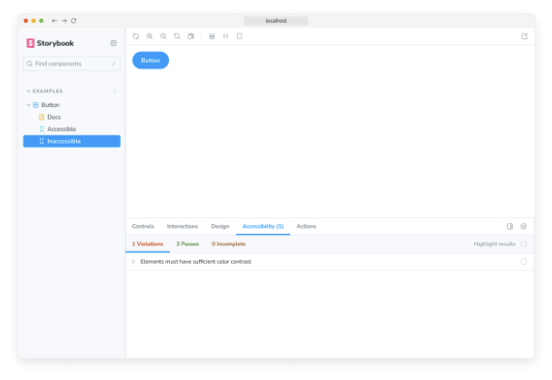
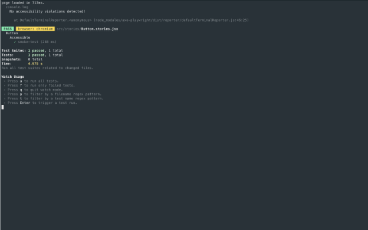

웹 접근성은 모든 사람을 포용할 수 있도록 웹 사이트를 제작하는 실천 방법입니다. 이는 키보드 탐색, 스크린 리더 지원, 터치 친화성, 사용 가능한 색 대비, 모션 줄이기 및 확대 지원과 같은 요구 사항을 지원하는 것을 의미합니다.

웹 접근성 테스트는 렌더링된 DOM을 WCAG 규칙과 다른 산업 수용되는 최상의 실천 방법에 기반한 일련의 휴리스틱과 대조합니다. 튀어나온 접근성 위반 사항을 잡기 위한 QA의 첫 번째 라인 역할을 합니다.


## a11y 애드온을 사용한 웹 접근성 점검


Storybook은 공식 a11y 애드온을 제공합니다. Deque의 axe-core를 기반으로 하며, WCAG 문제의 57%까지 자동으로 감지합니다.

### a11y 애드온 설정

애드온을 사용하여 이야기의 접근성을 확인하려면 애드온을 설치하고 Storybook에 추가해야 합니다.

다음 명령을 실행하여 애드온을 설치합니다.


```npm
npm install @storybook/addon-a11y --save-dev
```

Storybook 구성 파일(.storybook/main.js|ts)을 업데이트하여 접근성 애드온을 포함시킵니다.

```typescript
// 사용 중인 프레임워크로 교체하세요 (예: react-webpack5, vue3-vite)
import type { StorybookConfig } from '@storybook/your-framework';

const config: StorybookConfig = {
  framework: '@storybook/your-framework',
  stories: ['../src/**/*.mdx', '../src/**/*.stories.@(js|jsx|mjs|ts|tsx)'],
  addons: [
    // 다른 Storybook 애드온들
    '@storybook/addon-a11y', //👈 여기에 a11y 애드온 추가
  ],
};

export default config;
```

Storybook을 시작하면 UI에 눈에 띄는 차이를 볼 수 있습니다. 새로운 툴바 아이콘과 테스트 결과를 검사할 수 있는 접근성 패널이 표시됩니다.


### 어떻게 작동하는지

Storybook의 a11y 애드온은 선택된 스토리에 Axe를 실행합니다. 이를 통해 개발 중에 웹 접근성 문제를 파악하고 해결할 수 있습니다. 예를 들어, 버튼 구성 요소에 작업 중이고 다음과 같은 스토리 집합이 포함된 경우:

```typescript
import type { Meta, StoryObj } from '@storybook/react';

import { Button } from './Button';

const meta: Meta<typeof Button> = {
  component: Button,
  argTypes: {
    backgroundColor: { control: 'color' },
  },
};

export default meta;
type Story = StoryObj<typeof Button>;

// 이 스토리는 접근 가능합니다
export const Accessible: Story = {
  args: {
    primary: false,
    label: 'Button',
  },
};

// 이 스토리는 접근성이 떨어집니다
export const Inaccessible: Story = {
  args: {
    ...Accessible.args,
    backgroundColor: 'red',
  },
};
```


두 가지 이야기를 전체적으로 확인하면 "접근 불가" 이야기에 몇 가지 수정이 필요하다는 것을 알 수 있습니다. 접근성 패널에서 위반 사항 탭을 열면 접근성 문제에 대한 명확한 설명과 해결 방법 가이드가 제공됩니다.



### 설정

Storybook의 접근성 애드온은 기본적으로 대부분의 문제를 다루는 일련의 접근성 규칙이 포함되어 있습니다. 또한 애드온 구성을 세밀하게 조정하거나 Axe의 규칙 세트를 필요에 맞게 재정의할 수도 있습니다.


#### 글로벌 a11y 구성

만약 접근성 규칙을 무시하거나 모든 이야기에 걸쳐 설정을 수정해야 할 경우, storybook/preview.js|ts에 다음을 추가할 수 있습니다:

```typescript
// 사용 중인 프레임워크에 맞게 'your-framework'를 교체하세요 (예: react, vue3)
import { Preview } from '@storybook/your-framework';

const preview: Preview = {
  parameters: {
    a11y: {
      // 검사할 선택기 (선택 사항)
      element: '#storybook-root',
      config: {
        rules: [
          {
            // 제공된 CSS 선택기에 따라 자동완성 규칙을 실행하지 않음
            id: 'autocomplete-valid',
            selector: '*:not([autocomplete="nope"])',
          },
          {
            // enabled 옵션을 false로 설정하면 모든 이야기에서 특정 규칙의 검사가 비활성화됩니다.
            id: 'image-alt',
            enabled: false,
          },
        ],
      },
      // Axe의 옵션 매개변수
      options: {},
      // 자동 검사 방지를 위한 선택 사항
      manual: true,
    },
  },
};

export default preview;
```

#### 컴포넌트 수준의 a11y 구성


컴포넌트의 모든 이야기에 대한 규칙 세트를 사용자 정의할 수도 있어요. 이야기의 기본 내보내기를 업데이트하고 필요한 구성을 가진 매개변수를 추가하세요:

```typescript
// your-framework을 사용하고 있는 프레임워크의 이름으로 바꿔주세요
import type { Meta } from '@storybook/your-framework';

import { MyComponent } from './MyComponent';

const meta: Meta<typeof MyComponent> = {
  component: MyComponent,
  parameters: {
    a11y: {
      // 검사할 선택기 선택은 선택 사항입니다
      element: '#storybook-root',
      config: {
        rules: [
          {
            // 제공된 CSS 선택기에 따라 자동완성 규칙을 실행하지 않습니다
            id: 'autocomplete-valid',
            selector: '*:not([autocomplete="nope"])',
          },
          {
            // enabled 옵션을 false로 설정하면 모든 이야기의 이 특정 규칙에 대한 확인이 비활성화됩니다
            id: 'image-alt',
            enabled: false,
          },
        ],
      },
      options: {},
      manual: true,
    },
  },
};

export default meta;
```

#### 이야기 수준의 a11y 구성

새로운 매개변수를 포함하도록 이야기를 업데이트하여 이야기 수준에서 a11y 규칙 세트를 사용자 정의하세요.


```typescript
import type { Meta, StoryObj } from '@storybook/react';

import { MyComponent } from './MyComponent';

const meta: Meta<typeof MyComponent> = {
  component: MyComponent,
};

export default meta;
type Story = StoryObj<typeof MyComponent>;

export const ExampleStory: Story = {
  parameters: {
    a11y: {
      element: '#storybook-root',
      config: {
        rules: [
          {
            // The autocomplete rule will not run based on the CSS selector provided
            id: 'autocomplete-valid',
            selector: '*:not([autocomplete="nope"])',
          },
          {
            // Setting the enabled option to false will disable checks for this particular rule on all stories.
            id: 'image-alt',
            enabled: false,
          },
        ],
      },
      options: {},
      manual: true,
    },
  },
};
```

#### a11y 테스트 비활성화하는 방법

다음 매개변수를 스토리의 내보내기 또는 컴포넌트의 기본 내보내기에 추가하여 스토리 또는 컴포넌트의 접근성 테스트를 비활성화할 수 있습니다:

```typescript
import type { Meta, StoryObj } from '@storybook/react';

import { MyComponent } from './MyComponent';

const meta: Meta<typeof MyComponent> = {
    component: MyComponent,
};

export default meta;
type Story = StoryObj<typeof MyComponent>;

export const NonA11yStory: Story = {
    parameters: {
        a11y: {
            // This option disables all a11y checks on this story
            disable: true,
        },
    },
};
```


## 테스트 러너로 접근성 테스트 자동화하기

접근성을 확인하는 가장 정확한 방법은 실제 디바이스에서 수동으로 확인하는 것입니다. 하지만 일반적인 접근성 문제를 확인하기 위해 자동화된 도구를 사용할 수도 있습니다. 예를 들어, 평균적으로 Axe는 WCAG 규칙을 자동으로 적용하여 약 57%의 문제를 찾아냅니다.

이러한 도구들은 렌더링된 DOM을 WCAG 규칙과 다른 업계 수용된 최상의 방법에 기반한 휴리스틱으로 평가함으로써 작동합니다. 그런 다음 Storybook 테스트 러너와 axe-playwright를 사용하여 이러한 도구들을 테스트 자동화 파이프라인에 통합할 수 있습니다.

### 설정


접근성 테스트를 위해 테스트 러너를 활성화하려면 제대로 설정하기 위해 추가 조치를 취해야 합니다. 나머지 필수 구성을 진행하기 전에 테스트 러너 설명서를 참고하는 것을 권장합니다.

다음 명령을 실행하여 필수 종속성을 설치하세요.

```npm
npm install axe-playwright --save-dev
```

Storybook 디렉토리 내에 새 구성 파일을 추가하고 다음을 넣으세요.


```typescript
import type { TestRunnerConfig } from '@storybook/test-runner';
import { injectAxe, checkA11y } from 'axe-playwright';

/*
 * 자세한 사항은 https://storybook.js.org/docs/writing-tests/test-runner#test-hook-api
 * 를 확인하여 테스트 러너 훅 API에 대해 더 많이 알아보세요.
 */
const config: TestRunnerConfig = {
  async preVisit(page) {
    await injectAxe(page);
  },
  async postVisit(page) {
    await checkA11y(page, '#storybook-root', {
      detailedReport: true,
      detailedReportOptions: {
        html: true,
      },
    });
  },
};

export default config;
```

테스트 러너를 실행하면(accessibility audit 및 각 구성된 상호작용 테스트와 함께) 각 컴포넌트 스토리에 대해 실행됩니다.

스토리의 루트 엘리먼트부터 DOM 트리를 탐색하며 문제점을 확인하고, 만난 문제점을 기반으로 자세한 보고서를 생성합니다.




### 테스트 러너에서 A11y 구성

테스트 러너는 이야기 정보에 액세스할 수 있도록 도우미 메소드를 제공합니다. 이를 사용하여 특정 이야기에 대한 추가 옵션을 제공하고 테스트 러너의 구성을 확장할 수 있습니다. 예를 들어:

```typescript
import type { TestRunnerConfig } from '@storybook/test-runner';
import { getStoryContext } from '@storybook/test-runner';

import { injectAxe, checkA11y, configureAxe } from 'axe-playwright';

/*
 * 테스트 러너 후크 API에 대해 더 알아보려면 https://storybook.js.org/docs/writing-tests/test-runner#test-hook-api 를 참조하세요.
 */
const config: TestRunnerConfig = {
  async preVisit(page) {
    await injectAxe(page);
  },
  async postVisit(page, context) {
    // 매개변수, args, argTypes 등을 포함한 이야기의 전체 컨텍스트 가져오기
    const storyContext = await getStoryContext(page, context);

    // 이야기 수준의 a11y 규칙 적용
    await configureAxe(page, {
      rules: storyContext.parameters?.a11y?.config?.rules,
    });

    await checkA11y(page, '#storybook-root', {
      detailedReport: true,
      detailedReportOptions: {
        html: true,
      },
    });
  },
};

export default config;
```

### 테스트 러너를 사용하여 A11y 테스트 비활성화


또한, 이미 특정 이야기에 대한 접근성 테스트를 비활성화한 경우, 테스트 러너를 구성하여 해당 테스트를 건너뛸 수도 있습니다. 예를 들어:

```typescript
import type { TestRunnerConfig } from '@storybook/test-runner';
import { getStoryContext } from '@storybook/test-runner';

import { injectAxe, checkA11y } from 'axe-playwright';

/*
 * 테스트 러너 훅 API에 대해 자세히 알아보려면 https://storybook.js.org/docs/writing-tests/test-runner#test-hook-api를 참조하세요.
 */
const config: TestRunnerConfig = {
  async preVisit(page) {
    await injectAxe(page);
  },
  async postVisit(page, context) {
    // 매개변수, args, argTypes 등을 포함한 이야기의 전체 컨텍스트를 가져옵니다.
    const storyContext = await getStoryContext(page, context);

    // 비활성화된 이야기에 대해서는 a11y 테스트를 실행하지 않습니다.
    if (storyContext.parameters?.a11y?.disable) {
      return;
    }
    await checkA11y(page, '#storybook-root', {
      detailedReport: true,
      detailedReportOptions: {
        html: true,
      },
    });
  },
};

export default config;
```

#### 브라우저 기반과 린터 기반 접근성 테스트의 차이는 무엇인가요?

브라우저 기반의 접근성 테스트는 Storybook과 같은 것들이 렌더링된 DOM을 평가함으로써 가장 높은 정확성을 제공합니다. 아직 컴파일되지 않은 코드를 실제 실행되기 전에 점검하는 것은 실제 경험과 한 단계 멀어져, 사용자가 경험할 수 있는 모든 것을 잡아내지 못할 수 있습니다.


다른 UI 테스트에 대해 알아보세요

- 테스트 실행을 자동화하는 테스트 러너
- 외관을 위한 시각적 테스트
- 접근성을 위한 접근성 테스트
- 사용자 동작 시뮬레이션을 위한 상호 작용 테스트
- 코드 커버리지를 측정하는 커버리지 테스트
- 렌더링 오류와 경고를 위한 스냅샷 테스트
- 실제 사용자 시나리오를 시뮬레이션하는 엔드 투 엔드 테스트
- 기능성을 위한 단위 테스트