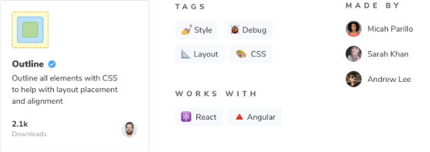

Storybook에는 애드온과 레시피 두 가지 유형의 통합이 있습니다. 이들은 통합 카탈로그에 나열되어 있습니다.

## 애드온

Storybook 애드온은 npm을 통해 배포됩니다. 카탈로그는 package.json에서 Storybook에 특화된 메타데이터를 쿼리하여 npm 레지스트리에서 채워집니다.

다음 요구 사항을 준수하는 npm 패키지를 게시하여 애드온을 카탈로그에 추가하세요:


- module 정보와 애드온 메타데이터가 포함된 package.json 파일
- 설치 및 구성 지침이 포함된 README.md 파일
- /dist 디렉토리에는 변환된 ES5 코드가 포함되어 있습니다.
- 루트 레벨에 ES5 모듈로 작성된 preset.js 파일

### 애드온 메타데이터

카탈로그에서 애드온을 구성하는 데 메타데이터를 사용합니다. storybook-addons를 첫 번째 키워드로 추가한 후 애드온의 카테고리를 따릅니다. 추가 키워드는 검색 및 태그로 사용됩니다.

애드온의 외관을 사용자 정의하려면 아래 필드를 가진 storybook 속성을 추가하세요.


아래 목록을 참조하여 supportedFrameworks와 unsupportedFrameworks 필드의 값을 채울 때 사용하세요.

- react
- vue
- angular
- web-components
- ember
- html
- svelte
- preact
- react-native

```js
{
  // package.json

  "name": "storybook-addon-outline",
  "version": "1.0.0",
  "description": "CSS를 사용하여 모든 요소를 강조하여 레이아웃 배치 및 정렬을 도와줍니다",
  "repository": {
    "type": "git",
    "url": "https://github.com/chromaui/storybook-outline"
  },
  "author": "winkerVSbecks",
  "keywords": ["storybook-addons", "style", "debug", "layout", "css"],
  "storybook": {
    "displayName": "Outline",
    "unsupportedFrameworks": ["vue"],
    "supportedFrameworks": ["react", "angular"],
    "icon": "https://yoursite.com/outline-icon.png"
  }
}
```

상단의 package.json은 카탈로그에 아래와 같이 나타납니다. 제품용 package.json의 예제는 여기에서 참조하세요.




#### 추가 기능이 카탈로그에 표시되는 데 얼마나 걸릴까요?

추가 기능을 게시하면 카탈로그에 표시됩니다. 추가 기능을 게시한 후에 카탈로그에 나타나는 데 시간이 걸릴 수 있습니다. 추가 기능이 24시간 이내에 나타나지 않는 경우 이슈를 열어주세요.

## 레시피


**레시피**는 애드온이 없는 경우나 통합에 수동 작업이 필요한 경우에 Storybook에 서드파티 라이브러리를 통합하는 지침의 집합입니다.

### 누가 소유하고 있나요?

레시피는 Storybook 팀에 의해 작성되고 유지보수됩니다. 우리는 커뮤니티 인기, 도구 성숙도 및 통합의 안정성에 기초하여 레시피를 작성합니다. 우리의 목표는 레시피가 시간이 지남에도 계속 작동할 수 있도록 하는 것입니다.

원하는 레시피를 찾지 못했나요? 그것이 커뮤니티에서 인기가 있다면, 우리 문서팀이 하나를 작성할 것입니다. 그 사이에 해결책을 찾아보세요 — 당신이 원하는 것과 같은 요구 사항을 가진 사람이 이미 있을 가능성이 높습니다. 또한 자신의 사이트에서 레시피를 작성하여 연구과정을 가속화하는 데 도움을 줄 수 있습니다.


### 레시피 요청하기

레시피를 요청하려면 GitHub 저장소에서 새로운 토론을 열어주세요. 요청을 검토하고 인기가 있으면 백로그에 추가하여 우선순위를 매길 겁니다.

Storybook 애드온 생태계에 대해 더 알아보기

- 다른 종류의 애드온을 위한 애드온 유형
- 애드온 개발의 기초를 위한 애드온 작성
- 프리셋 개발을 위한 프리셋
- 요구 사항 및 사용 가능한 레시피에 대한 통합 카탈로그
- 사용 가능한 API에 대해 알아보는 API 참조