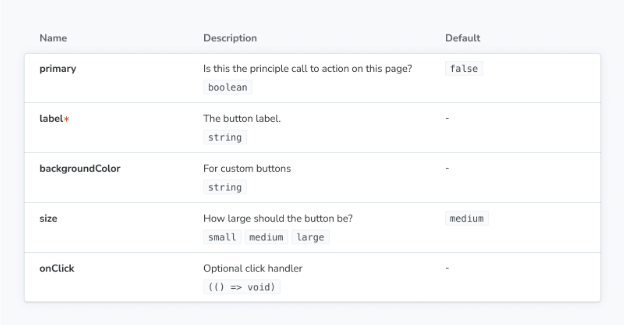

ArgTypes은 args의 동작을 지정합니다. arg의 유형을 지정함으로써 허용할 수 있는 값들을 제한하고 명시적으로 설정되지 않은 args에 대한 정보를 제공합니다(즉, 설명).

argTypes를 사용하여 애드온들이 사용하는 정보로 args를 "주석" 처리할 수도 있습니다. 예를 들어, 컬러 피커를 렌더링하기 위해 제어 애드온에게 명령하려면 `color` 제어 유형을 지정할 수 있습니다.

ArgTypes의 가장 구체적인 구현은 ArgTypes 문서 블록입니다(Controls와 유사함). 표의 각 행은 단일 arg 유형과 해당 arg의 현재 값에 해당합니다.




## 자동 argType 추론

Storybook 문서 애드온을 사용 중이라면 (기본으로 essentials의 일부로 설치되었음), Storybook은 CSF 파일의 기본 내보내기에 지정된 컴포넌트를 기반으로 각 스토리에 대한 argTypes 세트를 추론할 것입니다.

이를 위해 Storybook은 귀하의 프레임워크에 따라 다양한 정적 분석 도구를 사용합니다.

argTypes의 데이터 구조는 이러한 도구의 출력과 일치하도록 설계되었습니다. 수동으로 지정된 속성은 추론된 내용을 덮어씁니다.


## argTypes 수동 지정하기

대부분의 Storybook 프로젝트에서 argTypes는 컴포넌트에서 자동으로 유추됩니다. 수동으로 지정된 argTypes는 유추된 값들을 무시합니다.

ArgTypes는 보통 default export 내에서 메타(컴포넌트) 수준에서 지정됩니다. CSF 파일에서 다음과 같이 지정할 수 있습니다:

```typescript
// 사용 중인 렌더러에 맞게 'your-renderer'를 해당 렌더러 이름으로 바꿔주세요. (예: react, vue3, angular 등)
import type { Meta } from '@storybook/your-renderer';

import { Button } from './Button';

const meta: Meta<typeof Button> = {
  component: Button,
  argTypes: {
    // 👇 모든 Button 스토리는 label 인자를 기대합니다
    label: {
      control: 'text',
      description: '덮어쓴 설명',
    },
  },
};

export default meta;
```


프로젝트(전역) 수준에서 지정된 경우 모든 이야기에 적용할 수 있습니다. preview.js|ts 설정 파일에서 다음과 같이 작성하면 됩니다:

```typescript
// 사용 중인 렌더러(예: react, vue3, angular 등)로 your-renderer를 바꿉니다.
import type { Preview } from '@storybook/your-renderer';

const preview: Preview = {
  argTypes: {
    // 👇 모든 이야기에는 label 인자가 필요합니다.
    label: {
      control: 'text',
      description: '덮어쓴 설명',
    },
  },
};

export default preview;
```

또는 특정 이야기에만 적용할 수도 있습니다:

```typescript
// 사용 중인 렌더러(예: react, vue3, angular 등)로 your-renderer를 바꿉니다.
import type { Meta, StoryObj } from '@storybook/your-renderer';

import { Button } from './Button';

const meta: Meta<typeof Button> = {
  component: Button,
};

export default meta;

type Story = StoryObj<typeof Button>;

export const Basic: Story = {
  argTypes: {
    // 👇 이 이야기에는 label 인자가 필요합니다.
    label: {
      control: 'text',
      description: '덮어쓴 설명',
    },
  },
};
```


## argTypes

타입:

```js
{
  [key: string]: {
    control?: ControlType | { type: ControlType; /* 자세한 내용은 아래 참조 */ } | false;
    description?: string;
    if?: Conditional;
    mapping?: { [key: string]: { [option: string]: any } };
    name?: string;
    options?: string[];
    table?: {
      category?: string;
      defaultValue?: { summary: string; detail?: string };
      disable?: boolean;
      subcategory?: string;
      type?: { summary?: string; detail?: string };
    },
    type?: SBType | SBScalarType['name'];
  }
}
```

argTypes는 args의 이름과 일치하는 키를 가진 객체를 사용하여 구성합니다. 각 키의 값은 다음 속성을 가진 객체입니다:


### 컨트롤

유형:

```js
| ControlType 
| {
    type: ControlType,
    accept?: string;
    labels?: { [option: string]: string };
    max?: number;
    min?: number;
    presetColors?: string[];
    step?: number;
  }
| false
```

기본값:


- `select`이면 옵션이 지정됩니다.
- 그렇지 않으면 유형에서 유추됩니다.
- 그렇지 않으면 `object`입니다.

인수에 대한 컨트롤 애드온의 동작을 지정하세요. 문자열을 지정하면 해당 유형으로 컨트롤이 사용됩니다. 객체를 지정하면 추가 구성을 제공할 수 있습니다. false를 지정하면 컨트롤을 렌더링하는 것을 방지합니다.

```typescript
// 사용 중인 렌더러에 맞게 'your-renderer'를 렌더러로 교체하세요 (예: react, vue3, angular 등)
import type { Meta } from '@storybook/your-renderer';

import { Example } from './Example';

const meta: Meta<typeof Example> = {
  component: Example,
  argTypes: {
    value: {
      control: {
        type: 'number',
        min: 0,
        max: 100,
        step: 10,
      },
    },
  },
};

export default meta;
```

#### control.type


유형: ControlType | null

기본값: 추론됨; 옵션을 지정했을 때 `select`; 그렇지 않으면 `object`로 되돌아갑니다.

컨트롤 애드온을 사용하여 인수 값을 변경하는 데 사용되는 컨트롤 유형을 지정합니다. 다음은 처리하는 데이터 유형에 따라 그룹화된 사용 가능한 유형인 ControlType입니다:

#### control.accept


유형: 문자열

`file`으로 설정하면 허용되는 파일 유형을 지정할 수 있습니다. 값은 쉼표로 구분된 MIME 유형의 문자열이어야 합니다.

#### control.labels

유형: { [옵션: 문자열]: 문자열 }


옵션을 레이블에 매핑합니다. 레이블은 모두를 포함할 필요는 없습니다. 옵션이 객체의 키에 없다면 원래대로 사용됩니다.

#### control.max

유형: 숫자

유형이 `숫자` 또는 `범위`일 때 허용되는 최대값을 설정합니다.


#### control.min

유형: 숫자

유형이 '숫자' 또는 '범위'인 경우 최소 허용 값으로 설정합니다.

#### control.presetColors


유형: 문자열[]

유형이 `색상`인 경우, 일반적인 색상 선택기에 추가로 사용할 수 있는 색상 집합을 정의합니다. 배열 내의 값은 유효한 CSS 색상 값이어야 합니다.

#### control.step

유형: 숫자


type이 `number` 또는 `range` 일 때, 값 증가/감소 시 허용되는 정밀도를 설정합니다.

### 설명

유형: 문자열

기본값: 추론됨


```typescript
// 사용하는 렌더러(예: 리액트, 뷰3, 앵귤러 등)로 your-renderer을(를) 교체하세요.
import type { Meta } from '@storybook/your-renderer';

import { Example } from './Example';

const meta: Meta<typeof Example> = {
  component: Example,
  argTypes: {
    value: {
      description: 'The value of the slider',
    },
  },
};

export default meta;
```

### 인수

타입: 


```typescript
{
  [predicateType: 'arg' | 'global']: string;
  eq?: any;
  exists?: boolean;
  neq?: any;
  truthy?: boolean;
}
```

다른 arg 또는 global 값에 따라 argType을 조건부로 렌더링합니다.

```typescript
// 사용 중인 렌더러(예: react, vue3, angular 등)로 교체하세요.
import type { Meta } from '@storybook/your-renderer';

import { Example } from './Example';

const meta: Meta<typeof Example> = {
  component: Example,
  argTypes: {
    parent: { control: 'select', options: ['one', 'two', 'three'] },

    // 👇 `parent` arg가 존재할 때만 표시됩니다
    parentExists: { if: { arg: 'parent', exists: true } },

    // 👇 `parent` arg가 없을 때만 표시됩니다
    parentDoesNotExist: { if: { arg: 'parent', exists: false } },

    // 👇 `parent` arg 값이 참일 때만 표시됩니다
    parentIsTruthy: { if: { arg: 'parent' } },
    parentIsTruthyVerbose: { if: { arg: 'parent', truthy: true } },

    // 👇 `parent` arg 값이 거짓일 때만 표시됩니다
    parentIsNotTruthy: { if: { arg: 'parent', truthy: false } },

    // 👇 `parent` arg 값이 'three'일 때만 표시됩니다
    parentIsEqToValue: { if: { arg: 'parent', eq: 'three' } },

    // 👇 `parent` arg 값이 'three'이 아닌 경우에만 표시됩니다
    parentIsNotEqToValue: { if: { arg: 'parent', neq: 'three' } },

    // 위의 각 항목은 globalType의 값에도 종속될 수 있습니다.

    // 👇 `theme` global이 존재할 때만 표시됩니다
    parentExists: { if: { global: 'theme', exists: true } },
  },
};

export default meta;
```

### 매핑


유형: { [키: 문자열]: { [옵션: 문자열]: any } }

값에 옵션을 매핑하세요.

원시 값이 아닌 값을 처리할 때 일부 제한에 부딪힐 수 있다는 사실을 알게 될 거예요. 가장 명백한 문제는 모든 값이 URL의 args 매개변수의 일부로 표현될 수 없다는 것이며, 이는 해당 상태를 공유하고 딥링크할 수 있는 능력을 상실하게 합니다. 또한 JSX와 같은 복잡한 값은 (예: Controls 애드온을 포함한) 관리 도구와 미리보기(당신의 이야기) 간에 동기화되지 않을 수 있습니다.

매핑은 모든 경우를 다 다룰 필요는 없어요. 현재 선택된 옵션이 목록에 없다면 그대로 사용됩니다. control.labels과 함께 사용 가능합니다.


```typescript
// 원하는 렌더러로 교체하십시오 (예: react, vue3, angular 등)
import type { Meta } from '@storybook/your-renderer';

import { Example } from './Example';

const meta: Meta<typeof Example> = {
  component: Example,
  argTypes: {
    label: {
      options: ['보통', '굵게', '기울임꼴'],
      mapping: {
        '굵게': <b>굵게</b>,
        '기울임꼴': <i>기울임꼴</i>,
      },
    },
  },
};

export default meta;
```

### 이름

타입: 문자열

argTypes 객체는 arg의 이름을 키로 사용합니다. 기본적으로 해당 키는 Storybook에서 argType을 표시할 때 사용됩니다. 표시된 이름을 재정의하려면 name 속성을 지정하면 됩니다.


```typescript
// Replace your-renderer with the renderer you are using (e.g., react, vue3, angular, etc.)
import type { Meta } from '@storybook/your-renderer';

import { Example } from './Example';

const meta: Meta<typeof Example> = {
  component: Example,
  argTypes: {
    actualArgName: {
      name: '친근한 이름',
    },
  },
};

export default meta;
```

### options

타입: 문자열 배열

기본값: 추론됨


arg이 일정한 값 집합을 허용하는 경우, 옵션을 사용하여 해당 값들을 지정할 수 있습니다. 만약 그 값들이 JSX 요소와 같이 복잡하다면, 매핑(mapping)을 사용하여 문자열 값으로 매핑할 수 있습니다. control.labels를 사용하여 옵션에 대한 사용자 정의 레이블을 제공할 수도 있습니다.

```typescript
// 사용 중인 렌더러(예: react, vue3, angular 등)로 your-renderer를 대체합니다.
import type { Meta } from '@storybook/your-renderer';

import { Example } from './Example';

const meta: Meta<typeof Example> = {
  component: Example,
  argTypes: {
    icon: {
      options: ['arrow-up', 'arrow-down', 'loading'],
    },
  },
};

export default meta;
```

### Markdown 형식으로 변경

Type:


```js
{
  category?: string;
  defaultValue?: {
    detail?: string;
    summary: string;
  };
  disable?: boolean;
  subcategory?: string;
  type?: {
    detail?: string;
    summary: string;
  };
}
```

기본값: 추정됨

ArgTypes 문서 블록, Controls 문서 블록 및 Controls 애드온 패널에서 인수가 어떻게 문서화되는지 지정하십시오.

```typescript
// 사용 중인 렌더러(예: react, vue3, angular 등)로 your-renderer를 교체하세요.
import type { Meta } from '@storybook/your-renderer';

import { Example } from './Example';

const meta: Meta<typeof Example> = {
  component: Example,
  argTypes: {
    value: {
      table: {
        defaultValue: { summary: 0 },
        type: { summary: 'number' },
      },
    },
  },
};

export default meta;
```


#### 테이블.category

유형: 문자열

기본값: 일부 프레임워크에서 추론됨

argType를 카테고리 제목 아래에 표시하고 레이블은 category로 지정합니다.


#### table.defaultValue

유형: { detail?: string; summary: string }

기본값: 추론됨

argType의 문서화된 기본값입니다. summary는 일반적으로 값 자체에 사용되고, detail은 추가 정보에 사용됩니다.


#### table.disable

유형: 부울(boolean)

argType 행을 테이블에서 제거하려면 true로 설정하세요.

#### table.subcategory


종류: 문자열

[argType]은 하위 카테고리 제목 아래에 표시됩니다 ([category] 제목 아래에 표시). 라벨은 subcategory로 지정됩니다.

#### table.type

종류: { detail?: 문자열; summary: 문자열 }


기본값: 타입에 따라 유추됨

argType의 문서화된 타입입니다. summary는 일반적으로 타입 자체에 사용되고, detail은 추가 정보에 사용됩니다.

실제 의미를 명시해야 할 경우 type을 대신 사용해야 합니다.

### type


타입: `boolean` | `function` | `number` | `string` | `symbol` | SBType

SBType의 전체 타입은 다음과 같습니다:

기본값: 추론됨

argType의 의미있는 타입을 지정합니다. argType가 추론될 때, 다양한 도구에서 가져온 정보가 이 속성에 요약되고 이 정보를 사용하여 제어 및 table.type과 같은 다른 속성을 추론합니다.


만약 당신이 문서화된 유형만 지정하고 싶다면, table.type 대신 사용해야 합니다.

```typescript
// 사용 중인 렌더러(예: react, vue3, angular 등)로 your-renderer를 대체하세요.
import type { Meta } from '@storybook/your-renderer';

import { Example } from './Example';

const meta: Meta<typeof Example> = {
  component: Example,
  argTypes: {
    value: { type: 'number' },
  },
};

export default meta;
```

### defaultValue

(⛔️ 사용이 중단된 기능)


이렇게 수정하면 됩니다: 

```typescript
// 사용 중인 렌더러에 맞게 'your-renderer'를 해당 렌더러로 바꿔주세요 (예: react, vue3, angular 등)
import type { Meta } from '@storybook/your-renderer';

import { Example } from './Example';

const meta: Meta<typeof Example> = {
  component: Example,
  argTypes: {
    value: {
      // ⛔️ 사용 중단됨, 사용하지 마세요
      defaultValue: 0,
    },
  },
  // ✅ 대신 이렇게 하세요
  args: {
    value: 0,
  },
};

export default meta;
```