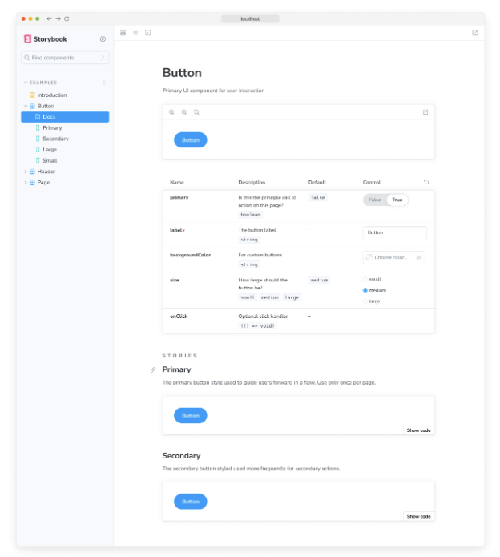
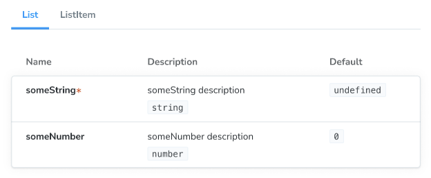

Storybook Autodocs는 UI 컴포넌트에 대한 포괄적인 문서를 빠르게 생성하는 데 도움이 되는 강력한 도구입니다. Autodocs를 활용하면 이야기를 생생한 문서로 변환하여 MDX와 Doc Blocks를 추가로 확장하여 컴포넌트 기능에 대한 명확하고 간결한 이해를 제공할 수 있습니다.

## 자동화된 문서 설정

이야기에 대한 자동 생성 문서를 활성화하려면 이야기의 기본 내보내기에 태그 구성 속성을 추가해야 합니다. 예를 들어:

```typescript
import type { Meta } from '@storybook/react';

import { Button } from './Button';

const meta: Meta<typeof Button> = {
  component: Button,
  //👇 컴포넌트 이야기에 대한 자동 생성 문서 활성화
  tags: ['autodocs'],
  argTypes: {
    backgroundColor: { control: 'color' },
  },
};

export default meta;
type Story = StoryObj<typeof Button>;

export const Primary: Story = {
  args: {
    primary: true,
    label: 'Button',
  },
};

export const Secondary: Story = {
  args: {
    ...Primary.args,
    primary: false,
  },
};
```




이야기가로드된 후, Storybook은 관련 메타데이터(예: args, argTypes, parameters)를 추론하고 이 정보로 구성 요소 트리의 루트 수준에 문서화 페이지를 자동으로 생성합니다.

### 구성

기본적으로 Storybook은 문서화 지원을 위한 구성이 없으며 태그 구성 속성을 통해 활성화된 각 이야기를 위한 문서화 페이지를 자동으로 설정합니다. 그러나 Storybook 구성 파일(.storybook/main.js|ts|cjs)을 확장하여 문서 작성 방식을 제어하는 추가 옵션을 제공할 수 있습니다. 아래에 사용할 수 있는 옵션과 사용 방법 예시가 나와 있습니다.


```typescript
// 원하는 프레임워크 (예: react-webpack5, vue3-vite)로 대체하세요.
import type { StorybookConfig } from '@storybook/your-framework';

const config: StorybookConfig = {
  framework: '@storybook/your-framework',
  stories: ['../src/**/*.mdx', '../src/**/*.stories.@(js|jsx|mjs|ts|tsx)'],
  addons: ['@storybook/addon-essentials'],
  docs: {
    //👇 아래 표를 참조하여 지원되는 옵션 목록을 확인하세요
    autodocs: 'tag',
    defaultName: 'Documentation',
  },
};

export default config;
```

### 사용자 정의 템플릿 작성

Storybook에서 사용하는 기본 문서 템플릿을 변경하려면 UI 구성 파일(.storybook/preview.js|ts)을 확장하고 docs 매개변수를 도입하세요. 이 매개변수는 리액트 컴포넌트를 반환하는 페이지 함수를 허용하며, 이를 사용하여 필요한 템플릿을 생성할 수 있습니다. 예를 들어:

```typescript
// 원하는 프레임워크 (예: react, vue3)로 대체하세요.
import { Preview } from '@storybook/your-framework';

import { Title, Subtitle, Description, Primary, Controls, Stories } from '@storybook/blocks';

const preview: Preview = {
  parameters: {
    controls: {
      matchers: {
        color: /(background|color)$/i,
        date: /Date$/,
      },
    },
    docs: {
      page: () => (
        <>
          <Title />
          <Subtitle />
          <Description />
          <Primary />
          <Controls />
          <Stories />
        </>
      ),
    },
  },
};

export default preview;
```


코드 스니펫을 더 자세히 살펴봅시다. 스토리북이 시작되면 기본 템플릿을 다음으로 구성된 사용자 정의 템플릿으로 대체합니다:

- 제목, 부제 및 설명 문서 블록에서 검색한 구성 요소의 메타데이터로 구성된 헤더.
- Primary Doc 블록을 통해 파일에서 정의된 첫 번째 스토리로 컴포넌트 확대 및 축소를위한 편리한 UI 컨트롤 세트.
- Controls Doc 블록을 통해 이야기에서 정의된 모든 관련 args 및 argTypes로 대화식 테이블.
- Stories Doc 블록을 통해 남은 스토리의 개요.

#### MDX로

MDX를 사용하여 문서 템플릿을 생성할 수도 있습니다. 이것은 JSX 처리가 설정되어 있지 않은 비-React 프로젝트에서 유용합니다. 프로젝트에 MDX 파일을 만들면 일반 문서로 간주됩니다. MDX 파일이 문서 템플릿임을 나타내려면 해당 메타 Doc 블록에 isTemplate 속성을 제공하면 됩니다. 예를 들어:


```typescript
import { Meta, Title, Primary, Controls, Stories } from '@storybook/blocks';

{/* 
  * 👇 isTemplate 속성은 이것이 템플릿임을 Storybook에 알려주기 위해 필요합니다.
  * 사용 방법은 https://storybook.js.org/docs/api/doc-block-meta
  * 참고하여 배워보세요
*/}

<Meta isTemplate />

<Title />

# 기본 구현

<Primary />

## 입력값

컴포넌트는 다음 입력값(props)을 받습니다:

<Controls />

---

## 추가 변형

아래에 컴포넌트의 추가 변형이 나열되어 있습니다.

<Stories />
```

그런 다음 .storybook/preview.js 또는 개별 스토리 파일에서 가져와서 사용할 수 있습니다:

```typescript
import DocumentationTemplate from './DocumentationTemplate.mdx';

export default {
  parameters: {
    docs: {
      page: DocumentationTemplate,
    },
  },
};
```

### 목차 생성```


Storybook이 자동 생성한 문서 페이지는 상당히 길고 탐색이 어려울 수 있습니다. 이를 돕기 위해 목차 기능을 활성화하여 문서 페이지의 빠른 개요를 제공하고 사용자가 특정 섹션으로 이동할 수 있도록 할 수 있습니다. 이를 활성화하려면 Storybook UI 구성 파일(예: .storybook/preview.js)을 확장하고 toc 속성이 있는 docs 매개변수를 제공하세요.

```typescript
// 사용 중인 프레임워크에 맞춰 your-framework를 교체하세요 (예: react, vue3)
import { Preview } from '@storybook/your-framework';

const preview: Preview = {
  parameters: {
    docs: {
      toc: true, // 👈 목차 활성화
    },
  },
};

export default preview;
```

### 목차 구성

기본적으로 문서 페이지의 목차는 자동으로 생성된 h3 제목만 표시됩니다. 그러나 목차를 사용자 정의하려면 toc 속성에 더 많은 매개변수를 추가할 수 있습니다. 다음은 사용 가능한 옵션 및 그 사용법 예시입니다.


```typescript
// 사용하는 프레임워크로 교체하세요 (예: react, vue3)
import { Preview } from '@storybook/your-framework';

const preview: Preview = {
  parameters: {
    docs: {
      toc: {
        contentsSelector: '.sbdocs-content',
        headingSelector: 'h1, h2, h3',
        ignoreSelector: '#primary',
        title: 'Table of Contents',
        disable: false,
        unsafeTocbotOptions: {
          orderedList: false,
        },
      },
    },
  },
};

export default preview;
```

#### 구성 요소 수준의 설정

특정 스토리에 대한 목차를 사용자 정의하려면 스토리의 기본 내보내기에 toc 속성을 포함하고 필요한 구성을 제공하면 됩니다. 예를 들어, 특정 스토리에서 목차를 숨기려면 다음과 같이 스토리를 조정하세요:

```typescript
// 사용하는 프레임워크의 이름으로 교체
import type { Meta } from '@storybook/your-framework';

import { MyComponent } from './MyComponent';

const meta: Meta<typeof MyComponent> = {
  component: MyComponent,
  tags: ['autodocs'],
  parameters: {
    docs: {
      toc: {
        disable: true, // 👈 목차 비활성화
      },
    },
  },
};

export default meta;
```


### 컴포넌트 문서화 사용자 정의

Storybook의 Autodocs를 사용하여 자동화된 문서를 작성하면 지속 가능한 문서 양식을 구축하는 데 출발점을 제공받을 수 있습니다. 그럼에도 불구하고 모든 경우에 적합하지는 않을 수 있으며, 확장하고 추가 정보를 제공하고 싶을 수 있습니다. 이러한 경우를 위해 MDX와 Storybook의 Doc Blocks를 결합하여 문서를 작성하는 것을 권장합니다.

## 고급 설정

### 여러 컴포넌트 문서화


가끔은 여러 구성 요소를 함께 문서화하는 것이 도움이 될 때가 있어요. 예를 들어, 구성 요소 라이브러리의 ButtonGroup과 Button 구성 요소는 함께 없이는 의미가 없을 수 있어요.

Autodocs를 사용하면 "main" 구성 요소를 document 할 수 있고, 이와 관련된 하나 이상의 하위 구성 요소도 함께 document 할 수 있어요.

```typescript
import React from 'react';
import type { Meta, StoryObj } from '@storybook/react';

import { List } from './List';
import { ListItem } from './ListItem';

const meta: Meta<typeof List> = {
  component: List,
  subcomponents: { ListItem }, //👈 ListItem 구성 요소를 하위 구성 요소로 추가
};
export default meta;

type Story = StoryObj<typeof List>;

export const Empty: Story = {};

export const OneItem: Story = {
  render: (args) => (
    <List {...args}>
      <ListItem />
    </List>
  ),
};
```


```


주요 구성 요소와 해당 하위 구성 요소는 ArgTypes 문서 블록의 탭 형식으로 표시됩니다. 탭 제목은 하위 구성 요소 객체의 키에 해당합니다.

구성 요소 그룹에 대해 문서를 다르게 정리하려면 MDX를 사용하는 것이 좋습니다. MDX를 사용하면 구성 요소가 표시되는 방식을 완전히 제어할 수 있고 모든 구성을 지원합니다.

### 문서 컨테이너 사용자 정의

문서 컨테이너는 문서 페이지를 감싸는 구성 요소입니다. Storybook의 UI에서 문서 페이지를 렌더링하는 것을 담당합니다. 자체 구성 요소를 생성하고 Storybook UI 구성 파일(예: .storybook/preview.js)을 업데이트하여 참조함으로써 사용자 정의할 수 있습니다.


```typescript
import * as React from 'react';

// 사용 중인 프레임워크로 your-framework를 대체하세요 (예: react, vue3)
import { Preview } from '@storybook/your-framework';

import { DocsContainer } from '@storybook/blocks';

const ExampleContainer = ({ children, ...props }) => {
  return <DocsContainer {...props}>{children}</DocsContainer>;
};

const preview: Preview = {
  parameters: {
    controls: {
      matchers: {
        color: /(background|color)$/i,
        date: /Date$/,
      },
    },
    docs: {
      container: ExampleContainer,
    },
  },
};

export default preview;
```

### 기본 테마 재정의

기본적으로 Storybook은 UI에 대한 두 가지 테마(light 및 dark)를 제공합니다. 문서에서 사용되는 테마를 기존 테마와 일치하도록 맞춰야 하는 경우, Storybook UI 구성 파일(.storybook/preview.js)을 업데이트하고 적용할 수 있습니다.

```typescript
// 사용 중인 프레임워크로 your-framework를 대체하세요 (예: react, vue3)
import { Preview } from '@storybook/your-framework';

import { themes, ensure } from '@storybook/theming';

const preview: Preview = {
  parameters: {
    controls: {
      matchers: {
        color: /(background|color)$/i,
        date: /Date$/,
      },
    },
    docs: {
      theme: ensure(themes.dark), // 사용할 대체 테마
    },
  },
};

export default preview;
```


### 사용자 정의 MDX 컴포넌트 사용하기

Storybook을 기본적으로 제공되는 컴포넌트들을 사용하여 문서 페이지를 사용자 정의할 수 있습니다. 디자인 시스템이나 컴포넌트 라이브러리를 사용하고 있고 해당 컴포넌트들을 문서 페이지에 추가하고 싶다면, @mdx-js/react에서 상속된 MDXProvider 컴포넌트를 자체적인 것으로 대체할 수 있습니다. 그러나 이에는 주의해야 할 점이 있습니다. 컴포넌트를 대체할 때 Markdown 구문(예: #로 표시하는 제목)을 사용하여 문서를 작성한 경우에만 영향을 미칩니다. `h1`과 같은 네이티브 HTML 요소는 사용자 정의 구현으로 대체되지 않습니다.

```typescript
// 사용 중인 프레임워크(예: react, vue3)에 맞게 your-framework를 해당 프레임워크로 바꿔주세요.
import { Preview } from '@storybook/your-framework';

import { MDXProvider } from '@mdx-js/react';

import { DocsContainer } from '@storybook/blocks';

import * as DesignSystem from 'your-design-system';

export const MyDocsContainer = (props) => (
  <MDXProvider
    components={{
      h1: DesignSystem.H1,
      h2: DesignSystem.H2,
    }}
  >
    <DocsContainer {...props} />
  </MDXProvider>
);

const preview: Preview = {
  parameters: {
    controls: {
      matchers: {
        color: /(background|color)$/i,
        date: /Date$/,
      },
    },
    docs: {
      container: MyDocsContainer,
    },
  },
};

export default preview;
```

## 문제 해결


### 목차가 예상대로 표시되지 않는 경우

**Autodocs**의 목차를 사용할 때 예상과 다르게 나타나는 경우가 발생할 수 있습니다. 이러한 문제를 해결하기 위해 발생할 수 있는 상황들을 모아봤습니다.

#### 간단한 문서 페이지의 경우

하나의 일치하는 제목만 있는 문서 페이지에 목차를 만들면 목차가 기본적으로 숨겨지지 않습니다. 이 문제에 대한 해결책으로 두 번째 제목을 추가하거나 완전히 끄는 것이 있을 수 있습니다.


#### 작은 화면에서

화면 너비가 1200px 미만인 경우 목차는 기본적으로 숨겨집니다. 현재 이 문제에 영향을 미치지 않는 내장 솔루션이 없습니다. 그 외의 방법으로 문서 페이지의 스타일 호환성을 유지할 수 있는 것은 없습니다.

#### MDX로 작성된 문서

MDX를 사용하여 비접속형 문서를 작성하는 경우, 현재 구현에 따라 매개변수 정의를 지원하지 않음으로 인해 목차를 사용자 정의할 수 없습니다. 결과적으로 전역적으로 제공된 기본 구성으로 목차가 항상 되돌아갑니다.


### 자동 생성된 문서가 모노리포 설정에서 나타나지 않아요

기본적으로 Storybook의 Autodocs 기능은 이야기에 대한 문서를 자동으로 생성하는 데 사용됩니다. 그런데 모노리포 설정(예: Yarn Workspaces, pnpm Workspaces)로 작업하는 경우 문서의 일부가 자동으로 생성되지 않을 수 있는 문제가 발생할 수 있어요. 이러한 문제를 해결하는 데 도움이 되도록 몇 가지 권고안을 준비했어요.

import 문을 업데이트하여 패키지의 루트 대신 컴포넌트를 직접 참조하도록 수정해주세요. 예를 들어:

```typescript
// 당신의 프레임워크 이름으로 교체하세요
import type { Meta } from '@storybook/your-framework';

// ❌ 패키지의 인덱스 파일을 사용하여 컴포넌트를 가져오지 마세요.
import { MyComponent } from '@component-package';

// ✅ 컴포넌트의 내보내기를 사용하여 직접 가져오세요.
import { MyComponent } from '@component-package/src/MyComponent';

const meta: Meta<typeof MyComponent> = {
  /* 👇 title 속성은 선택 사항입니다.
   * 자동 제목을 생성하는 방법에 대해 알아보려면 https://storybook.js.org/docs/configure/#configure-story-loading 를 참조하세요
   */
  title: 'MyComponent',
  component: MyComponent,
};

export default meta;
```


또한 TypeScript를 사용하여 개발 중이라면 이를 업데이트해야 할 수도 있습니다. Storybook의 구성 파일(i.e., .storybook/main.js|ts)을 다음과 같이 포함해야 합니다:

```typescript
// 사용 중인 프레임워크로 your-framework를 대체하세요 (예: react-webpack5, vue3-vite)
import type { StorybookConfig } from '@storybook/your-framework';

const config: StorybookConfig = {
  framework: '@storybook/your-framework',
  stories: ['../src/**/*.mdx', '../src/**/*.stories.@(js|jsx|mjs|ts|tsx)'],
  typescript: {
    // 오토독을 통해 다중 패키지 컴포넌트를 문서화할 수 있도록 기본 TypeScript 구성을 재정의합니다.
    reactDocgen: 'react-docgen',
    check: false,
  },
};

export default config;
```

문제가 계속되는 경우, GitHub 토론 등의 기본 커뮤니케이션 채널을 통해 커뮤니티에 문의해보시기를 권장합니다.

### 컨트롤들이 자동 생성된 문서 내에서 스토리를 업데이트하지 않음


스토리북을 통해 이야기의 인라인 렌더링을 해제한 경우, 문서 페이지 내에서 연결된 컨트롤이 이야기를 업데이트하지 않는 상황에 직면할 수 있습니다. 이것은 현재 구현의 알려진 한계이며 향후 릴리스에서 해결될 예정입니다.

스토리북 문서에 대해 더 알아보기

- 이야기에 대한 문서 작성을 위한 오토독
- 문서를 사용자 정의하기 위한 MDX
- 문서 작성을 위한 독 블록
- 문서 게시를 자동화하여 문서를 게시하는 프로세스 automation