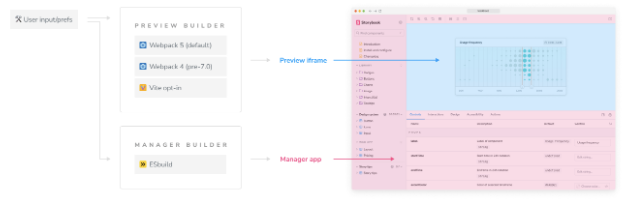

Storybook은 Webpack, Vite 및 ESBuild를 포함한 여러 빌더를 지원하는 구조로 설계되어 있습니다. 빌더 API는 Storybook에 새로운 빌더를 추가할 수 있는 인터페이스 세트입니다.



## 빌더는 어떻게 작동하나요?

Storybook에서 빌더는 컴포넌트와 이야기를 브라우저에서 실행되는 JS 번들로 컴파일하는 역할을 합니다. 빌더는 인터랙티브 개발을 위한 개발 서버뿐만 아니라 최적화된 번들을 위한 프로덕션 모드도 제공합니다.


빌더를 선택하려면 사용자는 종속성으로 추가한 후 구성 파일(.storybook/main.js)을 편집하여 활성화해야 합니다. 예를 들어, Vite 빌더를 사용하는 경우:

```npm
npm install @storybook/builder-vite --save-dev
```

```typescript
export default {
  stories: ['../src/**/*.mdx', '../stories/**/*.stories.@(js|jsx|mjs|ts|tsx)'],
  addons: ['@storybook/addon-links', '@storybook/addon-essentials'],
  core: {
    builder: '@storybook/builder-vite', // 👈 여기서 빌더를 활성화합니다.
  },
};
```

## 빌더 API


Storybook에서는 모든 빌더가 다음 API를 구현해야 하며, 다음 구성 옵션과 진입 지점을 노출해야 합니다:

```typescript
export interface Builder<Config, Stats> {
  start: (args: {
    options: Options;
    startTime: ReturnType<typeof process.hrtime>;
    router: Router;
    server: Server;
  }) => Promise<void | {
    stats?: Stats;
    totalTime: ReturnType<typeof process.hrtime>;
    bail: (e?: Error) => Promise<void>;
  }>;
  build: (arg: {
    options: Options;
    startTime: ReturnType<typeof process.hrtime>;
  }) => Promise<void | Stats>;
  bail: (e?: Error) => Promise<void>;
  getConfig: (options: Options) => Promise<Config>;
  corePresets?: string[];
  overridePresets?: string[];
}
```

개발 모드에서 start API 호출은 개발 서버를 초기화하여 파일 시스템 변경 사항(예: 컴포넌트 및 스토리)을 모니터링한 후 브라우저에서 핫 모듈 리로드를 실행하는 것을 담당합니다. 또한 사용자 입력 또는 오류를 통해 실행 프로세스를 안전하게 종료하기 위한 bail 함수를 제공합니다.

프로덕션에서 build API 호출은 정적 Storybook 빌드를 생성하는 것을 담당하며, 추가 구성이 제공되지 않는 경우 기본적으로 storybook-static 디렉토리에 저장합니다. 생성된 출력물은 사용자가 인덱스.html 또는 iframe.html을 열어 Storybook을 보는 데 필요한 모든 것을 포함해야 하며, 다른 프로세스가 실행되고 있지 않은 상태에서 브라우저에서 열 수 있어야 합니다.


## 구현

내부적으로 빌더는 미리보기 iframe을 제공하거나 구축하는 역할을 맡고 있습니다. 미리보기 iframe은 별도의 요구 사항을 갖고 있습니다. Storybook과 함께 제공되는 Essential 애드온을 완전히 지원하려면 다음 사항을 고려해야 합니다.

### 스토리 가져오기

스토리 설정 필드는 Storybook에서 스토리를 로딩하는 데 사용됩니다. 구성은 컴포넌트의 스토리의 물리적 위치를 포함하는 파일 글로브 배열을 정의합니다. 빌더는 해당 파일을 로드하고 변경 사항을 모니터링하고 UI를 업데이트할 수 있어야 합니다.


### 구성 옵션 제공

기본적으로 Storybook의 구성은 별도의 파일 (storybook/main.js|ts)에서 처리되어 사용자가 필요에 맞게 사용자 정의할 수 있는 옵션을 제공합니다. 빌더는 추가 필드 또는 다른 빌더에 적합한 메커니즘을 통해 자체 구성 지원도 제공해야 합니다. 예를 들어:

```typescript
import { stringifyProcessEnvs } from './envs';
import { getOptimizeDeps } from './optimizeDeps';
import { commonConfig } from './vite-config';

import type { EnvsRaw, ExtendedOptions } from './types';

export async function createViteServer(options: ExtendedOptions, devServer: Server) {
  const { port, presets } = options;

  // Defines the baseline config.
  const baseConfig = await commonConfig(options, 'development');
  const defaultConfig = {
    ...baseConfig,
    server: {
      middlewareMode: true,
      hmr: {
        port,
        server: devServer,
      },
      fs: {
        strict: true,
      },
    },
    optimizeDeps: await getOptimizeDeps(baseConfig, options),
  };

  const finalConfig = await presets.apply('viteFinal', defaultConfig, options);

  const envsRaw = await presets.apply<Promise<EnvsRaw>>('env');

  // Remainder implementation
}
```

### 미리보기.js 내보내기 처리


프리뷰.js 구성 파일을 통해 사용자는 스토리가 UI에 어떻게 렌더링되는지를 제어할 수 있습니다. 이는 데코레이터로 내보낸 것을 통해 제공됩니다. Storybook이 시작될 때, 내부 API 호출로 이러한 이름 지정된 내보내기를 가상 모듈 엔트리를 통해 변환합니다. 예를 들어, addDecorator()와 같은 것입니다. 빌더는 비슷한 구현을 제공해야 합니다. 아래는 예시입니다:

```typescript
import { virtualPreviewFile, virtualStoriesFile } from './virtual-file-names';
import { transformAbsPath } from './utils/transform-abs-path';
import type { ExtendedOptions } from './types';

export async function generateIframeScriptCode(options: ExtendedOptions) {
  const { presets, frameworkPath, framework } = options;
  const frameworkImportPath = frameworkPath || `@storybook/${framework}`;

  const presetEntries = await presets.apply('config', [], options);
  const configEntries = [...presetEntries].filter(Boolean);

  const absoluteFilesToImport = (files: string[], name: string) =>
    files
      .map((el, i) => `import ${name ? `* as ${name}_${i} from ` : ''}'${transformAbsPath(el)}'`)
      .join('\n');

  const importArray = (name: string, length: number) =>
    new Array(length).fill(0).map((_, i) => `${name}_${i}`);

  const code = `
    // Ensure that the client API is initialized by the framework before any other iframe code
    // is loaded. That way our client-apis can assume the existence of the API+store
    import { configure } from '${frameworkImportPath}';

    import {
      addDecorator,
      addParameters,
      addArgTypesEnhancer,
      addArgsEnhancer,
      setGlobalRender
    } from '@storybook/preview-api';
    import { logger } from '@storybook/client-logger';
    ${absoluteFilesToImport(configEntries, 'config')}
    import * as preview from '${virtualPreviewFile}';
    import { configStories } from '${virtualStoriesFile}';

    const configs = [${importArray('config', configEntries.length)
      .concat('preview.default')
      .join(',')}].filter(Boolean)

    configs.forEach(config => {
      Object.keys(config).forEach((key) => {
        const value = config[key];
        switch (key) {
          case 'args':
          case 'argTypes': {
            return logger.warn('Invalid args/argTypes in config, ignoring.', JSON.stringify(value));
          }
          case 'decorators': {
            return value.forEach((decorator) => addDecorator(decorator, false));
          }
          case 'parameters': {
            return addParameters({ ...value }, false);
          }
          case 'render': {
            return setGlobalRender(value)
          }
          case 'globals':
          case 'globalTypes': {
            const v = {};
            v[key] = value;
            return addParameters(v, false);
          }
          case 'decorateStory':
          case 'renderToCanvas': {
            return null;
          }
          default: {
            // eslint-disable-next-line prefer-template
            return console.log(key + ' was not supported :( !');
          }
        }
      });
    })
    configStories(configure);
    `.trim();
  return code;
}
```

### MDX 지원

Storybook의 Docs에는 MDX를 사용하여 스토리/문서를 작성할 수 있는 기능이 포함되어 있습니다. 빌더는 또한 MDX를 해석하고 Storybook의 특수 확장 기능을 호출하는 방법을 알아야 합니다. 예를 들어:


```typescript
import mdx from 'vite-plugin-mdx';

import { createCompiler } from '@storybook/csf-tools/mdx';

export function mdxPlugin() {
  return mdx((filename) => {
    const compilers = [];

    if (filename.endsWith('stories.mdx') || filename.endsWith('story.mdx')) {
      compilers.push(createCompiler({}));
    }
    return {
      compilers,
    };
  });
}
```

### 소스 코드 스니펫 생성

Storybook은 컴포넌트 및 이야기에 대한 추가 입력과 관련된 메타데이터를 주석으로 붙여서 대화식 컨트롤 및 문서를 자동으로 생성합니다. 현재, Webpack 로더/플러그인을 통해 제공됩니다. 빌더는 이러한 기능을 지원하기 위해 이를 다시 구현해야 합니다.

### 정적 빌드 생성


Storybook의 핵심 기능 중 하나는 웹 호스팅 서비스에 발행할 수 있는 정적 빌드를 생성할 수 있는 능력입니다. 빌더는 비슷한 메커니즘을 제공해야 합니다. 예를 들어:

```typescript
import { build as viteBuild } from 'vite';
import { stringifyProcessEnvs } from './envs';
import { commonConfig } from './vite-config';

import type { EnvsRaw, ExtendedOptions } from './types';

export async function build(options: ExtendedOptions) {
  const { presets } = options;

  const baseConfig = await commonConfig(options, 'build');
  const config = {
    ...baseConfig,
    build: {
      outDir: options.outputDir,
      emptyOutDir: false,
      sourcemap: true,
    },
  };

  const finalConfig = await presets.apply('viteFinal', config, options);

  const envsRaw = await presets.apply<Promise<EnvsRaw>>('env');
  // Stringify env variables after getting `envPrefix` from the final config
  const envs = stringifyProcessEnvs(envsRaw, finalConfig.envPrefix);
  // Update `define`
  finalConfig.define = {
    ...finalConfig.define,
    ...envs,
  };

  await viteBuild(finalConfig);
}
```

### 개발 서버 통합

기본적으로 Storybook이 개발 모드에서 시작될 때, 내부 개발 서버에 의존합니다. 빌더는 이와 통합할 수 있어야 합니다. 예를 들어:


```typescript
import { createServer } from 'vite';

export async function createViteServer(options: ExtendedOptions, devServer: Server) {
  const { port } = options;
  // 나머지 서버 구성

  // 서버를 생성합니다.
  return createServer({
    // 서버 구성은 여기에 작성합니다
    server: {
      middlewareMode: true,
      hmr: {
        port,
        server: devServer,
      },
    },
  });
}
```

### 개발 서버 종료

개발자는 프로세스가 종료될 때 개발 서버를 중지할 수 있는 방법을 제공해야 합니다. 사용자 입력이나 오류를 통해서 구현할 수 있습니다. 예를 들어:

```typescript
import { createViteServer } from './vite-server';

let server: ViteDevServer;
export async function bail(): Promise<void> {
  return server?.close();
}

export const start: ViteBuilder['start'] = async ({ options, server: devServer }) => {
  // 남은 구현 부분을 여기에 작성합니다
  server = await createViteServer(options as ExtendedOptions, devServer);

  return {
    bail,
    totalTime: process.hrtime(startTime),
  };
};
```


### HMR 지원

개발 모드에서 실행 중일 때, 개발 서버는 변경이 발생할 때 페이지를 다시로드할 수 있어야 합니다. 변경은 이야기, 구성 요소, 또는 도우미 함수 중 어디서든 발생할 수 있습니다.

### 자세한 정보

이 영역은 빠르게 개발 중이며, 관련 문서는 아직 진행 중이며 변경될 수 있습니다. 만약 빌더를 만들고 싶다면, Vite, Webpack 또는 Modern Web의 dev-server-storybook 소스 코드를 확인하여 Storybook에서 빌더를 구현하는 방법에 대해 더 알아볼 수 있습니다. 준비가 되었을 때, Storybook 커뮤니티 및 유지 보수자들과의 제안을 논의하기 위해 RFC를 열어주세요.


빌더에 대해 더 알아보세요

- Vite 빌더: Vite로 번들링
- Webpack 빌더: Webpack으로 번들링
- 빌더 API: Storybook 빌더를 구축하기 위한 API