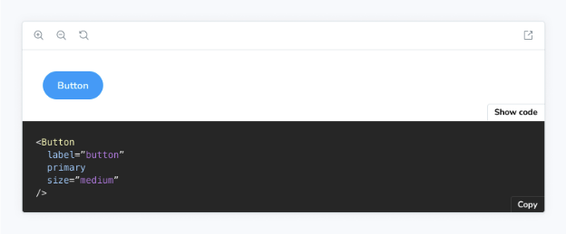

캔버스 블록은 이야기를 래핑하는 역할을 하며, 해당 콘텐츠와 상호작용할 수 있는 툴바를 제공하면서 필요한 소스 스니펫을 자동으로 제공합니다.



MDX에서 Canvas 블록을 사용할 때에는 prop을 사용하여 이야기를 참조합니다:

```js
import { Meta, Canvas } from '@storybook/blocks';
import * as ButtonStories from './Button.stories';

<Meta of={ButtonStories} />

<Canvas of={ButtonStories.Primary} />
```


## 캔버스

```js
import { Canvas } from '@storybook/blocks';
```

### additionalActions

타입:


```js
배열<{
  title: string | JSX.Element;
  className?: string;
  onClick: () => void;
  disabled?: boolean;
}>;
```

기본값: parameters.docs.canvas.additionalActions

오른쪽 하단에 표시할 추가 사용자 정의 작업을 제공합니다. 이들은 onClick 함수에서 지정한 작업을 수행하는 단순한 버튼입니다.

```js
import { Meta, Story, Canvas, SourceState } from '@storybook/blocks';
import * as ButtonStories from './Button.stories';

<Meta of={ButtonStories} />

{/* 추가 작업이 있는 경우 */}
<Canvas
  additionalActions={[
    {
      title: 'GitHub에서 열기',
      onClick: () => {
        window.open(
          'https://github.com/storybookjs/storybook/blob/next/code/ui/blocks/src/examples/Button.stories.tsx',
          '_blank'
        );
      },
    }
  ]}
  of={ButtonStories.Primary}
/>
```


### 클래스 이름

유형: 문자열

기본값: parameters.docs.canvas.className

사용자 지정 스타일링을 위해 미리보기 요소에 제공하는 HTML 클래스(들)입니다.


### 레이아웃

유형: `centered` | `fullscreen` | `padded`

기본값: parameters.layout 또는 parameters.docs.canvas.layout 또는 `padded`

캔버스가 이야기를 배치하는 방식을 지정합니다.


- 중앙정렬: 캔버스 내에서 이야기를 가운데 정렬합니다
- 패딩 추가: (기본값) 이야기에 패딩을 추가합니다
- 전체화면: 패딩 없이 이야기를 표시합니다

Canvas 블록은 parameters.docs.canvas.layout 속성이나 layout 속성 외에도, 이야기가 일반 이야기보기에서 어떻게 레이아웃되는지 정의하는 parameters.layout 값을 존중합니다.

### meta

유형: CSF 파일 내보내기


이야기가 연관된 CSF 파일을 지정합니다.

MDX 파일에 (메타를 통해) 첨부하지 않은 CSF 파일에서 이야기를 렌더링할 수 있습니다. meta 속성을 사용하여 CSF 파일에서 모든 내보내기를 전달하십시오 (기본 내보내기가 아닌!).

```js
import { Meta, Canvas } from '@storybook/blocks';
import * as ButtonStories from './Button.stories';
import * as HeaderStories from './Header.stories';

<Meta of={ButtonStories} />

{/* 이 MDX 파일은 대부분 Button에 관한 것이지만, Header 이야기도 렌더링할 수 있습니다 */}
<Canvas of={HeaderStories.LoggedIn} meta={HeaderStories} />
```

### of


타입: 이야기 내보내기

어떤 이야기 소스가 표시되는지 지정합니다.

### 소스

타입: SourceProps['code'] | SourceProps['format'] | SourceProps['language'] | SourceProps['type']


내부 Source 블록에 전달된 props을 지정합니다. 더 많은 정보는 Source Doc Block 문서를 참조하세요.

### sourceState

유형: `hidden` | `shown` | `none`

기본값: parameters.docs.canvas.sourceState 또는 `hidden`


원본 패널의 초기 상태를 지정합니다.

- hidden: 원본 패널이 기본적으로 숨겨집니다.
- shown: 원본 패널이 기본적으로 표시됩니다.
- none: 원본 패널을 사용할 수 없으며, 표시하는 버튼이 렌더링되지 않습니다.

### 이야기

유형: StoryProps[`inline`] | StoryProps[`height`] | StoryProps[`autoplay`]


내부 스토리 블록에 전달된 속성을 지정합니다. 자세한 내용은 Story Doc Block 문서를 참조하세요.

### withToolbar

타입: 부울

기본값: parameters.docs.canvas.withToolbar


이 스토리와 상호 작용하는 도구가 포함된 툴바를 렌더링할지 여부를 결정합니다.