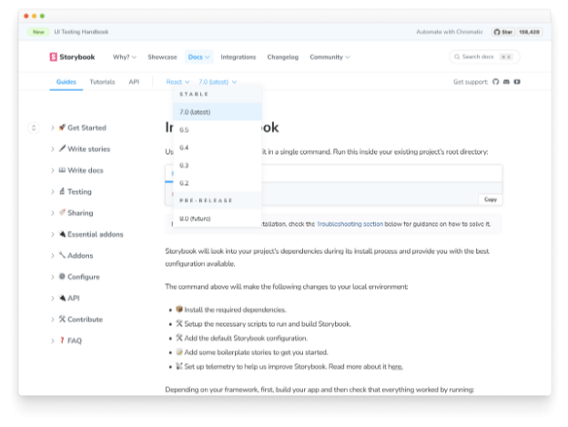

문서화된 프레임워크

Storybook은 다양한 프레임워크에 대한 코드 스니펫을 유지합니다. 프레임워크 API가 진화함에 따라 항상 최신 상태로 유지하려고 노력합니다. 그러나 모든 프레임워크의 모든 API 변경 사항을 계속 추적하는 것은 어렵습니다.

커뮤니티 기여를 환영합니다. 이곳은 우리가 코드 스니펫을 가지고 있는 프레임워크를 보여주는 매트릭스입니다. 여러분의 선호하는 프레임워크에 대한 스니펫을 추가하는 데 도움을 주세요.


## 설정

로컬 환경 안내서를 이미 따라하셨다고 가정하고, 제일 먼저 해야 할 일은 다음 명령을 실행하여 로컬 Storybook 모노리포에 브랜치를 생성하는 것입니다:

```js
git checkout -b code-snippets-for-framework
```

스니펫을 추가하기 전에 선택한 편집기로 docs 폴더를 열어주세요. 스니펫이 어떻게 구성되어 있는지와 내용을 확인하는 등 문서 구조에 익숙해지세요.


Storybook 모노레포의 루트 폴더 안에서 다음 명령어를 실행해주세요:

```js
yarn task
```

옵션으로 "Synchronize documentation (sync-docs)"를 선택하고 프론트페이지 프로젝트 폴더의 경로를 입력해주세요. 이제 모노레포 docs 폴더 안의 모든 파일 변경 사항이 src/content/docs에 반영됩니다.

### 첫 번째 스니펫 추가하기


이제 문서 구조를 익혔으니 코드 조각을 추가하는 시간입니다. 먼저 docs/snippets/ 폴더로 이동하여 원하는 프레임워크(예: ember)를 위한 새 디렉토리를 만드세요.

문서를 찾아 기여하고자 하는 코드 조각을 찾으세요. 예를 들어, 설정 페이지에서 다음과 비슷한 내용을 볼 수 있어요:

```js
<!-- prettier-ignore-start -->

<CodeSnippets
  paths={[
    'react/your-component.js.mdx',
    'react/your-component.ts.mdx',
    'angular/your-component.ts.mdx',
    'vue/your-component.3.js.mdx',
    'svelte/your-component.js.mdx',
    'web-components/your-component.js.mdx',
    'solid/your-component.js.mdx',
    'solid/your-component.ts.mdx',
  ]}
/>

<!-- prettier-ignore-end -->
```

다른 프레임워크와 유사하게 ember/your-component.js.mdx 파일을 생성하고 참조하세요.


```js
<!-- prettier-ignore-start -->

<CodeSnippets
  paths={[
    'react/your-component.js.mdx',
    'react/your-component.ts.mdx',
    'angular/your-component.ts.mdx',
    'vue/your-component.3.js.mdx',
    'svelte/your-component.js.mdx',
    'web-components/your-component.js.mdx',
    'solid/your-component.js.mdx',
    'solid/your-component.ts.mdx',
    'ember/your-component.js.mdx', //👈🏼 생성한 코드 스니펫입니다.
  ]}
/>

<!-- prettier-ignore-end -->
```

나머지 문서도 동일한 작업을 반복해 주세요.

### 작업 미리보기

기여를 제출하기 전에, 작업물을 Storybook 웹사이트에서 확인하는 것을 권장합니다. 이를 통해 문서에 대한 미지의 문제를 방지하고, PR을 제출한 후 유지 보수자가 빠르게 병합할 수 있게 됩니다. 그렇지 않으면, 유지 보수자 중 한 명이 제출한 기여에 문제가 있음을 알릴 것입니다.```


frontpage 레포지토리를 포크한 후 로컬로 클론하세요.

```js
git clone https://github.com/your-username/frontpage.git
```

frontpage 디렉토리로 이동한 후 다음 명령어로 필요한 종속성을 설치하세요:

```js
yarn
```


다음으로 Storybook monorepo에서 동기화 문서(sync-docs) 작업이 실행 중인지 확인하십시오. 그런 다음 Storybook 웹사이트를 시작하려면 다음 명령을 실행하십시오.

```js
yarn start:docs-only
```

브라우저 창을 열어 http://localhost:8000 으로 이동하고 Docs 링크를 클릭한 후 드롭다운에서 프레임워크를 선택하십시오.




문서를 확인하고 작업을 확인해주세요.

## 기여 작업 제출

마지막으로 변경 사항을 커밋하고 푸시한 후 Storybook 모노레포지토리에 풀 리퀘스트를 오픈해주세요. 수행한 작업에 대한 명확한 설명을 추가하고, 유지 보수자 중 한 명이 병합 프로세스를 안내해줄 것입니다.

Storybook에 기여하는 방법을 더 알아보세요.


- 기능 요청 작성을 위한 RFC 프로세스
- 기능 및 버그 수정을 위한 코드
- 새로운 프레임워크로 시작하는 데 도움이 되는 프레임워크
- 문서 개선, 오탈자 및 명확성 관련 문서
- 새로운 코드 스니펫과 예제를 위한 예제