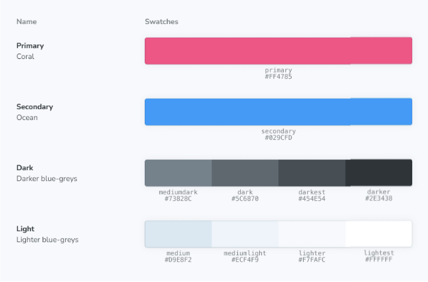

ColorPalette 블록을 사용하면 프로젝트 전체에서 사용되는 색상 관련 항목(예: 색 견본)을 문서화할 수 있어요.



```js
import { Meta, ColorPalette, ColorItem } from '@storybook/blocks';

<Meta title="Colors" />

<ColorPalette>
  <ColorItem
    title="theme.color.greyscale"
    subtitle="Some of the greys"
    colors={ White: '#FFFFFF', Alabaster: '#F8F8F8', Concrete: '#F3F3F3' }
  />
  <ColorItem 
    title="theme.color.primary" 
    subtitle="Coral" 
    colors={ WildWatermelon: '#FF4785' } 
  />
  <ColorItem 
    title="theme.color.secondary" 
    subtitle="Ocean" 
    colors={ DodgerBlue: '#1EA7FD' } 
  />
  <ColorItem
    title="theme.color.positive"
    subtitle="Green"
    colors={
      Apple: 'rgba(102,191,60,1)',
      Apple80: 'rgba(102,191,60,.8)',
      Apple60: 'rgba(102,191,60,.6)',
      Apple30: 'rgba(102,191,60,.3)',
    }
  />
</ColorPalette>
```


```js
import { ColorPalette } from '@storybook/blocks';
```

ColorPalette은 다음과 같은 속성으로 구성되어 있어요:

### children

타입: React.ReactNode


ColorPalette는 ColorItem 자식만 허용합니다.

## ColorItem

```js
import { ColorItem } from '@storybook/blocks';
```

ColorItem은 다음과 같은 props로 구성됩니다:


### 색상

(필수)

유형: string[] | { [key: string]: string }

표시할 색상 목록을 제공합니다. 유효한 CSS 색상 형식(16진수, RGB, HSL 등)을 수용합니다. 객체를 제공할 경우 키는 값 위에 표시됩니다.


### 부제

(필수)

유형: 문자열

색상에 대한 추가 설명을 제공합니다.


### 제목

(필수)

유형: 문자열

표시할 색상의 이름을 설정합니다.