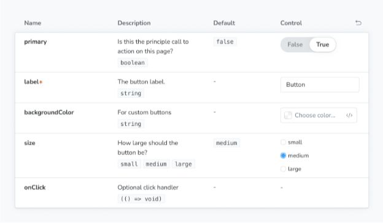

Storybook Controls은 코드를 작성할 필요 없이 컴포넌트의 인수와 상호작용하는 그래픽 UI를 제공합니다. 이는 컴포넌트 예시("스토리") 옆에 애드온 패널을 생성하여 실시간으로 편집할 수 있도록 합니다.

<video autoplay playsinline loop>
  <source src="@source/docs/Tech/2024-04-07-Controls/img/Controls_0.mp4" type="video/mp4">
</video>

Controls는 컴포넌트를 수정할 필요가 없습니다. Controls에 대한 스토리는 다음과 같습니다:

- 편리함: React/Vue/Angular 등 컴포넌트에 기반하여 자동으로 컨트롤을 생성합니다.
- 휴대성: 대화형 스토리를 문서, 테스트 및 디자인에서 재사용할 수 있습니다.
- 풍부함: 컨트롤 및 대화형 데이터를 정확히 필요에 맞게 사용자 정의할 수 있습니다.


Controls 애드온을 사용하려면 args를 사용하여 이야기를 작성해야 합니다. Storybook은 구성 요소에 대한 args와 해당 구성 요소에 대해 추론할 수 있는 정보를 기반으로 UI 컨트롤을 자동으로 생성합니다. 그럼에도 불구하고 argTypes를 사용하여 컨트롤을 더 구성할 수 있습니다. 아래 내용을 참조하세요.

## 컨트롤 유형 선택하기

기본적으로 Storybook은 각 arg에 대해 초기 값에 따라 컨트롤을 선택합니다. 이는 특정 arg 유형(예: boolean 또는 string)과 잘 작동합니다. 이를 활성화하려면 이야기 파일의 기본 내보내기에 구성 요소 주석을 추가하면 되며, 이는 리액트 컴포넌트의 문서 생성기이자 TypeScript에 대한 일류 지원을 포함하는 react-docgen을 사용하여 구성 요소에 대한 일치하는 argTypes를 추론하고 자동으로 생성할 것입니다.

```typescript
import type { Meta } from '@storybook/react';

import { Button } from './Button';

const meta: Meta<typeof Button> = {
  component: Button,
};

export default meta;
```


예를 들어, 이야기에 primary 또는 secondary여야 하는 변수 arg가 있는 경우:

```typescript
// your-framework을 사용하는 프레임워크의 이름으로 교체하세요
import type { Meta, StoryObj } from '@storybook/your-framework';

import { Button } from './Button';

const meta: Meta<typeof Button> = {
  component: Button,
};

export default meta;
type Story = StoryObj<typeof Button>;

export const Primary: Story = {
  args: {
    variant: 'primary',
  },
};
```

기본적으로, Storybook은 variant arg에 대해 자유 텍스트 입력을 렌더링합니다:




자동으로 생성된 텍스트 컨트롤에 유효한 문자열을 입력하면 작동합니다. 하지만 구성 요소가 기본 또는 보조를 변형으로만 허용하기 때문에 우리의 시나리오에는 최적의 UI가 아닙니다. 이를 Storybook의 라디오 구성 요소로 대체해 보겠습니다.

변형 속성에 대한 사용할 컨트롤을 지정할 수 있습니다. 변형은 args의 이름, 설명 및 기본값과 같은 기본 메타데이터를 인코딩하는 사용자 정의 argType를 선언하여 지정할 수 있습니다. 이러한 것들은 Storybook Docs에 의해 자동으로 채워집니다.

ArgTypes에는 사용자가 재정의할 수 있는 임의의 주석도 포함될 수 있습니다. 변형은 구성 요소의 속성이므로 그 주석을 기본 내보내기에 추가해 보겠습니다.

```typescript
// 자신의 프레임워크 이름으로 교체하세요
import type { Meta } from '@storybook/your-framework';

import { Button } from './Button';

const meta: Meta<typeof Button> = {
  component: Button,
  argTypes: {
    variant: {
      options: ['primary', 'secondary'],
      control: { type: 'radio' },
    },
  },
};

export default meta;
```


## 사용자 정의 컨트롤 유형 매처

컨트롤은 arg의 이름으로부터 정규식을 사용하여 자동으로 유추될 수 있지만, 현재는 색상 선택기 및 날짜 선택기 컨트롤에만 해당됩니다. 프로젝트 설정을 위해 Storybook CLI를 사용했다면, 자동으로 .storybook/preview.js에 다음의 기본값이 생성되었어야 합니다:


만약 CLI를 사용하여 구성을 설정하지 않았거나 자체적인 규칙을 정의하려면 controls 매개변수의 matchers 속성을 사용하세요:

```typescript
// 사용 중인 프레임워크에 맞게 (예: react, vue3) your-framework로 바꿔주세요.
import { Preview } from '@storybook/your-framework';

const preview: Preview = {
  parameters: {
    controls: {
      matchers: {
        color: /(background|color)$/i,
        date: /Date$/,
      },
    },
  },
};

export default preview;
```

## 완전히 사용자 정의된 인수

지금까지는 스토리를 작성하는 컴포넌트를 기반으로 자동 생성된 컨트롤만 사용했습니다. 더 복잡한 스토리를 작성하는 경우에는 컴포넌트에 포함되지 않은 인수에 대한 컨트롤을 추가하고 싶을 수 있습니다. 예를 들어, 하위 컴포넌트를 채우기 위해 footer 인수를 사용하는 방법은 이렇습니다:```


```typescript
import type { Meta, StoryObj } from '@storybook/react';

import { Page } from './Page';

type PagePropsAndCustomArgs = React.ComponentProps<typeof Page> & { footer?: string };

const meta: Meta<PagePropsAndCustomArgs> = {
  component: Page,
  render: ({ footer, ...args }) => (
    <Page {...args}>
      <footer>{footer}</footer>
    </Page>
  ),
};
export default meta;

type Story = StoryObj<PagePropsAndCustomArgs>;

export const CustomFooter: Story = {
  args: {
    footer: 'Built with Storybook',
  },
};
```

Storybook는 기본적으로 모든 아규먼트에 대한 컨트롤을 추가합니다. 이 아규먼트는 다음과 같을 때 컨트롤이 추가됩니다:

- 컴포넌트 정의에서 추론할 수 있는 경우 (당신이 사용하는 프레임워크에서 지원하는 경우)
- 스토리에 포함된 아규먼트 목록에 나타나는 경우

argTypes를 사용하면 각 컨트롤의 디스플레이와 동작을 변경할 수 있습니다.```


### 복잡한 값 다루기

원시(primitive) 값이 아닌 값들을 다룰 때, 일부 제한 사항을 만나게 될 것입니다. 가장 분명한 문제는 모든 값이 args 매개변수의 일부로 표현될 수 없다는 것입니다. 이는 해당 상태를 공유하고 깊은 링크(deep link)를 만드는 능력을 상실하게 됩니다. 또한, JSX와 같은 복잡한 값은 (예를 들어, Controls 애드온과 같은) 매니저와 미리보기에서 동기화되지 않을 수 있습니다.

이를 해결하는 한 가지 방법은 arg 값으로 원시 값 (예: 문자열)을 사용하고 렌더링 전에 해당 복잡한 상대값으로 변환하기 위한 사용자 지정 렌더 함수를 추가하는 것입니다. 이는 그것을 하는 가장 좋은 방법은 아니지만 (아래 참조), 확실히 가장 유연한 방법입니다.

```typescript
import type { Meta, StoryObj } from '@storybook/react';

import { YourComponent } from './your-component';

const meta: Meta<typeof YourComponent> = {
  component: YourComponent,
  //👇 특정 argTypes와 옵션을 생성
  argTypes: {
    propertyA: {
      options: ['아이템 하나', '아이템 둘', '아이템 셋'],
      control: { type: 'select' }, // 'options'가 정의되면 자동으로 추론됨
    },
    propertyB: {
      options: ['다른 아이템 하나', '다른 아이템 둘', '다른 아이템 셋'],
    },
  },
};

export default meta;
type Story = StoryObj<typeof YourComponent>;

const someFunction = (valuePropertyA, valuePropertyB) => {
  // 여기서 일부 로직 수행
};

export const ExampleStory: Story = {
  render: (args) => {
    const { propertyA, propertyB } = args;
    //👇 함수 결과를 변수에 할당
    const someFunctionResult = someFunction(propertyA, propertyB);

    return <YourComponent {...args} someProperty={someFunctionResult} />;
  },
  args: {
    propertyA: '아이템 하나',
    propertyB: '다른 아이템 하나',
  },
};
```


함수의 유연성이 필요하지 않은 경우, 렌더링 전에 기본 값들을 복잡한 값들에 매핑하는 간단한 방법은 매핑을 정의하는 것입니다; 게다가, 커스텀 레이블을 구성하기 위해 control.labels를 지정할 수도 있습니다.

```typescript
// 'your-framework'을(를) 사용하는 프레임워크 이름으로 바꿔주세요
import type { Meta } from '@storybook/your-framework';

import { Button } from './Button';

import { ArrowUp, ArrowDown, ArrowLeft, ArrowRight } from './icons';

const arrows = { ArrowUp, ArrowDown, ArrowLeft, ArrowRight };

const meta: Meta<typeof Button> = {
  component: Button,
  argTypes: {
    arrow: {
      options: Object.keys(arrows), // 직렬화 가능한 값의 배열
      mapping: arrows, // 직렬화 가능한 옵션 값들을 복잡한 arg 값들로 매핑
      control: {
        type: 'select', // 'options'를 정의할 때 'select' 유형이 자동으로 추론됩니다
        labels: {
          // 'labels'는 옵션 값들을 문자열 레이블에 매핑합니다
          ArrowUp: '위',
          ArrowDown: '아래',
          ArrowLeft: '왼쪽',
          ArrowRight: '오른쪽',
        },
      },
    },
  },
};

export default meta;
```

주의: mapping과 control.labels은 전체적이지 않아도 됩니다. 현재 선택된 옵션이 목록에 없으면 직렬화되어 사용됩니다.

## 구성


컨트롤 애드온은 두 가지 방법으로 구성할 수 있습니다:

- 개별 컨트롤은 컨트롤 어노테이션을 통해 구성할 수 있습니다.
- 애드온의 모양은 매개변수를 통해 구성할 수 있습니다.

### 어노테이션

위에 나온 대로, 컴포넌트나 스토리의 argTypes 필드에서 "control" 어노테이션을 사용하여 개별 컨트롤을 구성할 수 있습니다. 아래는 사용 가능한 모든 컨트롤을 간략히 설명한 예제와 테이블이 포함되어 있습니다.


```typescript
// 'your-framework'을(를) 사용 중인 이름으로 변경하세요
import type { Meta } from '@storybook/your-framework';

import { Gizmo } from './Gizmo';

const meta: Meta<typeof Gizmo> = {
  component: Gizmo,
  argTypes: {
    canRotate: {
      control: 'boolean',
    },
    width: {
      control: { type: 'number', min: 400, max: 1200, step: 50 },
    },
    height: {
      control: { type: 'range', min: 200, max: 1500, step: 50 },
    },
    rawData: {
      control: 'object',
    },
    coordinates: {
      control: 'object',
    },
    texture: {
      control: {
        type: 'file',
        accept: '.png',
      },
    },
    position: {
      control: 'radio',
      options: ['left', 'right', 'center'],
    },
    rotationAxis: {
      control: 'check',
      options: ['x', 'y', 'z'],
    },
    scaling: {
      control: 'select',
      options: [10, 50, 75, 100, 200],
    },
    label: {
      control: 'text',
    },
    meshColors: {
      control: {
        type: 'color',
        presetColors: ['#ff0000', '#00ff00', '#0000ff'],
      },
    },
    revisionDate: {
      control: 'date',
    },
  },
};

export default meta;
```

### 매개변수

컨트롤은 다음 구성 매개변수를 전역적으로 또는 스토리별로 지원합니다:

#### 각 속성에 대한 전체 설명 보기
```


컨트롤은 Storybook Docs와 동일한 엔진으로 구축되어 있기 때문에 기본적으로 확장된 매개변수 (기본값은 false)를 사용하여 컨트롤 옆에 속성 설명을 표시할 수 있습니다. 이는 컨트롤 패널에 완전한 컨트롤 설명 블록을 포함할 수 있다는 것을 의미합니다. 설명 및 기본값 렌더링은 설명 블록과 동일하게 사용자 정의할 수 있습니다.

전역으로 확장된 모드를 활성화하려면 .storybook/preview.js에 다음을 추가하세요:

```typescript
// 사용 중인 프레임워크에 맞춰 your-framework를 원하는 프레임워크로 대체하세요 (예: react, vue3)
import { Preview } from '@storybook/your-framework';

const preview: Preview = {
  parameters: {
    controls: { expanded: true },
  },
};

export default preview;
```

결과 UI는 다음과 같습니다:


#### 초기 프리셋 색상 샘플 지정

색상 컨트롤에서는 argTypes의 컨트롤 또는 컨트롤 네임스페이스 하위의 매개변수로 presetColors 배열을 지정할 수 있습니다:

```typescript
// 사용 중인 프레임워크에 맞춰 your-framework를 교체하세요 (예: react, vue3)
import { Preview } from '@storybook/your-framework';

const preview: Preview = {
  parameters: {
    controls: {
      presetColors: [{ color: '#ff4785', title: 'Coral' }, 'rgba(0, 159, 183, 1)', '#fe4a49'],
    },
  },
};

export default preview;
```


색상 프리셋은 색상과 제목이 포함된 객체나 간단한 CSS 색상 문자열로 정의할 수 있습니다. 이들은 그 다음에 색상 선택기에서 스와치로 이용할 수 있습니다. 색상 스와치 위에 마우스를 올리면 해당 제목을 볼 수 있습니다. 제목이 지정되지 않은 경우 가장 가까운 CSS 색상 이름으로 기본 설정됩니다.

#### 필터링 컨트롤

특정 경우에 제어 패널에서 제어 항목 중 제한된 개수만 표시하거나 특정 세트를 제외한 나머지를 표시해야 할 수도 있습니다.

이를 가능하게 하려면, 제어 매개변수에서 선택적으로 include와 exclude 구성 필드를 사용할 수 있습니다. 이들은 문자열 배열이나 정규 표현식으로 정의할 수 있습니다.


다음 스토리 조각들을 고려해보세요:

```typescript
// your-framework에는 프레임워크의 이름을 넣으세요
import type { Meta, StoryObj } from '@storybook/your-framework';

import { YourComponent } from './YourComponent';

const meta: Meta<typeof YourComponent> = {
  component: YourComponent,
};

export default meta;
type Story = StoryObj<typeof YourComponent>;

export const ArrayInclude: Story = {
  parameters: {
    controls: { include: ['foo', 'bar'] },
  },
};

export const RegexInclude: Story = {
  parameters: {
    controls: { include: /^hello*/ },
  },
};

export const ArrayExclude: Story = {
  parameters: {
    controls: { exclude: ['foo', 'bar'] },
  },
};

export const RegexExclude: Story = {
  parameters: {
    controls: { exclude: /^hello*/ },
  },
};
```

#### 컨트롤 정렬

기본적으로 컨트롤은 정렬되지 않았으며 args 데이터가 처리되는 순서(없음)를 따릅니다. 또한, arg의 이름으로 알파벳순(알파)이나 필수 arg를 먼저 보여주는 방식으로 정렬할 수 있습니다 (requiredFirst).


다음 스니펫을 사용하여 필수 args를 먼저 나열하도록 강제합니다:

```typescript
// 귀하의 프레임워크 이름으로 'your-framework'를 대체하세요
import type { Meta } from '@storybook/your-framework';

import { YourComponent } from './YourComponent';

const meta: Meta<typeof YourComponent> = {
  component: YourComponent,
  parameters: { controls: { sort: 'requiredFirst' } },
};

export default meta;
```

### 특정 속성에 대한 컨트롤 비활성화

여기에 이미 문서화된 기능 외에도, 컨트롤은 개별 속성에 대해 비활성화할 수 있습니다.


만약 컴포넌트 스토리에서 foo라는 속성의 컨트롤을 끄고 싶다면, 아래 예제를 참고하세요:

```typescript
// 'your-framework'을 사용하는 프레임워크 이름으로 변경해주세요
import type { Meta } from '@storybook/your-framework';

import { YourComponent } from './YourComponent';

const meta: Meta<typeof YourComponent> = {
  component: YourComponent,
  argTypes: {
    // UI에서 제거하고자 하는 속성인 foo
    foo: {
      table: {
        disable: true,
      },
    },
  },
};

export default meta;
```

Storybook UI에서 아래와 같이 변경됩니다:

<video autoplay playsinline loop>
  <source src="@source/docs/Tech/2024-04-07-Controls/img/Controls_1.mp4" type="video/mp4">
</video>


이전 예제에서 표에서 prop 설명을 제거했습니다. 경우에 따라 이것은 괜찮습니다. 그러나 때로는 prop 설명을 컨트롤 없이 렌더링하고 싶을 수도 있습니다. 다음 예제는 이를 설명합니다:

```typescript
// 'your-framework'을 사용 중인 프레임워크 이름으로 바꿔주세요
import type { Meta } from '@storybook/your-framework';

import { YourComponent } from './YourComponent';

const meta: Meta<typeof YourComponent> = {
  component: YourComponent,
  argTypes: {
    // UI에서 제거하려는 속성인 foo
    foo: {
      control: false,
    },
  },
};

export default meta;
```

### 조건부 컨트롤

어떤 경우에는 다른 컨트롤의 값에 따라 컨트롤을 조건부적으로 제외하는 것이 유용할 수 있습니다. Controls는 이러한 경우를 기본적으로 지원하며, if를 사용하여 단순한 쿼리 객체를 가져와 컨트롤을 포함할지 여부를 결정할 수 있습니다.


사용자가 "고급" 토글을 전환하면 "고급" 설정만 표시되는 컬렉션을 고려해보세요.

```typescript
// 'your-framework' 부분은 사용하고 있는 프레임워크의 이름으로 대체하세요
import type { Meta } from '@storybook/your-framework';

import { Button } from './Button';

const meta: Meta<typeof Button> = {
  component: Button,
  argTypes: {
    label: { control: 'text' }, // 항상 컨트롤을 표시
    advanced: { control: 'boolean' },
    // advanced가 true일 때만 활성화됨
    margin: { control: 'number', if: { arg: 'advanced' } },
    padding: { control: 'number', if: { arg: 'advanced' } },
    cornerRadius: { control: 'number', if: { arg: 'advanced' } },
  },
};

export default meta;
```

또는 사용자가 한 컨트롤 값을 설정하는 경우, 사용자가 다른 값을 설정할 수 없는 제약조건을 고려해보세요.

```typescript
// 'your-framework' 부분은 사용하고 있는 프레임워크의 이름으로 대체하세요
import type { Meta } from '@storybook/your-framework';

import { Button } from './Button';

const meta: Meta<typeof Button> = {
  component: Button,
  argTypes: {
    // Label 또는 이미지를 전달할 수 있지만 둘 다는 불가능합니다.
    label: {
      control: 'text',
      if: { arg: 'image', truthy: false },
    },
    image: {
      control: { type: 'select', options: ['foo.jpg', 'bar.jpg'] },
      if: { arg: 'label', truthy: false },
    },
  },
};

export default meta;
```


쿼리 객체는 arg 또는 global target 중 하나를 반드시 포함해야 합니다:

또한 다음 연산자 중 최대 하나를 포함할 수 있습니다:

만약 연산자가 제공되지 않으면, { truthy: true }와 동일합니다.

## API


### 매개변수

본 애드온은 controls 네임스페이스 하위에 다음과 같은 매개변수를 Storybook에 추가합니다:

#### disable

타입: 불리언


이 애드온의 동작을 비활성화하세요. 전체 Storybook에서 이 애드온을 비활성화하려면 addon-essentials를 등록할 때 그렇게 하면 됩니다. 더 많은 정보는 essential addon의 문서를 참조해주세요.

이 매개변수는 보다 구체적인 수준에서 재정의를 허용하는 데 가장 유용합니다. 예를 들어, 이 매개변수를 프로젝트 수준에서 true로 설정하면 메타(컴포넌트) 또는 스토리 수준에서 false로 설정하여 다시 활성화할 수 있습니다.

#### exclude

유형: string[] | 정규식


Controls 애드온 패널에서 제외할 속성을 지정합니다. 이름이 정규식과 일치하거나 배열의 일부인 속성은 제외됩니다. 위의 사용 예시를 참조하세요.

#### expanded

타입: 불리언

각 속성에 대한 전체 설명과 기본값을 포함하여 Controls 애드온 패널에서 모든 문서를 표시합니다. 위의 사용 예시를 참조하세요.


#### 포함

유형: 문자열[] | 정규식

Controls 애드온 패널에 포함할 속성을 지정합니다. 정규식과 일치하지 않거나 배열의 일부가 아닌 속성은 제외됩니다. 위의 사용 예시를 참조하세요.

#### presetColors


Type: (string | { color: string; title?: string })[]

Specify preset color swatches for the color picker control. The color value may be any valid CSS color. See usage example, above.

#### sort

Type: `none` | `alpha` | `requiredFirst`


| 값        | 설명                                                                  |
|-----------|-----------------------------------------------------------------------|
| none      | 컨트롤이 어떻게 정렬되는지를 지정합니다.                                |
| alpha     | 인수 유형의 이름을 기준으로 알파벳순으로 정렬됩니다.                  |
| requiredFirst| 알파벳순과 동일하지만 필수로 지정된 인수 유형이 먼저 표시됩니다.     |