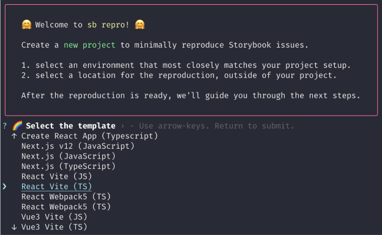
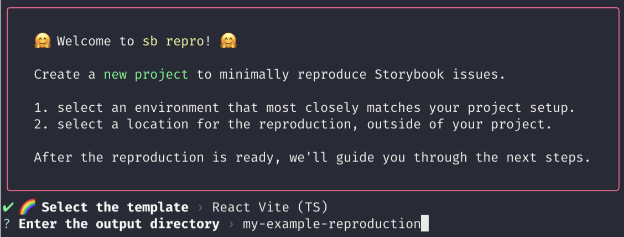
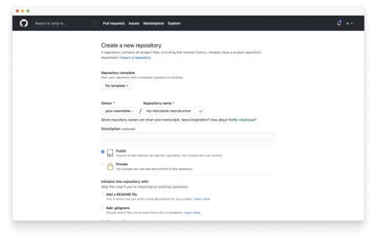
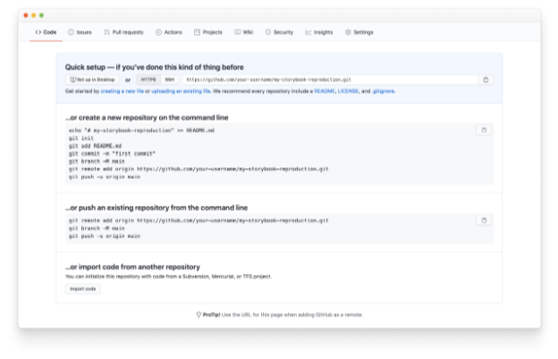

재현 가능한 테스트 케이스는 문제의 원인을 격리하는 데 도움이 되며, 이는 문제를 해결하기 위한 첫 번째 단계입니다! 이 페이지에서는 재현을 생성하는 데 필요한 설정 방법을 안내합니다.

## 왜 재현을 만들어야 할까요?

재현 가능한 테스트 케이스는 버그를 일으키는 특정 조건 세트를 공유하는 훌륭한 방법입니다. 유지보수자와 커뮤니티 모두가 문제의 원인을 확인하고 도와주어 문제를 해결할 수 있도록 좁혀낼 수 있습니다.

## 사전 준비조건


표를 Markdown 형식으로 변경하세요.


| 먼저 내 컴퓨터에 `Yarn`을 설치해주세요.   |
| `GitHub` 계정이 있어야 코드를 호스팅할 수 있습니다. |
| `Chromatic` 계정이 있어야 Storybook을 게시할 수 있습니다. |

## 초기 설정

첫 번째로 터미널을 열고 다음 명령을 실행하세요:


```js
npx storybook@next sandbox
```

다음으로, 사용하고자 하는 템플릿을 선택하세요:



마지막으로, 재현할 위치를 입력하세요:




모든 것이 제대로 작동했다면, 로컬 환경에서 완전히 기능하는 Storybook이 설정되어 있어야 합니다.

## 타사 종속성 및 애드온

코드를 추가하기 전에 필요한 패키지를 설치하고 구성해주세요. 예를 들어 CSS 프레임워크(예: Tailwind)에 문제가 발생하면 해당 프레임워크를 설치하고 구성해주세요.


문제와 관련된 Storybook 애드온(@storybook/addon-a11y 등)을 설치하고 구성하세요.

## 스토리 추가

문제를 빠르게 해결하기 위해 꼭 필요한 최소한의 스토리를 포함하는 것이 좋습니다. 

## 호스트


작업을 완료하면 재현물을 호스팅해야 합니다. GitHub.com에 로그인한 다음 새 저장소를 만드세요.



그런 다음 GitHub의 지침에 따라 저장소를 설정하세요.




## 게시

당신의 재현물을 온라인으로 배포한 후 확인하는 것은 최고의 방법입니다. 우린 Storybook 유지자들이 만든 무료 배포 서비스인 Chromatic을 추천합니다. 이 서비스를 통해 안전하고 안정적으로 클라우드에 재현물을 배포하고 호스팅할 수 있습니다.

### Chromatic 작업 시 유용한 자료

- Storybook 게시
- Chromatic 설정
- 지속적 통합을 통해 Chromatic 자동화


## 이슈 제출하기

마지막으로, Storybook 이슈 트래커에 문제를 작성하고 필수 단계를 따라 문제에 대한 자세한 설명을 제공하세요. 문제 해결을 돕기 위해 GitHub 저장소와 배포된 재현을 추가해주세요.