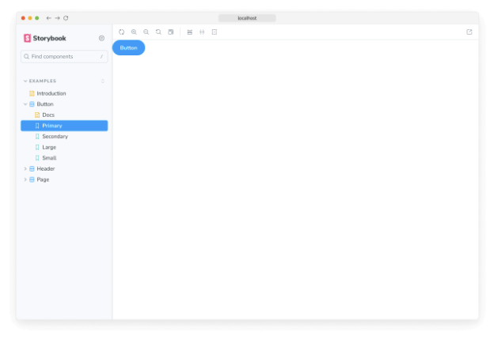
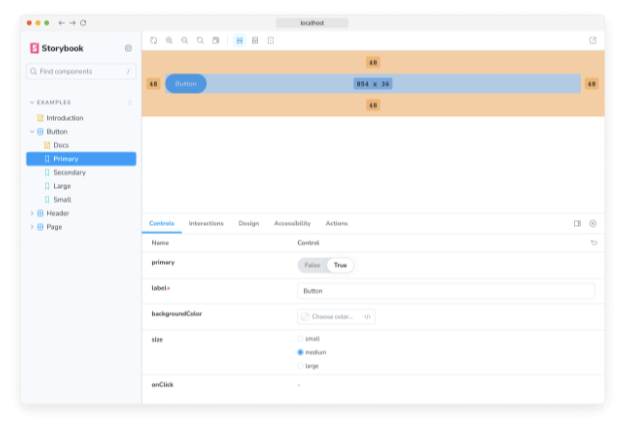

데코레이터는 이야기를 추가 “렌더링” 기능으로 둘러싸는 방법입니다. 많은 애드온은 이야기를 더 많은 렌더링이나 이야기의 렌더링에 대한 세부 정보를 수집하는 데코레이터를 정의합니다.

이야기를 작성할 때 데코레이터는 일반적으로 이야기를 추가 마크업이나 컨텍스트 모킹으로 둘러싸는 데 사용됩니다.

## 추가 마크업으로 이야기 둘러싸기

일부 구성 요소는 유용하게 렌더링하기 위해 “하네스”가 필요할 수 있습니다. 예를 들어, 구성 요소가 가장자리에 바로 달려있으면 Storybook 내부에서 여백을 추가할 수 있습니다. 모든 구성 요소 이야기에 여백을 추가하려면 데코레이터를 사용하세요.




```typescript
import type { Meta } from '@storybook/react';

import { YourComponent } from './YourComponent';

const meta: Meta<typeof YourComponent> = {
  component: YourComponent,
  decorators: [
    (Story) => (
      <div style={ margin: '3em' }>
        {/* 👇 Storybook의 데코레이터는 함수도 허용합니다. <Story/> 대신 Story()로 변경하여 활성화할 수 있습니다. */}
        <Story />
      </div>
    ),
  ],
};

export default meta;
```



## "모의(mocking)"을 위한 "Context"


프레임워크별 라이브러리 (예: Styled Components, Vue용 Fontawesome, Angular의 localize)은 Storybook에서 올바르게 렌더링되도록 추가 구성이 필요할 수 있어요.

예를 들어, React의 Styled Components를 사용하고 있고 컴포넌트가 테마를 사용하는 경우, .storybook/preview.js에 전역 데코레이터를 추가해 활성화하세요. Vue의 경우, Storybook 애플리케이션을 확장하고 라이브러리를 등록하세요. Angular의 경우, polyfills.ts에 패키지를 추가하고 import하세요:

```typescript
import React from 'react';

import { Preview } from '@storybook/react';

import { ThemeProvider } from 'styled-components';

const preview: Preview = {
  decorators: [
    (Story) => (
      <ThemeProvider theme="default">
        {/* 👇 Storybook의 데코레이터에서도 함수를 사용할 수 있어요. <Story/>를 Story()로 바꿔 활성화하세요 */}
        <Story />
      </ThemeProvider>
    ),
  ],
};

export default preview;
```

위의 예시에서 제공된 값은 하드코딩되어 있지만, 스토리 단위로 다르게 설정하거나 (즉, 추가하는 값이 특정 스토리에 관련된 경우) 또는 사용자가 조절할 수 있는 방식(예: 테마 전환기 또는 다른 아이콘 집합 제공)으로 다양하게 설정할 수 있어요.


데코레이터 함수에 전달되는 두 번째 인수는 스토리 컨텍스트이며 특히 다음과 같은 키를 포함합니다:

- args - 스토리 인수입니다. 데코레이터에서 일부 args를 사용하고 스토리 구현 자체에서는 해당 args를 삭제할 수 있습니다.
- argTypes - Storybook의 argTypes을 사용하면 스토리 args를 사용자 정의하고 세부 조정할 수 있습니다.
- globals - Storybook 전역 변수입니다. 특히 툴바 기능을 사용하여 Storybook의 UI를 통해 이러한 값들을 변경할 수 있습니다.
- hooks - Storybook의 API 후크(예: useArgs)입니다.
- parameters - 스토리의 정적 메타데이터로서, 주로 기능 및 애드온의 Storybook 동작을 제어하는 데 사용됩니다.
- viewMode - Storybook의 현재 활성 창(예: 캔버스, 문서)입니다.

### 데이터 제공을 위한 데코레이터 사용

컴포넌트가 "연결"되어 있고 렌더링하기 위해 사전로드된 데이터가 필요한 경우, 데코레이터를 사용하여 해당 데이터를 모의로 제공할 수 있습니다. 컴포넌트를 해당 데이터를 인수로 취할 수 있도록 재구성할 필요 없이 이러한 데이터를 제공할 수 있습니다. 이를 달성하는 여러 기술이 있습니다. 정확히 그 데이터를 로드하는 방법에 따라 Storybook 섹션의 페이지 빌드에서 자세히 알아보세요.


## 스토리 데코레이터

단일 스토리를 위해 데코레이터를 정의하려면, named export의 decorators 키를 사용하세요:

```typescript
import type { Meta, StoryObj } from '@storybook/react';

import { Button } from './Button';

const meta: Meta<typeof Button> = {
  component: Button,
};

export default meta;
type Story = StoryObj<typeof Button>;

export const Primary: Story = {
  decorators: [
    (Story) => (
      <div style={{ margin: '3em' }}>
        {/* 👇 Storybook의 데코레이터는 함수도 허용합니다. 사용하려면 <Story/> 대신 Story()를 사용하세요 */}
        <Story />
      </div>
    ),
  ],
};
```

이렇게 함으로써 스토리가 테스트 중인 컴포넌트의 "순수" 렌더링 유지 및 추가 HTML 또는 컴포넌트가 데코레이터로만 사용되도록 하는 것이 유용합니다. 특히 소스 문서 블록은 이렇게 하면 가장 잘 작동합니다.


## 컴포넌트 데코레이터

컴포넌트의 모든 스토리에 대한 데코레이터를 정의하려면, 기본 CSF 내보내기의 decorators 키를 사용하세요:

```typescript
import type { Meta, StoryObj } from '@storybook/react';

import { Button } from './Button';

const meta: Meta<typeof Button> = {
  component: Button,
  decorators: [
    (Story) => (
      <div style={ margin: '3em' }>
        {/* 👇 Storybook에서 데코레이터도 함수를 사용할 수 있어요. <Story/>를 Story()로 바꾸면 활성화됩니다. */}
        <Story />
      </div>
    ),
  ],
};

export default meta;
```

## 전역 데코레이터


.storybook/preview.js 파일의 decorators 내보내기를 통해 모든 스토리에 대한 데코레이터도 설정할 수 있어요 (여기서 모든 스토리를 구성하는 파일이에요):

```typescript
import React from 'react';

import { Preview } from '@storybook/react';

const preview: Preview = {
  decorators: [
    (Story) => (
      <div style={ margin: '3em' }>
        {/* 👇 Storybook의 데코레이터는 함수도 받아들여요. <Story/>를 Story()로 바꿔 활성화할 수 있어요 */}
        <Story />
      </div>
    ),
  ],
};

export default preview;
```

## 데코레이터 상속

매개변수와 마찬가지로 데코레이터는 전역적으로 정의하거나, 컴포넌트 레벨에서, 그리고 단일 스토리에 대해 정의할 수 있어요 (우리가 본 것처럼).


한 이야기와 관련된 모든 장식자는 이야기를 렌더링한 후 다음 순서대로 실행됩니다:

- 전역 장식자는 정의된 순서대로 실행됩니다.
- 컴포넌트 장식자는 정의된 순서대로 실행됩니다.
- 이야기 장식자는 정의된 순서대로 실행됩니다.