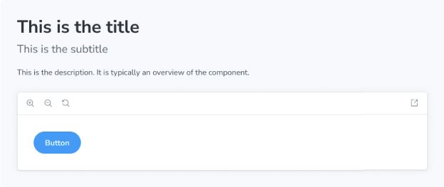

Description 블록은 해당하는 JSDoc 주석에서 가져온 컴포넌트, 스토리 또는 메타의 설명을 표시합니다.



```js
import { Meta, Description } from '@storybook/blocks';
import * as ButtonStories from './Button.stories';

<Meta of={ButtonStories} />

<Description of={ButtonStories.Primary} />
```

## Description


```js
import { Description } from '@storybook/blocks';
```

Description 컴포넌트는 다음과 같은 props으로 구성됩니다:

### of

타입: 스토리 내보내기 또는 CSF 파일 내보내기


설명을 가져올 위치를 지정합니다. 표시할 설명에 따라 이야기 또는 메타를 가리킬 수 있습니다.

설명은 JSDoc 주석이나 매개변수에서 가져오며, 마크다운으로 렌더링됩니다. 자세한 내용은 설명 작성을 참조하세요.

## 설명 작성

원하는 내용에 따라 컴포넌트/이야기의 설명을 작성할 수 있는 여러 위치가 있습니다. 설명은 컴포넌트의 각 이야기를 설명한다고 하면 이야기 수준에서 작성할 수 있고, 컴포넌트를 일반적으로 설명하려면 메타나 컴포넌트 수준에서 작성할 수 있습니다.


JSDoc 주석 위에 이야기, 메타 또는 컴포넌트에 대한 설명을 작성할 수 있습니다. 또한 매개변수에도 지정할 수 있습니다. 주석 대신 매개변수를 통해 이야기를 설명하려면 parameters.docs.description.story에 추가하고, 메타/컴포넌트를 설명하려면 parameters.docs.description.component에 추가하십시오.

설명에 대해선 주석을 사용하는 것을 권장합니다. only use the parameters.docs.description.X properties in situations where comments are not possible to write for some reason, 혹은 Storybook에 표시되는 설명을 주석과 다르게 원할 때에만 매개변수.docs.description.X 속성을 사용하세요. 주석을 사용하면 들여쓰기를 걱정할 필요가 없으며, 다른 개발자들이 이야기/컴포넌트 소스를 탐색하는 데 더 쉽게 발견할 수 있습니다.

이야기를 문서화할 때는 of prop(아래 참조)에서 이야기 내보내기를 참조하고 Description 블록은 다음 순서로 설명을 찾습니다:

- 이야기에서 parameters.docs.description.story 찾기
- 이야기 위의 JSDoc 주석


컴포넌트를 문서화할 때, prop의 meta 내에 있는 meta 내보내기를 참조하고 Description 블록은 다음 순서로 설명을 찾습니다:

- meta에서 parameters.docs.description.component
- meta 위의 JSDoc 주석
- 컴포넌트 위의 JSDoc 주석

이 흐름을 통해 각 시나리오별 설명을 재정의하는 강력한 방법을 제공합니다. 다음 예시를 살펴보세요:

```js
/**
 * # 버튼 컴포넌트
 * 버튼을 보여줍니다
 */
export const Button = () => <button>Click me</button>;
```


```typescript
// Replace your-framework with the name of your framework
import type { Meta, StoryObj } from '@storybook/your-framework';

import { Button } from './Button';

/**
 * # Button stories
 * These stories showcase the button
 */
const meta: Meta<typeof Button> = {
  component: Button
  parameters: {
    docs: {
      description: {
        component: 'Another description, overriding the comments'
      },
    },
  },
};

export default meta;
type Story = StoryObj<typeof Button>;

/**
 * # Primary Button
 * This is the primary button
 */
export const Primary: Story = {
  parameters: {
    docs: {
      description: {
        story: 'Another description on the story, overriding the comments'
      },
    },
  },
};
```

```js
import { Meta, Description } from '@storybook/blocks';
import * as ButtonStories from './Button.stories';

<Meta of={ButtonStories} />

{/* Shows the description for the default export (the meta).
    If that didn't have any comments, it would show the 
    comments from the component instead */}
<Description of={ButtonStories} />

{/* Shows the description for the Primary export */}
<Description of={ButtonStories.Primary} />
```