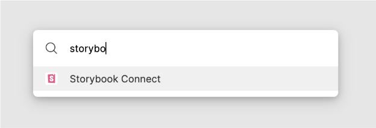
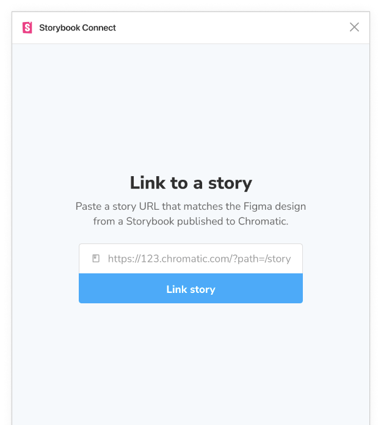
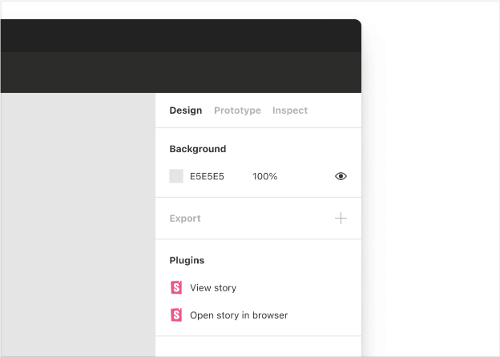
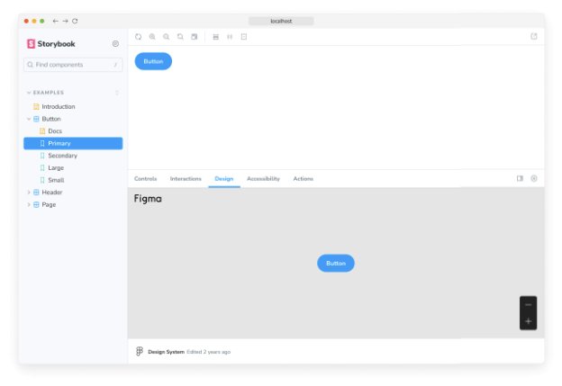
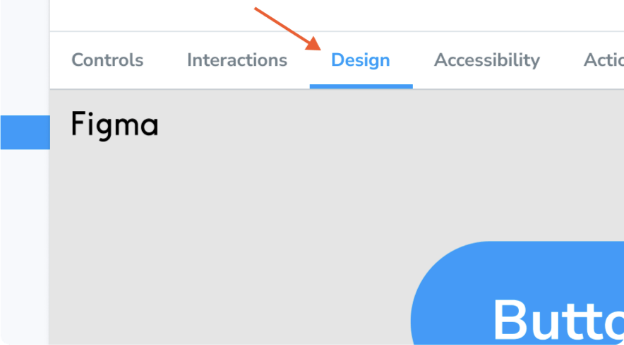
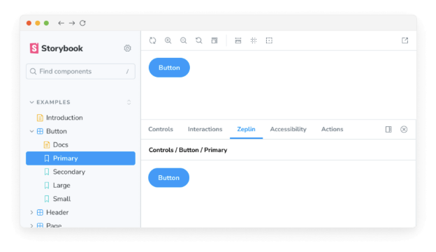
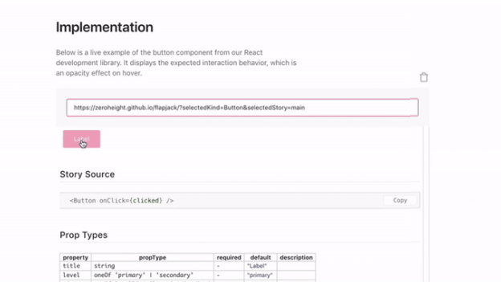
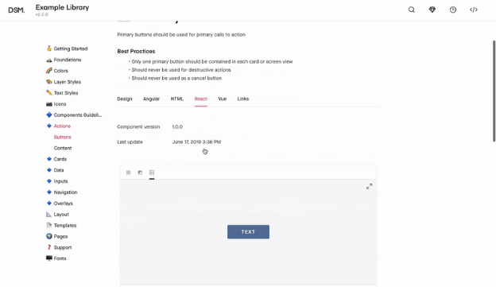

Storybook은 디자인 도구와 통합되어 개발 워크플로우를 가속화합니다. 이를 통해 디자인 프로세스 초기에 불일치를 디버깅하고, 재사용할 수 있는 기존 컴포넌트를 발견하며, 디자인을 이야기와 비교할 수 있습니다.

## Figma

Figma는 협업 가능한 UI 디자인 도구로, 여러 사람이 브라우저에서 동시에 동일한 디자인에 작업할 수 있습니다. Storybook와 Figma를 통합하는 두 가지 방법이 있습니다.

- Figma에 Storybook 임베드
- Storybook에 Figma 임베드


### Figma 플러그인을 사용하여 스토리북을 Figma에 임베드하세요

Storybook Connect은 Figma 플러그인으로서 Figma에 컴포넌트 스토리를 임베드할 수 있게 해줍니다. 이는 스토리북 팀이 만든 Chromatic이라는 발행 도구와 함께 작동합니다.


#### 플러그인 설치하기


시작하기 전에 크로매틱에 Storybook를 발행해야 합니다. 이는 플러그인을 지원하는 인덱스, 버전 및 액세스 제어를 제공합니다.

Storybook Connect로 이동하여 플러그인을 설치하세요.

Figma에서 명령 팔레트를 열고(Mac OS의 경우 Command + /, Windows의 경우 Control + / 사용) Storybook Connect를 입력하여 활성화하세요.




크로매틱과 연결하고 인증하는 방법을 따르세요.

#### 스토리를 Figma 구성 요소에 연결

스토리를 Figma 구성 요소, 변형 및 인스턴스에 연결하세요.

크로매틱에 게시된 스토리북에서 스토리로 이동하세요. 연결하려는 브랜치에 있는지 확인하세요. 그런 다음 스토리의 URL을 복사하세요.


피그마에서 컴포넌트를 선택하고 플러그인을 열어 URL을 붙여넣으세요.



크로매틱은 연결된 스토리를 자동으로 업데이트하여 연결된 브랜치에 최신 Storybook이 게시될 때 반영됩니다. 이는 새 코드를 푸시해도 링크가 지속된다는 의미입니다.

#### 피그마에서 스토리 보기


연결된 후에는 사이드바에서 링크를 클릭해서 이야기를 볼 수 있습니다. "이야기 보기"를 클릭하세요. 다른 방법으로는 명령 팔레트를 사용하여 플러그인을 열 수 있습니다 (Mac OS에서는 Command + /를 사용하고, Windows에서는 Control + /를 사용하십시오) 그런 다음 Storybook Connect를 입력하십시오.



### 추가 기능으로 Storybook에 Figma 내장하기

Designs 추가 기능을 사용하면 Figma 파일 및 프로토타입을 Storybook에 내장할 수 있습니다.




#### 디자인 애드온 설치하기

다음 명령어를 실행하여 애드온을 설치해보세요.

```npm
npm install --save-dev @storybook/addon-designs
```


Storybook 구성을 업데이트하세요 (.storybook/main.js|ts)에 어드온을 추가해주세요.

```typescript
// 사용 중인 프레임워크를 넣어주세요 (예: react-webpack5, vue3-vite)
import type { StorybookConfig } from '@storybook/your-framework';

const config: StorybookConfig = {
  framework: '@storybook/your-framework',
  stories: ['../src/**/*.mdx', '../src/**/*.stories.@(js|jsx|mjs|ts|tsx)'],
  addons: [
    // 다른 Storybook 어드온
    '@storybook/addon-designs', // 👈 어드온은 여기에 등록됩니다
  ],
};

export default config;
```

#### 스토리에 Figma 컴포넌트 연결

Storybook에 포함시키려는 파일을 Figma에서 열어주세요. 파일, 프로토타입, 컴포넌트, 그리고 프레임을 포함할 수 있습니다.


- 파일이나 프로토타입을 포함하려면 파일의 고유 URL을 생성하기 위해 "공유" 버튼을 클릭한 후 "링크 복사"를 클릭하세요.
- 컴포넌트나 프레임을 포함하려면 공유 대화 상자에서 "선택한 프레임에 링크"를 확인하세요. 또는 프레임을 마우스 오른쪽 클릭하고 "복사하여 붙여넣기" » "링크 복사"로 이동하세요.

Storybook에서 스토리에 design이라는 새로운 매개변수를 추가하고 Figma URL을 붙여넣으세요. 예를 들어:

```typescript
import type { Meta, StoryObj } from '@storybook/react';

import { MyComponent } from './MyComponent';

// 자세한 내용은 https://storybook.js.org/docs/writing-stories/#default-export을 확인하세요
const meta: Meta<typeof MyComponent> = {
  component: MyComponent,
};

export default meta;
type Story = StoryObj<typeof MyComponent>;

export const Example: Story = {
  parameters: {
    design: {
      type: 'figma',
      url: 'https://www.figma.com/file/Sample-File',
    },
  },
};
```

#### Storybook에서 디자인 보기


애드온 패널에서 "Design" 탭을 클릭하면 내장된 피그마 디자인을 볼 수 있어요.



## Zeplin

Zeplin은 Sketch, Figma 및 Adobe XD에서 스타일가이드를 생성하는 디자인 도구입니다.


Zeplin 애드온을 사용하여 Storybook을 연결하세요. 이 애드온을 통해 Zeplin에서 디자인을 현재 선택된 스토리와 함께 볼 수 있습니다. 또한, 디자인 이미지를 실제 컴포넌트 위에 겹쳐서 보여주는 편리한 도구도 제공됩니다.

Zeplin의 네이티브 앱은 게시된 Storybooks로의 링크도 지원합니다.



## Zeroheight


제로하이트는 디자인 시스템을 위한 협업 스타일가이드 생성기입니다. 디자인, 코드, 브랜드 및 글쓰기 문서를 한 곳에서 보여줍니다. 사용자들은 WYSIWYG 편집기로 쉽게 해당 문서를 편집할 수 있습니다.

제로하이트는 Storybook과 연동되어 디자인 명세서 옆에 이야기를 삽입할 수 있게 해줍니다.



## UXPin


UXPin은 프로토 타입을 생성하기 위해 제작 코드를 사용하는 대화형 디자인 도구입니다.

UXPin을 사용하면 대화형 이야기를 사용하여 사용자 흐름을 디자인할 수 있습니다.

<video autoplay playsinline loop>
  <source src="@source/docs/Tech/2024-04-07-Designintegrations/img/Designintegrations_1.mp4" type="video/mp4">
</video>

## InVision 디자인 시스템 관리자


InVision DSM은 디자인 시스템 문서화 도구입니다. 이 도구는 디자인 팀이 UX 원칙, 사용자 인터페이스 디자인 및 디자인 토큰을 공유 작업 공간에서 통합할 수 있도록 도와줍니다.

InVision을 사용하면 디자인 시스템 문서에 Storybook을 임베드할 수 있습니다.



## Adobe XD


Adobe XD는 와이어프레임, 상호작용 디자인 및 프로토타입을 만드는 UI 및 UX 디자인 툴입니다.

디자인 애드온을 사용하여 Adobe XD를 Storybook과 통합하세요. 다음 지침을 따라 스토리 옆에 디자인 스펙을 삽입할 수 있습니다.

## 나만의 통합 만들기

통합을 구축하여 Storybook을 확장하고 사용자 정의하세요. Storybook의 하위 수준 API와 통합하거나 UI와 동작을 사용자 정의하기 위해 애드온을 부트스트랩하세요.


- 애드온 문서
- 애드온 튜토리얼 만들기