스토리북은 여러분의 컴포넌트 및 프로젝트의 다른 측면을 문서화하는 데 도움이 되는 여러 가지 문서 블록을 제공합니다.

스토리북에서 문서 블록을 사용하는 두 가지 일반적인 방법이 있습니다. MDX 내부와 문서 페이지 템플릿의 일부로 사용하는 방법입니다.

## MDX 내부에서

이 블록들은 주로 스토리북의 MDX 문서에서 사용됩니다:


```javascript
import { Meta, Primary, Controls, Story } from '@storybook/blocks';
import * as ButtonStories from './Button.stories';

<Meta of={ButtonStories} />

# 버튼

버튼은...

<Primary />

## 속성

<Controls />

## 이야기

### Primary

버튼은 주요할 수 있습니다.

<Story of={ButtonStories.Primary} />

버튼은 중요할 수 있습니다.

<Story of={ButtonStories.Secondary} />

{/* ... */}
```

## 자동 문서 페이지 사용자 정의하기

블록은 자동 문서 페이지의 템플릿을 정의하는 데도 사용됩니다. 예를 들어, 여기에 기본 템플릿이 있습니다:


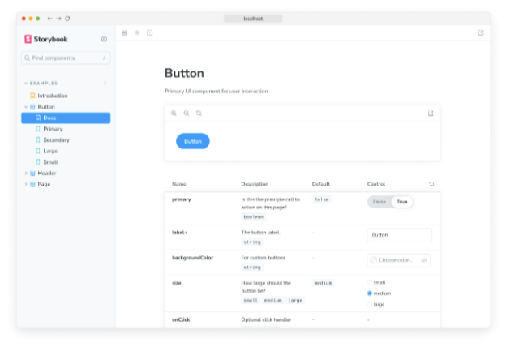

```js
import { Title, Subtitle, Description, Primary, Controls, Stories } from '@storybook/blocks';

export const autoDocsTemplate = () => (
  <>
    <Title />
    <Subtitle />
    <Description />
    <Primary />
    <Controls />
    <Stories />
  </>
);
```

기본 페이지 템플릿을 재정의하면 프로젝트에 완벽한 문서 페이지를 구축하는 데 Doc Blocks를 유사하게 사용할 수 있습니다.

일부 문서 블록은 다른 블록을 렌더링합니다. 예를 들어 `Stories /` 블록은 다음과 같이 확장됩니다:


```js
<Canvas>
  ### 스토리 이름
  <Description />
  <Story />
  <Source />
</Canvas>

{/* ... 각 스토리에 대해 <Canvas>를 반복 */}
```

결과적으로 예를 들어 Source 블록을 매개변수를 통해 사용자 정의하는 경우 (다음 섹션 참조) Canvas 블록의 일부로 렌더링되는 Source 블록도 영향을 받습니다.

## 문서 블록 사용자 정의

MDX 및 자동 문서의 두 사용 사례 모두에서 많은 문서 블록을 매개변수를 통해 사용자 정의할 수 있습니다.


예를 들어, Storybook을 통해 모든 Controls 테이블에서 style 속성을 필터링할 수 있습니다:

```typescript
// 사용 중인 프레임워크(예: react, vue3)로 your-framework을 대체하세요.
import { Preview } from '@storybook/your-framework';

const preview: Preview = {
  parameters: {
    docs: {
      controls: { exclude: ['style'] },
    },
  },
};

export default preview;
```

매개변수를 통해 사용자 정의가 가능한 블록은 아래 사용 가능한 블록 목록에서 표시되어 있습니다.

MDX에서 doc 블록을 사용할 때 props로도 사용자 정의할 수 있습니다.


| Controls exclude={['style']} |

## 사용 가능한 블록

각 블록마다 사용 방법, 사용 가능한 옵션 및 기술적 세부 사항을 설명한 전용 API 참조 페이지가 있습니다.

### ArgTypes


아래는 ComponentOrg의 arg types에 대한 정적 테이블을 보여주는 ArgTypes 블록을 사용할 수 있습니다. 이는 해당 컴포넌트의 인터페이스를 문서화하는 방법입니다.

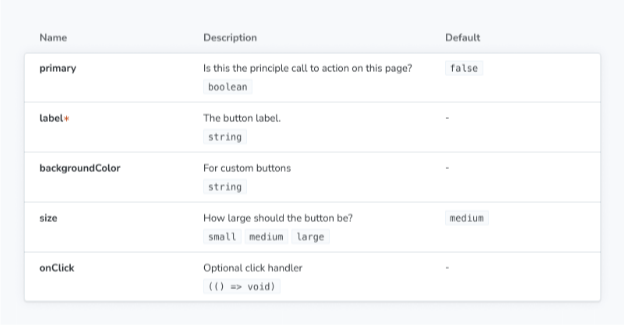

### 캔버스

캔버스 블록은 Story 주변을 감싸주며, 콘텐츠와 상호작용할 수 있는 툴바를 제공하면서 필요한 소스 스니펫을 자동으로 제공합니다.


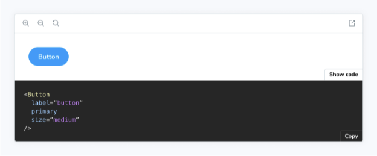

## ColorPalette

ColorPalette 블록은 프로젝트 전체에서 사용되는 모든 색상 관련 항목(예: 색 샘플)을 문서화할 수 있습니다.

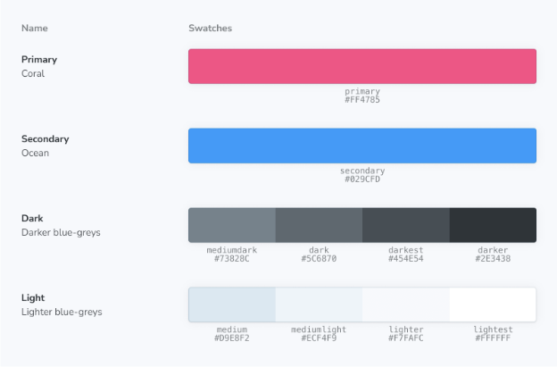


### 컨트롤

컨트롤 블록은 주어진 스토리의 동적 테이블을 보여주는 데 사용할 수 있습니다. 이는 해당 스토리의 인터페이스를 문서화하는 방법이며 (별도로) 렌더링된 스토리(Story 또는 Canvas 블록을 통해)의 args를 변경할 수 있도록 허용합니다.

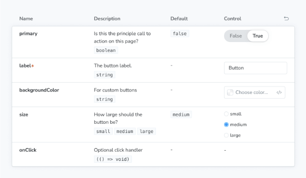

### 설명


Description 블록은 해당 JSDoc 코멘트에서 얻은 컴포넌트, 스토리 또는 메타의 설명을 표시합니다.

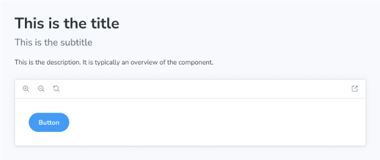

### IconGallery

IconGallery 블록은 프로젝트와 관련된 모든 아이콘을 깔끔한 그리드로 표시하여 빠르게 문서화할 수 있습니다.


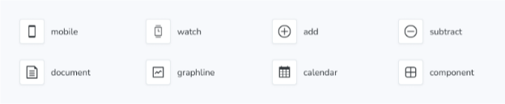

### Markdown

Markdown 블록을 사용하면 MDX 파일에 일반적인 마크다운을 가져와 포함할 수 있습니다.

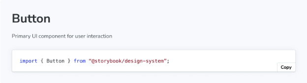
```


### 메타

메타 블록은 컴포넌트 목록 옆에 사용자 지정 MDX 문서 페이지를 첨부하는 데 사용됩니다. 내용을 렌더링하지는 않지만 MDX 파일에서 두 가지 목적을 제공합니다:

- MDX 파일을 컴포넌트와 해당 스토리에 첨부하거나
- 사이드바에 첨부하지 않은 문서 항목의 위치를 제어합니다.

### 프라이머리


주요 블록은 스토리 파일에서 정의된 첫 번째 스토리를 스토리 블록에서 표시합니다. 일반적으로 문서 항목 제목 아래 즉시 렌더링됩니다.

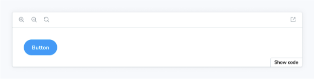

### 소스

소스 블록은 소스 코드 스니펫을 직접 렌더링하는 데 사용됩니다.


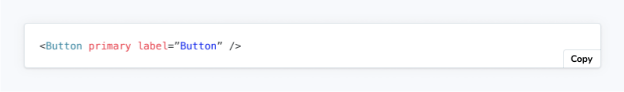

### Stories

The Stories block renders the full collection of stories in a stories file.

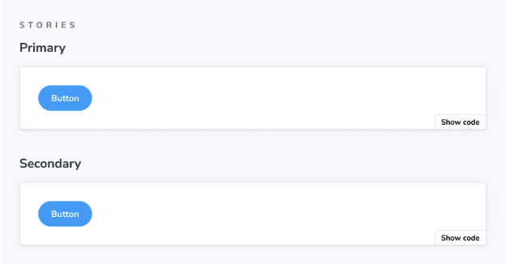


### 이야기

이야기들(컴포넌트 테스트)은 Storybook의 기본적인 구성 요소입니다.

Storybook Docs에서는 MDX 파일의 컨텍스트에서 CSF 파일 내의 이야기들 중 어떤 것이든, 모든 주석(파라미터, args, 로더, 데코레이터, play 함수)가 Story 블록을 사용하여 적용된 상태로 렌더링할 수 있습니다.

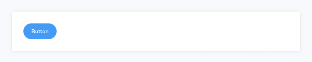


### 부제

부제 블록은 문서 항목의 보조 제목으로 사용할 수 있습니다.


### 제목


Title 블록은 문서 항목의 주요 제목 역할을 합니다. 일반적으로 구성 요소나 페이지 이름을 제공하는 데 사용됩니다.


### Typeset

Typeset 블록은 프로젝트 전체에서 사용된 글꼴을 문서화하는 데 도움이 됩니다.


### 스타일 없음

스타일 없음 블록은 Storybook의 기본 스타일을 제거하는 특별한 블록입니다. 이 블록을 추가하면 MDX 문서에서 Storybook의 기본 스타일을 비활성화할 수 있습니다.

기본적으로 대부분의 요소(예: h1, p 등)는 문서가 잘 보이도록 몇 가지 기본 스타일이 적용됩니다. 그러나 때로는 이러한 스타일을 적용하고 싶지 않은 내용이 있을 수 있습니다. 그럴 경우 내용을 스타일 없음 블록으로 감싸면 기본 스타일이 제거됩니다.


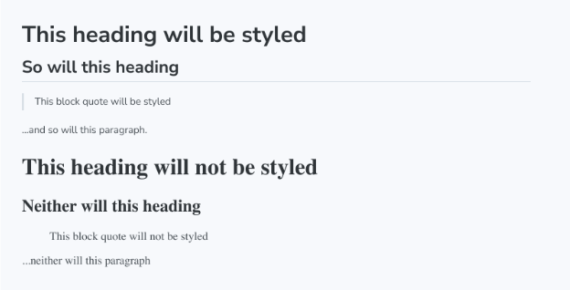

## 나만의 Doc Blocks 만들기

Storybook은 빌트인 블록과 같은 기능을 하는 자신만의 블록을 쉽게 만들 수 있도록 useOf 훅을 제공합니다.

## 문제 해결


### 왜 스토리 내에서 Doc 블록을 사용할 수 없을까요?

Storybook의 Doc 블록은 매우 사용자 지정 가능하고 사용자 정의 문서를 작성하는 데 도움이 되는 구성 요소입니다. 대부분의 경우 파라미터를 통해 사용자 정의하거나 전역적으로 커스텀 문서 템플릿을 생성할 수 있는 기능을 제공하지만, 이러한 블록들은 주로 MDX 파일을 위해 설계되었습니다. 예를 들어, 다음과 같이 ColorPalette 블록을 스토리에 추가하려고 하면 스토리가 Storybook에서 로드될 때 오류 메시지가 표시됩니다.

```typescript
// 'your-framework'을 사용하시는 프레임워크의 이름으로 대체해주세요
import type { Meta, StoryObj } from '@storybook/your-framework';

import { ColorItem, ColorPalette } from '@storybook/blocks';

import { MyComponent } from './MyComponent';

const meta: Meta<typeof MyComponent> = {
  component: MyComponent,
};

export default meta;
type Story = StoryObj<typeof MyComponent>;

const theme = {
  colors: {
    primaryDark: {
      value: '#1C1C1C',
    },
    primaryRegular: {
      value: '#363636',
    },
    primaryLight1: {
      value: '#4D4D4D',
    },
    primaryLight2: {
      value: '#878787',
    },
    primaryLight3: {
      value: '#D1D1D1',
    },
    primaryLight4: {
      value: '#EDEDED',
    },
  },
};

// ❌ 스토리 내에서 Doc 블록을 사용하지 마세요. 암호화된 오류가 발생하여 Storybook이 정상 작동하지 않습니다.
export const Colors: Story = {
  render: () => (
    <ColorPalette>
      {Object.entries(theme.colors).map(([key, { value }]) => (
        <ColorItem
          colors={{
            [key]: value,
          }}
          key={key}
          subtitle={`theme.colors.${key}`}
          title={key}
        />
      ))}
    </ColorPalette>
  ),
};
```

Storybook 문서에 대해 더 알아보세요.


- 스토리 문서화를 위한 Autodocs
- 문서를 사용자 정의하는 MDX
- 문서 작성을 위한 Doc Blocks
- 문서 공개를 자동화하여 문서 게시 프로세스를 자동화