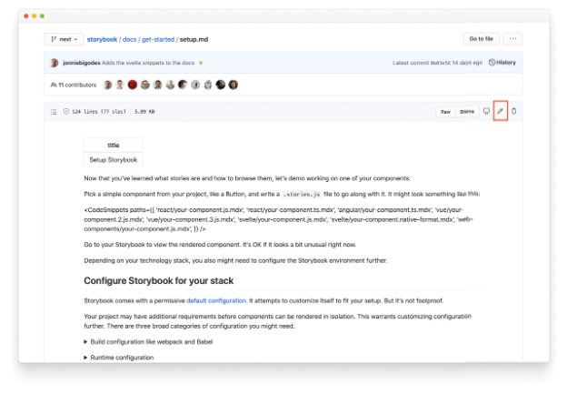

오타를 수정하거나 문서를 수정하는 방법에 대한 내용을 확인할 수 있는 페이지입니다.

## Markdown 파일 찾기

수정하려는 문서의 맨 아래로 스크롤하여 GitHub에서 ✍️ Edit를 클릭하십시오. PR을 환영합니다! 이렇게 하면 GitHub에서 Markdown 파일이 열립니다.

GitHub의 웹 편집기를 사용하려면 우측 상단에 있는 연필 아이콘을 클릭해주세요. 문서를 원하는 대로 조정해보세요.

GitHub의 문서 페이지 아래쪽으로 스크롤하고 변경한 내용과 그 이유를 설명해주세요. "Create a new branch for this commit and start a pull request" 옵션을 선택한 후 "Propose changes" 버튼을 클릭해주세요.

## 풀 리퀘스트 생성

Storybook 리포지토리에서 변경 내용을 설명하고 유지자가 리뷰할 수 있는 추가적인 컨텍스트를 포함한 풀 리퀘스트를 작성해주세요. PR을 제출하면 유지자가 귀하를 지원하여 트리아지 및 병합 프로세스를 안내해 드릴 것입니다.

Storybook에 기여하는 방법에 대해 더 알아보세요

- 기능 요청을 작성하기 위한 RFC 프로세스
- 기능 및 버그 수정을 위한 코드
- 새로운 프레임워크를 시작하는 데 필요한 지침
- 문서 개선, 오타 및 설명을 위한 문서
- 새로운 스니펫과 예제를 위한 예시