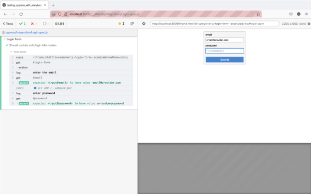

Storybook은 Cypress 및 Playwright와 같은 추가 테스트 프레임워크와 신속하게 통합되어 종합적인 테스트 솔루션을 제공합니다. Component Story Format (CSF)을 활용하여 개발자는 Storybook 환경 내에서 개별 구성 요소의 동작을 검증하는 사용자 상호작용을 시뮬레이션하는 테스트 케이스를 작성할 수 있습니다. 이 접근 방식을 통해 개발자는 서로 다른 시나리오에서 구성 요소의 기능, 반응성 및 시각적 모습을 철저히 테스트하여 더 견고하고 신뢰할 수 있는 애플리케이션을 만들 수 있습니다.

### Cypress와 함께

Cypress는 엔드 투 엔드 테스트 프레임워크입니다. 사용자 동작을 시뮬레이션하여 애플리케이션의 완전한 인스턴스를 테스트할 수 있습니다. Component Story Format을 활용하면 Cypress에서 스토리를 재사용할 수 있습니다. 각 명명된 내보내기(다시 말해, 스토리)는 테스트 설정 내에서 렌더링될 수 있습니다.

Cypress와 Storybook을 사용한 엔드 투 엔드 테스트의 예시로는 로그인 구성 요소를 올바른 입력값으로 테스트하는 것이 있습니다. 예를 들어, 다음과 같은 스토리가 있다면:


```typescript
import type { Meta, StoryObj } from '@storybook/react';

import { userEvent, within, expect } from '@storybook/test';

import { LoginForm } from './LoginForm';

const meta: Meta<typeof LoginForm> = {
  component: LoginForm,
};

export default meta;
type Story = StoryObj<typeof LoginForm>;

export const EmptyForm: Story = {};

/*
 * 자세한 내용은 https://storybook.js.org/docs/writing-stories/play-function#working-with-the-canvas
 * 를 참조하여 canvasElement를 사용하여 DOM을 쿼리하는 방법에 대해 알아보세요
 */
export const FilledForm: Story = {
  play: async ({ canvasElement }) => {
    const canvas = within(canvasElement);

    // 👇 컴포넌트와 상호작용 모방
    await userEvent.type(canvas.getByTestId('email'), 'email@provider.com');

    await userEvent.type(canvas.getByTestId('password'), 'a-random-password');

    // 자세한 내용은 https://storybook.js.org/docs/essentials/actions#automatically-matching-args 를 참조하여 Actions 패널에서 로깅 설정하는 방법 알아보세요
    await userEvent.click(canvas.getByRole('button'));

    // 👇 DOM 구조 확인
    await expect(
      canvas.getByText(
        '모든 것이 완벽합니다. 계정이 준비되었으니 시작할 준비가 되었네요!',
      ),
    ).toBeInTheDocument();
  },
};
```

싸이프레스를 사용하면 다음과 같은 테스트를 작성할 수 있습니다:

```typescript
/// <reference types="cypress" />

describe('로그인 양식', () => {
  it('올바른 로그인 정보를 포함해야 합니다.', () => {
    cy.visit('/iframe.html?id=components-login-form--example');
    cy.get('#login-form').within(() => {
      cy.log('**이메일 입력**');
      cy.get('#email').should('have.value', 'email@provider.com');
      cy.log('**비밀번호 입력**');
      cy.get('#password').should('have.value', 'a-random-password');
    });
  });
});
```

싸이프레스가 테스트를 실행할 때 Storybook의 격리된 iframe을 로드하고 입력 값이 테스트 값과 일치하는지 확인합니다.```




### Playwright로

Playwright는 Microsoft에서 나온 브라우저 자동화 도구이자 엔드 투 엔드 테스팅 프레임워크입니다. 크로스 브라우저 자동화, 장치 에뮬레이션을 통한 모바일 테스팅 및 헤드리스 테스팅을 제공합니다. Component Story Format을 이용하면 Playwright로 스토리를 재사용할 수 있습니다. 각각의 이름 있는 내보내기(다시 말해, 스토리)는 테스트 설정 내에서 렌더링됩니다.

Playwright를 사용하여 사용자 흐름 테스트를 하는 실제 시나리오는 로그인 양식을 유효성 검사하는 방법입니다. 예를 들어, 이미 다음과 같은 스토리가 만들어져 있다면:


```typescript
import type { Meta, StoryObj } from '@storybook/react';

import { userEvent, within, expect } from '@storybook/test';

import { LoginForm } from './LoginForm';

const meta: Meta<typeof LoginForm> = {
    component: LoginForm,
};

export default meta;
type Story = StoryObj<typeof LoginForm>;

export const EmptyForm: Story = {};

/*
 * 자세히 알아보려면 https://storybook.js.org/docs/writing-stories/play-function#working-with-the-canvas 를 참조하세요.
 * 캔버스 엘리먼트를 사용하여 DOM을 쿼리하는 방법에 대해 자세히 알아보세요.
 */
export const FilledForm: Story = {
    play: async ({ canvasElement }) => {
        const canvas = within(canvasElement);

        // 👇 컴포넌트와 상호작용 시뮬레이션
        await userEvent.type(canvas.getByTestId('email'), 'email@provider.com');

        await userEvent.type(canvas.getByTestId('password'), 'a-random-password');

        // https://storybook.js.org/docs/essentials/actions#automatically-matching-args 여기를 참조하여 Actions 패널에서 로깅 설정 방법을 확인하세요.
        await userEvent.click(canvas.getByRole('button'));

        // 👇 DOM 구조 확인
        await expect(
            canvas.getByText(
                'Everything is perfect. Your account is ready and we should probably get you started!',
            ),
        ).toBeInTheDocument();
    },
};
```

Playwright를 사용하면 입력값이 채워지고 스토리와 일치하는지 확인하는 테스트를 작성할 수 있습니다:

```typescript
const { test, expect } = require('@playwright/test');

test('Login Form inputs', async ({ page }) => {
    await page.goto('http://localhost:6006/iframe.html?id=components-login-form--example');
    const email = await page.inputValue('#email');
    const password = await page.inputValue('#password');
    await expect(email).toBe('email@provider.com');
    await expect(password).toBe('a-random-password');
});
```

Playwright를 실행하면 새 브라우저 창이 열리고 Storybook의 격리된 iframe을로드하여 입력값이 지정된 값들을 포함하는지 확인하고 터미널에서 테스트 결과를 표시합니다.```


#### 다른 UI 테스트에 대해 알아보세요

- 테스트 실행을 자동화하는 테스트 러너
- 외관을 위한 시각적 테스트
- 사용성을 위한 접근성 테스트
- 사용자 동작 시뮬레이션을 위한 상호 작용 테스트
- 코드 커버리지를 측정하기 위한 커버리지 테스트
- 렌더링 오류 및 경고를 위한 스냅샷 테스트
- 실제 사용자 시나리오를 시뮬레이션하기 위한 엔드-투-엔드 테스트
- 기능성을 위한 유닛 테스트