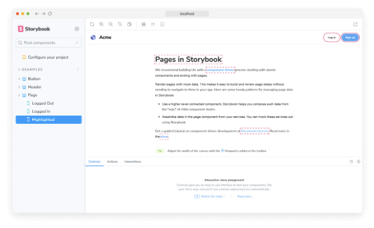

스토리북의 하이라이트 애드온은 컴포넌트를 시각적으로 디버깅하는 데 도움이 되는 유용한 도구입니다. 이 애드온을 독립 애드온으로 사용하거나 접근성 애드온과 같은 다른 애드온을 향상시킬 때 특정 DOM 노드를 강조할 수 있습니다.



## DOM 요소 강조

애드온을 사용하여 DOM 요소를 강조하려면 스토리나 애드온 내에서 HIGHLIGHT 이벤트를 발생해야 합니다. 이벤트 페이로드는 강조할 요소와 매치되는 선택자 배열이 포함된 elements 속성을 할당해야 합니다. 예를 들면:


```typescript
import type { Meta, StoryObj } from '@storybook/react';
import { useChannel } from '@storybook/preview-api';
import { HIGHLIGHT } from '@storybook/addon-highlight';

import { MyComponent } from './MyComponent';

const meta: Meta<typeof MyComponent> = {
  component: MyComponent,
};

export default meta;
type Story = StoryObj<typeof MyComponent>;

export const Highlighted: Story = {
  decorators: [
    (storyFn) => {
      const emit = useChannel({});
      emit(HIGHLIGHT, {
        elements: ['h2', 'a', '.storybook-button'],
      });
      return storyFn();
    },
  ],
};
```

### 강조가 표시된 요소 초기화

기본적으로 Storybook은 이야기 간 전환 시 자동으로 강조된 요소를 제거합니다. 그러나 수동으로 지우는 경우, 이야기나 애드온 내부에서 RESET_HIGHLIGHT 이벤트를 발생시킬 수 있습니다. 예를 들어:

```typescript
import type { Meta, StoryObj } from '@storybook/react';
import { useChannel } from '@storybook/preview-api';
import { HIGHLIGHT, RESET_HIGHLIGHT } from '@storybook/addon-highlight';

import { MyComponent } from './MyComponent';

const meta: Meta<typeof MyComponent> = {
  component: MyComponent,
};

export default meta;
type Story = StoryObj<typeof MyComponent>;

export const ResetHighlight: Story = {
  decorators: [
    (storyFn) => {
      const emit = useChannel({});
      emit(RESET_HIGHLIGHT); //👈 이전에 강조된 요소 제거
      emit(HIGHLIGHT, {
        elements: ['header', 'section', 'footer'],
      });
      return storyFn();
    },
  ],
};
```


## 스타일 사용자 정의

기본적으로 애드온은 이야기에 활성화된 강조된 요소에 표준 스타일을 적용합니다. 그러나 페이로드 객체를 확장하고 색상 및/또는 스타일 속성을 제공함으로써 사용자 지정 스타일을 활성화할 수 있습니다. 예를 들어:

```typescript
import type { Meta, StoryObj } from '@storybook/react';
import { useChannel } from '@storybook/preview-api';
import { HIGHLIGHT } from '@storybook/addon-highlight';

import { MyComponent } from './MyComponent';

const meta: Meta<typeof MyComponent> = {
  component: MyComponent,
};

export default meta;
type Story = StoryObj<typeof MyComponent>;

export const StyledHighlight: Story = {
  decorators: [
    (storyFn) => {
      const emit = useChannel({});
      emit(HIGHLIGHT, {
        elements: ['h2', 'a', '.storybook-button'],
        color: 'blue',
        style: 'double', // 'dotted' | 'dashed' | 'solid' | 'double'
      });
      return storyFn();
    },
  ],
};
```

## API


### 매개변수

이 애드온은 하이라이트 네임스페이스 하에 다음과 같은 매개변수를 Storybook에 추가합니다:

#### disable

유형: 불린(boolean)


이 애드온의 동작을 비활성화하세요. 전체 Storybook에서 이 애드온을 비활성화하려면 addon-essentials을 등록할 때 해야합니다. 더 많은 정보는 essential addon의 문서를 참조해주세요.

이 매개변수는 더 구체적인 수준에서 재정의를 허용하는 데 가장 유용합니다. 예를 들어, 이 매개변수를 프로젝트 수준에서 true로 설정하면, 메타(컴포넌트) 또는 스토리 수준에서 false로 설정하여 다시 활성화할 수 있습니다.

### 내보내기

이 애드온은 Storybook에 다음과 같은 내보내기를 제공합니다:


```js
import { HIGHLIGHT, RESET_HIGHLIGHT } from '@storybook/addon-highlight';
```

#### HIGHLIGHT

타입: 문자열

DOM 요소를 강조하는 이벤트입니다. 이벤트 페이로드는 강조하려는 요소에 매칭되는 선택기 배열로 할당된 elements 속성을 포함해야 합니다. 사용 예시는 위에서 확인하세요.


#### RESET_HIGHLIGHT

유형: 문자열

하이라이트된 요소에서 모든 하이라이트를 지우는 이벤트입니다. 위의 사용 예시를 확인하세요.