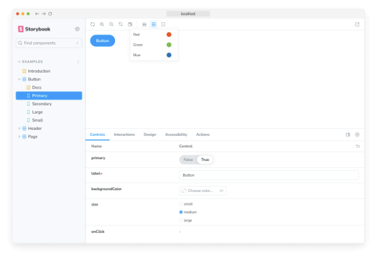

이야기는 UI 구성 요소의 렌더링된 상태를 캡처합니다. 일련의 인수가 주어졌을 때 구성 요소의 동작과 외관을 설명하는 주석이 담긴 객체입니다.

Storybook은 React의 props, Vue의 props, Angular의 @Input 등과 같은 유사한 컨셉을 다룰 때 일반적인 용어로 arguments(args로 약칭)를 사용합니다.

## 이야기를 어디에 넣어야 하는가

컴포넌트의 이야기는 컴포넌트 파일과 함께 위치하는 이야기 파일에 정의됩니다. 이야기 파일은 개발 전용이며, 프로덕션 번들에 포함되지 않습니다.


Button.js | ts | jsx | tsx | vue | svelte
Button.stories.js | ts | jsx | tsx

## 컴포넌트 이야기 형식

우리는 컴포넌트 이야기 형식(CSF)에 따라 이야기를 정의합니다. 이는 컴포넌트를 설명하는 ES6 모듈 기반 표준으로써 작성하기 쉽고 도구 간에 이식성이 좋습니다.

주요 구성 요소는 컴포넌트를 설명하는 default export와 이야기를 설명하는 named exports입니다.```


### 기본 익스포트

기본 익스포트 메타데이터는 Storybook이 스토리를 나열하는 방식을 제어하고 어드온이 사용하는 정보를 제공합니다. 예를 들어, 다음은 Button.stories.js|ts 스토리 파일의 기본 익스포트 예시입니다:

```typescript
import type { Meta } from '@storybook/react';

import { Button } from './Button';

const meta: Meta<typeof Button> = {
  component: Button,
};

export default meta;
```

### 스토리 정의하기


CSF 파일의 named exports를 사용하여 컴포넌트 스토리를 정의하세요. 스토리의 exports에는 UpperCamelCase를 사용하는 것을 권장합니다. "primary" 상태로 Button을 렌더링하고 Primary라는 스토리를 export하는 방법을 보여드리겠습니다.

```typescript
import type { Meta, StoryObj } from '@storybook/react';
import { Button } from './Button';

const meta: Meta<typeof Button> = {
  component: Button,
};

export default meta;
type Story = StoryObj<typeof Button>;

/*
 *👇 렌더링 함수는 컴포넌트가 어떻게 렌더링되는지 제어할 수 있도록 하는 프레임워크별 특징입니다. 
 * 렌더 함수를 사용하는 방법은 https://storybook.js.org/docs/api/csf 를 확인하세요.
 */
export const Primary: Story = {
  render: () => <Button primary label="Button" />,
};
```

#### React Hooks 사용하기

React Hooks는 더 간소한 접근 방식을 사용하여 컴포넌트를 생성하는 편리한 도우미 메서드입니다. 필요한 경우 컴포넌트 스토리를 생성하는 동안에도 사용할 수 있지만, 고급 사용 사례로 다뤄야 합니다. 자신의 스토리를 작성할 때 가능한 한 args를 사용하는 것이 좋습니다. 예를 들어, React Hooks를 사용하여 버튼 상태를 변경하는 스토리가 여기 있습니다:```


```typescript
import React, { useState } from 'react';

import { Meta, StoryObj } from '@storybook/react';

import { Button } from './Button';

const meta: Meta<typeof Button> = {
  component: Button,
};

export default meta;
type Story = StoryObj<typeof Button>;

/*
 * 예제 Button 이야기를 React Hooks와 함께 보여줍니다.
 * 이 예제와 관련된 아래 참고 사항을 참조하세요.
 */
const ButtonWithHooks = () => {
  // 레이블 및 프라이머리 속성을 위한 훅을 설정합니다.
  const [value, setValue] = useState('Secondary');
  const [isPrimary, setIsPrimary] = useState(false);

  // 레이블 값을 변경하는 클릭 핸들러를 설정합니다.
  const handleOnChange = () => {
    if (!isPrimary) {
      setIsPrimary(true);
      setValue('Primary');
    }
  };
  return <Button primary={isPrimary} onClick={handleOnChange} label={value} />;
};

export const Primary: Story = {
  render: () => <ButtonWithHooks />,
};
``` 

### 이야기 이름 변경

필요한 경우 특정 이야기의 이름을 변경할 수 있습니다. 예를 들어, 더 정확한 이름을 지정하려면 다음과 같이 기본 이야기의 이름을 변경할 수 있습니다:

```typescript
import type { Meta, StoryObj } from '@storybook/react';

import { Button } from './Button';

const meta: Meta<typeof Button> = {
  component: Button,
};

export default meta;
type Story = StoryObj<typeof Button>;

/*
 *👇 렌더 함수는 컴포넌트의 렌더링 방식을 제어할 수 있는 프레임워크별 기능입니다.
 * 렌더 함수를 사용하는 방법을 알아보려면 https://storybook.js.org/docs/api/csf를 참조하세요.
 */
export const Primary: Story = {
  name: 'I am the primary',
  render: () => <Button primary label="Button" />,
};
```


이야기는 컴포넌트를 렌더링하는 방법을 설명하는 객체입니다. 컴포넌트 당 여러 개의 이야기가 있을 수 있으며, 이야기를 만드는 가장 간단한 방법은 다른 인수를 사용하여 컴포넌트를 여러 번 렌더링하는 것입니다.

```typescript
import type { Meta, StoryObj } from '@storybook/react';

import { Button } from './Button';

const meta: Meta<typeof Button> = {
  component: Button,
};

export default meta;
type Story = StoryObj<typeof Button>;

/*
 *👇 렌더 함수는 컴포넌트가 어떻게 렌더링되는지 제어할 수 있는 프레임워크별 기능입니다.
 * 렌더 함수를 사용하는 방법을 배우려면 https://storybook.js.org/docs/api/csf 를 참조하세요.
 */
export const Primary: Story = {
  render: () => <Button backgroundColor="#ff0" label="Button" />,
};

export const Secondary: Story = {
  render: () => <Button backgroundColor="#ff0" label="😄👍😍💯" />,
};

export const Tertiary: Story = {
  render: () => <Button backgroundColor="#ff0" label="📚📕📈🤓" />,
};
```


컴포넌트에 적은 스토리가 있는 경우에는 간단하지만, 많은 스토리가 있는 경우에는 반복적일 수 있습니다.

### args 사용하기

컴포넌트의 스토리에 args를 도입하여 이 패턴을 개선할 수 있습니다. 각 스토리를 작성하고 유지하는 데 필요한 보일러플레이트 코드를 줄입니다.

```typescript
import type { Meta, StoryObj } from '@storybook/react';

import { Button } from './Button';

const meta: Meta<typeof Button> = {
  component: Button,
};

export default meta;
type Story = StoryObj<typeof Button>;

export const Primary: Story = {
  args: {
    backgroundColor: '#ff0',
    label: 'Button',
  },
};

export const Secondary: Story = {
  args: {
    ...Primary.args,
    label: '😄👍😍💯',
  },
};

export const Tertiary: Story = {
  args: {
    ...Primary.args,
    label: '📚📕📈🤓',
  },
};
```


컴포넌트 스토리에 args를 도입함으로써, 작성해야 하는 코드 양을 줄일뿐만 아니라 Primary 스토리의 args를 다른 스토리에 전파하여 데이터 중복을 줄일 수도 있습니다.

더불어, 다른 컴포넌트에 대한 스토리를 작성할 때 args를 가져와서 재사용할 수 있으며, 복합 컴포넌트를 구축하는 경우에 유용합니다. 예를 들어 ButtonGroup 스토리를 만들 때, 해당 자식 컴포넌트 Button의 두 가지 스토리를 조합할 수 있습니다.

```typescript
import type { Meta, StoryObj } from '@storybook/react';

import { ButtonGroup } from '../ButtonGroup';

//👇 Button 스토리를 가져옵니다
import * as ButtonStories from './Button.stories';

const meta: Meta<typeof ButtonGroup> = {
  component: ButtonGroup,
};

export default meta;
type Story = StoryObj<typeof ButtonGroup>;

export const Pair: Story = {
  args: {
    buttons: [{ ...ButtonStories.Primary.args }, { ...ButtonStories.Secondary.args }],
    orientation: 'horizontal',
  },
};
```

Button의 시그니처가 변경되면, 새로운 스키마를 반영하기 위해 Button의 스토리만 수정하면 되며, ButtonGroup의 스토리는 자동으로 업데이트됩니다. 이러한 패턴을 사용하면 컴포넌트 계층 구조 전반에서 데이터 정의를 재사용할 수 있어서 스토리를 보다 관리하기 쉽게 만들 수 있습니다.


모든 게 끝이 아니에요! 이야기 함수에서 받은 각각의 args는 Storybook의 컨트롤 패널을 사용하여 실시간으로 편집할 수 있어요. 이것은 팀원들이 Storybook에서 컴포넌트를 동적으로 변경하여 스트레스 테스트를 하고 엣지 케이스를 찾을 수 있다는 걸 의미해요.

<video autoplay playsinline loop>
  <source src="@source/docs/Tech/2024-04-07-Howtowritestories/img/Howtowritestories_0.mp4" type="video/mp4">
</video>

애드온을 사용하면 args를 향상시킬 수 있어요. 예를 들어, Actions는 어떤 args가 콜백인지 자동으로 감지하고 그에 logging 함수를 추가해요. 이렇게 하면 상호작용(예: 클릭)이 액션 패널에 로그로 남게 되요.

<video autoplay playsinline loop>
  <source src="@source/docs/Tech/2024-04-07-Howtowritestories/img/Howtowritestories_1.mp4" type="video/mp4">
</video>


### 플레이 함수 사용하기

Storybook의 플레이 함수와 @storybook/addon-interactions는 사용자 개입이 필요한 컴포넌트 시나리오를 테스트하는 데 편리한 도우미 메서드입니다. 이들은 스토리가 렌더링되면 한 번 실행되는 작은 코드 조각입니다. 예를 들어, 폼 컴포넌트를 유효성 검사하고 싶다면, 다음과 같이 play 함수를 사용하여 입력란에 정보를 입력할 때 컴포넌트의 반응을 확인할 수 있습니다:

```typescript
import type { Meta, StoryObj } from '@storybook/react';
import { userEvent, within, expect } from '@storybook/test';
import { LoginForm } from './LoginForm';

const meta: Meta<typeof LoginForm> = {
  component: LoginForm,
};

export default meta;
type Story = StoryObj<typeof LoginForm>;

export const EmptyForm: Story = {};

/*
 * 자세한 내용은 https://storybook.js.org/docs/writing-stories/play-function#working-with-the-canvas 를 참조하여
 * 캔버스 요소를 사용하여 DOM을 쿼리하는 방법을 알아보세요.
 */
export const FilledForm: Story = {
  play: async ({ canvasElement }) => {
    const canvas = within(canvasElement);

    // 👇 컴포넌트와 상호 작용 모방
    await userEvent.type(canvas.getByTestId('email'), 'email@provider.com');
    await userEvent.type(canvas.getByTestId('password'), 'a-random-password');

    // 자세한 내용은 https://storybook.js.org/docs/essentials/actions#automatically-matching-args 를 참조하시어
    // 액션 패널에 로깅 설정하는 방법을 알아보세요.
    await userEvent.click(canvas.getByRole('button'));

    // 👇 DOM 구조 확인
    await expect(
      canvas.getByText(
        'Everything is perfect. Your account is ready and we should probably get you started!',
      ),
    ).toBeInTheDocument();
  },
};
```

플레이 함수와 @storybook/addon-interactions의 도움 없이는 각 사용 사례 시나리오를 테스트하기 위해 스스로 스토리를 작성하고 컴포넌트와 수동으로 상호 작용해야 했습니다.


### 매개변수 사용하기

매개변수는 스토리북에서 이야기에 대한 정적 메타데이터를 정의하는 방법입니다. 이야기의 매개변수는 스토리나 그룹의 수준에서 다양한 애드온에 구성을 제공하는 데 사용할 수 있습니다.

예를 들어, 앱의 다른 구성 요소들보다 Button 구성 요소를 다른 배경 집합을 대상으로 테스트하려고 한다고 가정해보세요. 컴포넌트 수준의 backgrounds 매개변수를 추가할 수 있습니다:

```typescript
// 사용 중인 프레임워크로 교체하세요 (예: react-webpack5, vue3-vite)
import type { Meta, StoryObj } from '@storybook/your-framework';

import { Button } from './Button';

const meta: Meta<typeof Button> = {
  component: Button,
  // 👇 메타 레벨 매개변수
  parameters: {
    backgrounds: {
      default: 'dark',
    },
  },
};
export default meta;

type Story = StoryObj<typeof Button>;

export const Basic: Story = {};
```




이 매개변수는 Button 스토리가 선택될 때 배경 애드온 자체를 다시 구성하도록 지시합니다. 대부분의 애드온은 매개변수 기반 API를 통해 구성되며 전역, 컴포넌트 및 스토리 수준에서 영향을 받을 수 있습니다.

### 데코레이터 사용

데코레이터는 스토리 렌더링 시 컴포넌트를 임의의 마크업으로 래핑하는 메커니즘입니다. 컴포넌트는 종종 렌더링할 위치에 관한 가정으로 생성됩니다. 스타일은 테마나 레이아웃 래퍼를 예상할 수도 있고, UI는 특정 컨텍스트나 데이터 제공자를 예상할 수도 있습니다.


단순한 예제는 구성 요소 스토리에 패딩을 추가하는 것입니다. 이를 위해 스토리를 패딩이 있는 div로 래핑하는 데코레이터를 사용하여 다음과 같이 수행할 수 있습니다:

```typescript
import type { Meta, StoryObj } from '@storybook/react';

import { Button } from './Button';

const meta: Meta<typeof Button> = {
  component: Button,
  decorators: [
    (Story) => (
      <div style={ margin: '3em' }>
        {/* 👇 Storybook의 데코레이터는 함수도 허용합니다. 사용하려면 <Story/>를 Story()로 바꿔 활성화하세요 */}
        <Story />
      </div>
    ),
  ],
};

export default meta;
```

데코레이터는 더 복잡할 수 있으며 종종 애드온에 의해 제공됩니다. 데코레이터는 스토리, 구성 요소 및 전역 수준에서도 구성할 수 있습니다.

## 두 개 이상의 컴포넌트에 대한 스토리


가끔은 두 개 이상의 구성 요소가 함께 작동하도록 생성된 것이 있을 수 있습니다. 예를 들어, 부모 목록(List) 구성 요소가 있는 경우에는 자식 ListItem 구성 요소가 필요할 수 있습니다.

```typescript
import type { Meta, StoryObj } from '@storybook/react';

import { List } from './List';
const meta: Meta<typeof List> = {
  component: List,
};

export default meta;
type Story = StoryObj<typeof List>;

//👇 항상 빈 목록, 특별히 흥미로운 부분은 없습니다.
export const Empty: Story = {};
```

이러한 경우에는 각 스토리에 대해 다른 함수를 렌더링하는 것이 합리적일 수 있습니다:

```typescript
import type { Meta, StoryObj } from '@storybook/react';

import { List } from './List';
import { ListItem } from './ListItem';

const meta: Meta<typeof List> = {
  component: List,
};

export default meta;
type Story = StoryObj<typeof List>;

export const Empty: Story = {};

/*
 *👇 렌더 함수는 구성 요소가 렌더링되는 방식을 제어하기 위한 특정 프레임워크 기능입니다.
 * 렌더 함수(render functions)를 사용하는 방법에 대해 알아보려면 https://storybook.js.org/docs/api/csf을 확인해보세요.
 */
export const OneItem: Story = {
  render: (args) => (
    <List {...args}>
      <ListItem />
    </List>
  ),
};

export const ManyItems: Story = {
  render: (args) => (
    <List {...args}>
      <ListItem />
      <ListItem />
      <ListItem />
    </List>
  ),
};
```


자식 ListItem에서 이야기 데이터를 List 컴포넌트에서 다시 사용할 수도 있어요. 여러 군데서 업데이트할 필요가 없어서 유지보수하기 쉬워요. 

```typescript
import type { Meta, StoryObj } from '@storybook/react';

import { List } from './List';
import { ListItem } from './ListItem';

//👇 ListItem에서 필요한 스토리를 가져오고 있어요
import { Selected, Unselected } from './ListItem.stories';

const meta: Meta<typeof List> = {
  component: List,
};

export default meta;
type Story = StoryObj<typeof List>;

export const ManyItems: Story = {
  render: (args) => (
    <List {...args}>
      <ListItem {...Selected.args} />
      <ListItem {...Unselected.args} />
      <ListItem {...Unselected.args} />
    </List>
  ),
};
```