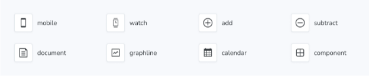

IconGallery 블록은 프로젝트와 관련된 React 아이콘 컴포넌트를 깔끔한 그리드로 표시하여 쉽게 문서화할 수 있습니다.



```js
import { Meta, Title, IconGallery, IconItem } from '@storybook/blocks';

import { Icon as IconExample } from './Icon';

<Meta title="Iconography" />

# 아이콘 그래피

<IconGallery>
  <IconItem name="mobile">
    <IconExample name="mobile" />
  </IconItem>
  <IconItem name="user">
    <IconExample name="user" />
  </IconItem>
  <IconItem name="browser">
    <IconExample name="browser" />
  </IconItem>
  <IconItem name="component">
    <IconExample name="component" />
  </IconItem>
  <IconItem name="calendar">
    <IconExample name="calendar" />
  </IconItem>
   <IconItem name="paintbrush">
    <IconExample name="paintbrush" />
  </IconItem>
   <IconItem name="add">
    <IconExample name="add" />
  </IconItem>
  <IconItem name="subtract">
    <IconExample name="subtract" />
  </IconItem>
   <IconItem name="document">
    <IconExample name="document" />
  </IconItem>
  <IconItem name="graphline">
    <IconExample name="graphline" />
  </IconItem>
</IconGallery>
```

## 아이콘 갤러리


```js
import { IconGallery } from '@storybook/blocks';
```

IconGallery는 다음과 같은 props로 구성되어 있습니다:

### children

타입: React.ReactNode


아이콘 갤러리는 오직 아이콘 아이템 자식 요소만을 예상합니다.

## 아이콘 아이템

```js
import { IconItem } from '@storybook/blocks';
```

아이콘 아이템은 다음과 같은 속성으로 구성됩니다:


### 이름

(필수)

유형: 문자열

아이콘의 이름을 설정합니다.


### children

유형: React.ReactNode

표시할 아이콘을 제공합니다.