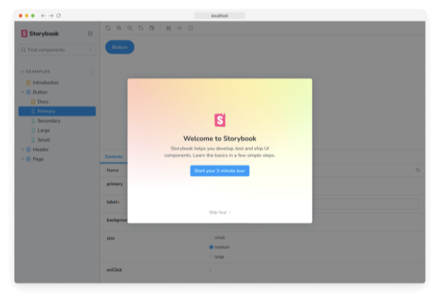
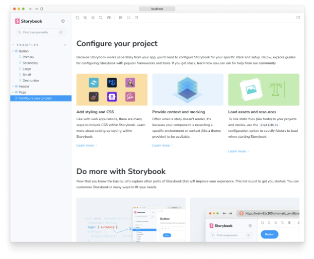

프로젝트 루트 디렉토리 내에서 다음 명령어를 실행하여 Storybook CLI를 한 번에 설치하세요.

```npm
npx storybook@latest init
```

Storybook은 설치 과정에서 프로젝트의 종속성을 확인하고 최적의 구성을 제공해줍니다.

위 명령어를 실행하면 로컬 환경에 다음과 같은 변경 사항이 적용됩니다:

- 📦 필요한 종속성을 설치하세요.
- 🛠 Storybook을 실행하고 빌드하기 위한 필요한 스크립트를 설정하세요.
- 🛠 기본 Storybook 구성을 추가하세요.
- 📝 시작할 수 있는 몇 가지 기본적인 스토리를 추가하세요.
- 📡 우리의 Storybook을 개선하는 데 도움이 되는 텔레미터를 설정하세요. 자세한 정보는 여기에서 확인하세요.

## 설치 마법사 실행

모든 것이 잘 되면, 메인 개념과 기능을 소개하는 설정 마법사가 표시됩니다. UI가 어떻게 구성되는지, 첫 번째 스토리를 작성하는 방법 및 컴포넌트가 다양한 입력에 대해 반응하는 방법을 테스트하는 방법 등을 알려줄 것입니다.



위자드를 건너 뛰었다면 여전히 예제 스토리를 사용할 수 있다면 Storybook 인스턴스의 URL에 `?path=/onboarding` 쿼리 파라미터를 추가하여 언제든지 다시 실행할 수 있어요.

## 스토리북 시작하기

스토리북은 프로젝트 개발에 필요한 모든 기능을 갖춘 내장 개발 서버와 함께 제공됩니다. 시스템 설정에 따라 `storybook` 명령어를 실행하면 로컬 개발 서버가 시작되며 주소가 표시되어 새 브라우저 탭에서 자동으로 해당 주소가 열리면 환영 화면이 나타날 거에요.

```npm
npm run storybook
```



여기 몇 가지 주목할 만한 사항들이 있어요:

- 깊이 있는 구성 및 사용자 정의 옵션에 대한 유용한 링크 모음이 있습니다.
- Storybook 지식을 확장하고 계속 성장하는 Storybook 커뮤니티와 연결될 수 있는 두 번째 링크 모음이 있습니다.
- 시작하는 데 도움이 될 몇 가지 예제 스토리가 있습니다.

이제 Storybook를 성공적으로 설치하고 작동 방식을 이해했으니, 설치 마법사에서 그만 뒀던 곳부터 이어서 이야기 작성에 대해 더 자세히 알아보겠습니다.
