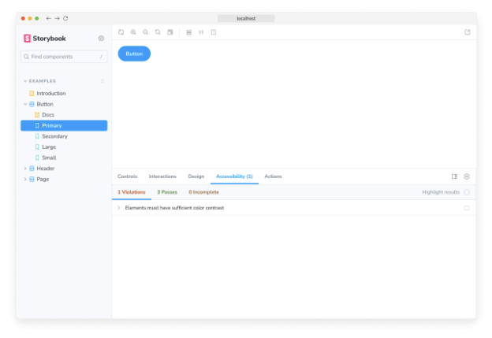

Storybook은 수백 개의 재사용 가능한 애드온이 NPM 모듈로 패키지화된 상태입니다. Storybook을 확장하는 방법을 살펴보기 위해 애드온을 설치하고 등록하는 방법을 알아봅시다.

## 자동 설치

Storybook에는 애드온 설정을 자동화하는 storybook@latest add 명령이 포함되어 있습니다. 이 명령을 사용하여 몇 가지 커뮤니티 주도의 애드온을 추가할 수 있지만, 프리셋 애드온은 제외됩니다. 애드온의 설치 프로세스에 대해 더 자세히 알아보기 위해 애드온 문서를 읽을 것을 권장합니다.

선호하는 패키지 매니저를 사용하여 storybook@latest add 명령을 실행하면 CLI가 Storybook 구성을 업데이트하여 애드온을 포함하고 필요한 종속성을 설치합니다.


```npm
npx storybook@latest add @storybook/addon-a11y
```

### 수동 설치

Storybook 애드온은 항상 .storybook/main.js|ts 파일의 addons 구성 배열을 통해 추가됩니다. 아래 예제는 Storybook에 수동으로 접근성 애드온을 추가하는 방법을 보여줍니다.

선호하는 패키지 매니저와 함께 다음 명령을 실행하여 애드온을 설치하세요.


```npm
npm install @storybook/addon-a11y --save-dev
```

다음으로, .storybook/main.js|ts을 다음과 같이 업데이트하십시오:

```typescript
// 사용 중인 프레임워크 (예: react-webpack5, vue3-vite)로 your-framework을 대체하십시오
import type { StorybookConfig } from '@storybook/your-framework';

const config: StorybookConfig = {
  framework: '@storybook/your-framework',
  stories: ['../src/**/*.mdx', '../src/**/*.stories.@(js|jsx|mjs|ts|tsx)'],
  addons: [
    // 다른 Storybook 애드온
    '@storybook/addon-a11y', //👈 여기에 a11y 애드온 추가
  ],
};

export default config;
```

Storybook을 실행하면 접근성 테스트 애드온이 활성화됩니다.




### 애드온 제거

Storybook에서 애드온을 제거하려면 수동으로 제거하고 구성 파일(즉, .storybook/main.js|ts)에서 해당 애드온을 제거하거나 CLI를 통해 자동으로 제거할 수 있습니다. 예를 들어, CLI를 사용하여 Storybook에서 접근성 애드온을 제거하려면 다음 명령을 실행하세요:

```npm
npx storybook@latest remove @storybook/addon-a11y
```