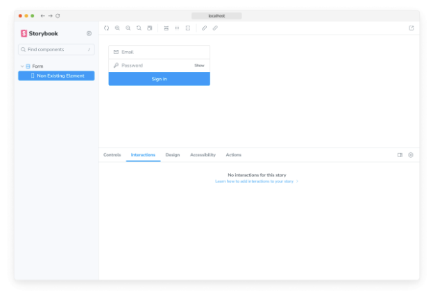

Storybook의 play 기능은 이야기가 렌더링된 후 실행할 수 있는 사용자 상호작용을 시뮬레이트하는 기능을 제공합니다. Interactions 애드온을 사용하면 이러한 상호작용을 시각화하고 디버그할 수 있습니다.

## 상호작용을 위한 play 기능

이야기는 구조화된 방식으로 구성 요소 상태를 격리하고 캡처합니다. 구성 요소를 개발하는 동안 스토리를 빠르게 순환하여 모양과 느낌을 확인할 수 있습니다. 각 스토리는 특정 상태를 재현하는 데 필요한 모든 입력을 지정합니다. 또한 컨텍스트와 API 호출을 모의할 수 있어서 구성 요소의 대부분 사용 사례를 처리할 수 있습니다. 하지만 사용자 상호작용이 필요한 상태는 어떨까요?

예를 들어, 버튼을 클릭하여 대화 상자를 열거나 닫거나, 목록 항목을 끌어서 다시 정렬하거나, 양식을 작성하여 유효성 오류를 확인하는 것과 같은 경우입니다. 이러한 동작을 테스트하려면 구성 요소와 사용자가 상호작용하는 방식으로 상호작용해야 합니다. 대화형 스토리는 play 함수를 사용하여 이러한 상호작용을 자동화할 수 있습니다. 이 함수는 스토리가 렌더링을 마치면 실행되는 작은 코드 조각으로, 사용자가 구성 요소와 상호작용하는 정확한 단계를 에뮬레이트합니다.


### Testing Library 및 Vitest에서 파워를 받았습니다

상호 작용은 @storybook/test라는 패키지를 사용하여 작성됩니다. 이는 Testing Library 및 Vitest의 Storybook에 적용된 버전을 제공합니다. 이를 통해 DOM과 상호 작용하고 확인을 수행하는 데 익숙한 개발자 친화적 구문이 제공되지만 디버깅을 지원하기 위한 추가 텔레메트리가 포함되어 있습니다.

## 상호 작용 애드온 설정하기

기본적으로, 새로운 프로젝트에 Storybook을 추가하면 이미 @storybook/addon-interactions이 설치되고 구성되어 있습니다. 이전 버전의 Storybook에서 마이그레이션하는 경우 수동으로 설치해야 합니다.


다음 명령어를 실행하여 상호작용 애드온 및 관련 종속 항목을 설치하세요.

```npm
npm install @storybook/test @storybook/addon-interactions --save-dev
```

그런 다음, `.storybook/main.js|ts` 파일을 아래와 같이 업데이트하세요.

```typescript
// 사용 중인 프레임워크(예: react-webpack5, vue3-vite)에 맞춰 your-framework를 대체하세요
import type { StorybookConfig } from '@storybook/your-framework';

const config: StorybookConfig = {
  framework: '@storybook/your-framework',
  stories: ['../src/**/*.mdx', '../src/**/*.stories.@(js|jsx|mjs|ts|tsx)'],
  addons: [
    // 다른 Storybook 애드온
    '@storybook/addon-interactions', // 👈 애드온 등록
  ],
};

export default config;
```


이제 Storybook을 실행하면 Interactions 애드온이 활성화됩니다.



## 상호작용 테스트 작성

상호작용은 이야기의 play 함수의 일부로 실행됩니다. 우리는 Testing Library를 사용하여 주요 작업을 처리합니다.


위의 예제에서는 canvasElement를 사용하여 현재 스토리에 대한 요소 쿼리를 범위로 설정합니다. Storybook Docs와 결합할 수 있도록 play 함수가 최종적으로 호환되기를 원한다면 필수적입니다. 또한 step 함수를 사용하여 상호 작용의 레이블이 지정된 그룹을 만들 수 있습니다.

Testing Library 문서에서 자세한 내용을 참고할 수 있지만 Storybook wrapper를 사용할 때는 중요한 세부 사항이 있습니다: 메소드 호출은 await이 필요합니다. 이렇게 하면 디버거를 사용하여 상호작용을 왕복할 수 있습니다.


액션으로 표시된 args는 argTypes 주석이나 argTypesRegex를 사용하여 자동으로 Jest mock 함수(spy)로 변환됩니다. 이를 통해 이러한 함수 호출에 대한 단언을 할 수 있습니다.

## API

### 매개변수

이 애드온은 interactions 네임스페이스 아래 다음 매개변수를 Storybook에 기여합니다.


#### 비활성화

타입: 부울(boolean)

이 애드온의 동작을 비활성화합니다. 전체 Storybook에서 이 애드온을 비활성화하려면 addon-essentials를 등록할 때 해야합니다. 더 많은 정보는 essential 애드온 문서를 확인해주세요.

이 매개변수는 더 구체적인 수준에서 오버라이드를 허용하는 데 가장 유용합니다. 예를 들어, 이 매개변수가 프로젝트 수준에서 true로 설정되면, 메타(component) 또는 스토리 수준에서 false로 설정하여 다시 활성화할 수 있습니다.