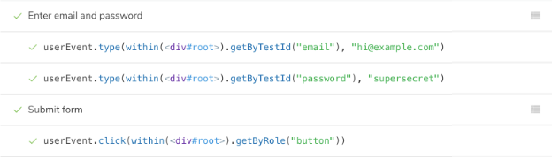
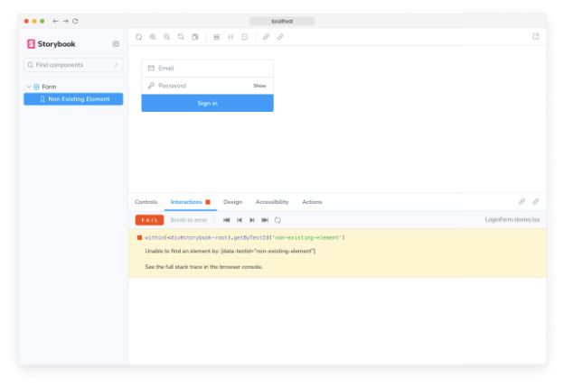
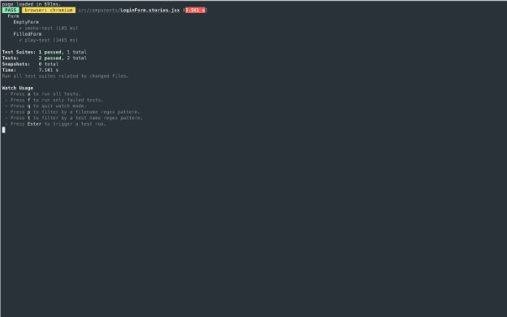

더 복잡한 UI(사용자 인터페이스)인 페이지를 만들 때, 컴포넌트는 UI를 렌더링하는 것 이상의 역할을 맡게 됩니다. 그들은 데이터를 가져오고 상태를 관리합니다. 상호작용 테스트를 통해 UI의 이러한 기능적 측면을 확인할 수 있습니다.

간단히 말해, 컴포넌트의 초기 상태에 적합한 속성을 제공하고, 사용자 클릭이나 양식 작성과 같은 동작을 모방합니다. 마지막으로 UI와 컴포넌트 상태가 올바르게 업데이트되는지 확인합니다.

Storybook에서는 이러한 익숙한 작업 흐름이 브라우저에서 발생합니다. 이렇게 함으로써 컴포넌트 개발 환경과 동일한 환경에서 테스트를 실행하기 때문에 오류를 디버깅하기가 더 쉬워집니다.


## Storybook에서 컴포넌트 테스트는 어떻게 작동하나요?

먼저, 컴포넌트의 초기 상태를 설정하기 위해 이야기를 작성합니다. 그런 다음, play 함수를 사용하여 사용자 동작을 모방합니다. 마지막으로, 테스트 실행기를 사용하여 컴포넌트가 올바르게 렌더링 되는지 확인하고 play 함수로 상호 작용하는 테스트가 통과하는지 확인합니다. 게다가, 명령줄이나 CI 환경에서 테스트 실행을 자동화할 수 있습니다.

- play 함수는 이야기가 렌더링을 마치고 실행되는 작은 코드 조각입니다. 이를 사용하여 사용자 작업을 테스트할 수 있습니다.
- 테스트는 @storybook/test 패키지에서 제공되는 Storybook-instrumented 버전의 Vitest와 Testing Library를 사용하여 작성됩니다.
- @storybook/addon-interactions은 Storybook에서 테스트를 시각화하고 편리한 브라우저 기반 디버깅을 위한 재생 인터페이스를 제공합니다.
- @storybook/test-runner는 Jest와 Playwright를 사용하여 실행되는 독립형 유틸리티로, 모든 인터랙션 테스트를 실행하고 문제가 있는 이야기를 찾습니다.

## 상호작용 애드온 설정하기


Storybook과 상호 작용 테스트를 활성화하려면 올바르게 설정해야 하는 추가 단계가 필요합니다. 나머지 필수 구성을 진행하기 전에 테스트 러너 설명서를 참조하는 것을 권장합니다.

다음 명령을 실행하여 상호 작용 애드온 및 관련 종속성을 설치합니다.

```npm
npm install @storybook/test @storybook/addon-interactions --save-dev
```

Storybook 구성(.storybook/main.js|ts)을 업데이트하여 상호 작용 애드온을 포함하세요.


```typescript
// 사용 중인 프레임워크(예: react-webpack5, vue3-vite)로 테이블 태그를 Markdown 형식으로 변경합니다.
import type { StorybookConfig } from '@storybook/your-framework';

const config: StorybookConfig = {
  framework: '@storybook/your-framework',
  stories: ['../src/**/*.mdx', '../src/**/*.stories.@(js|jsx|mjs|ts|tsx)'],
  addons: [
    // 다른 Storybook 애드온
    '@storybook/addon-interactions', // 👈 애드온 등록
  ],
};

export default config;
```

## 상호 작용 테스트 작성

테스트 자체는 이야기에 연결된 play 함수 내에서 정의됩니다. Storybook과 play 함수를 사용하여 상호 작용 테스트를 설정하는 예시입니다:

```typescript
import type { Meta, StoryObj } from '@storybook/react';

import { userEvent, within, expect } from '@storybook/test';

import { LoginForm } from './LoginForm';

const meta: Meta<typeof LoginForm> = {
  component: LoginForm,
};

export default meta;
type Story = StoryObj<typeof LoginForm>;

export const EmptyForm: Story = {};

/*
 * 캔버스 요소를 사용하여 DOM을 쿼리하는 방법에 대한 자세한 내용은 https://storybook.js.org/docs/writing-stories/play-function#working-with-the-canvas를 확인하세요.
 */
export const FilledForm: Story = {
  play: async ({ canvasElement }) => {
    const canvas = within(canvasElement);

    // 👇 컴포넌트와의 상호 작용 모의
    await userEvent.type(canvas.getByTestId('email'), 'email@provider.com');

    await userEvent.type(canvas.getByTestId('password'), 'a-random-password');

    // Actions 패널에 로깅 설정하는 방법에 대한 자세한 내용은 https://storybook.js.org/docs/essentials/actions#automatically-matching-args를 확인하세요.
    await userEvent.click(canvas.getByRole('button'));

    // 👇 DOM 구조 확인
    await expect(
      canvas.getByText(
        'Everything is perfect. Your account is ready and we should probably get you started!',
      ),
    ).toBeInTheDocument();
  },
};
```


UI에 이야기가로드되면 사용자의 행동을 모방하고 기저 로직을 확인합니다.

<video autoplay playsinline loop>
  <source src="@source/docs/Tech/2024-04-07-Interactiontests/img/Interactiontests_1.mp4" type="video/mp4">
</video>

### 사용자 이벤트용 API

Storybook의 @storybook/test 패키지는 Testing Library의 사용자 이벤트 API를 제공합니다. Testing Library에 익숙하다면 Storybook에서도 익숙할 것입니다.


아래는 사용자 이벤트에 대한 간략한 API입니다. 더 자세한 내용은 공식 사용자 이벤트 문서를 확인해보세요.

### Vitest의 API를 활용한 단언 테스트

Storybook의 @storybook/test는 expect와 vi.fn과 같은 Vitest의 API를 제공합니다. 이러한 API를 사용하면 함수가 호출되었는지, DOM에 요소가 있는지 등을 단언하여 테스트 경험을 향상시킬 수 있습니다. Jest나 Vitest와 같은 테스트 패키지에서 expect를 사용해본 적이 있다면 상호작용 테스트를 거의 동일한 방식으로 작성할 수 있습니다.

```typescript
// 프레임워크의 이름으로 'your-framework'를 대체하세요
import type { Meta, StoryObj } from '@storybook/your-framework';

import { userEvent, waitFor, within, expect, fn } from '@storybook/test';

import { Form } from './Form';

const meta: Meta<typeof Form> = {
  component: Form,
  args: {
    // 👇 'onSubmit' arg에 대한 감시를 위해 `fn`을 사용합니다
    onSubmit: fn(),
  },
};

export default meta;
type Story = StoryObj<typeof Form>;

/*
 * https://storybook.js.org/docs/writing-stories/play-function#working-with-the-canvas
 * 를 참조하여 canvasElement를 사용하여 DOM을 쿼리하는 방법에 대해 자세히 알아보세요
 */
export const Submitted: Story = {
  play: async ({ args, canvasElement, step }) => {
    const canvas = within(canvasElement);

    await step('인증 정보 입력', async () => {
      await userEvent.type(canvas.getByTestId('email'), 'hi@example.com');
      await userEvent.type(canvas.getByTestId('password'), 'supersecret');
    });

    await step('폼 제출', async () => {
      await userEvent.click(canvas.getByRole('button'));
    });

    // 👇 이제 onSubmit arg가 호출되었는지를 단언할 수 있습니다
    await waitFor(() => expect(args.onSubmit).toHaveBeenCalled());
  },
};
```


### 단계 함수를 사용한 그룹 상호작용

복잡한 플로우의 경우, 관련된 상호작용 세트를 그룹화하여 단계 함수를 사용하는 것이 좋습니다. 이를 통해 상호작용 세트를 설명하는 사용자 정의 레이블을 제공할 수 있습니다:

```typescript
// your-framework을 사용하고 있는 프레임워크의 이름으로 바꿔주세요
import type { Meta, StoryObj } from '@storybook/your-framework';

import { userEvent, within } from '@storybook/test';

import { MyComponent } from './MyComponent';

const meta: Meta<typeof MyComponent> = {
  component: MyComponent,
};

export default meta;
type Story = StoryObj<typeof MyComponent>;

/*
 * 캔버스 요소를 사용하여 DOM 쿼리하는 방법에 대해 더 알아보려면
 * https://storybook.js.org/docs/writing-stories/play-function#working-with-the-canvas를 참조하세요
 */
export const Submitted: Story = {
  play: async ({ args, canvasElement, step }) => {
    const canvas = within(canvasElement);

    await step('이메일과 비밀번호 입력', async () => {
      await userEvent.type(canvas.getByTestId('email'), 'hi@example.com');
      await userEvent.type(canvas.getByTestId('password'), 'supersecret');
    });

    await step('양식 제출', async () => {
      await userEvent.click(canvas.getByRole('button'));
    });
  },
};
```

이렇게 하면 접을 수 있는 그룹에 중첩된 상호작용이 표시됩니다:




### 대화형 디버거

상호작용 패널을 확인하면 단계별 흐름을 볼 수 있어요. 또한 일시 정지, 다시 시작, 되감기, 각 상호작용을 거치는 UI 컨트롤을 제공해요.

<video autoplay playsinline loop>
  <source src="@source/docs/Tech/2024-04-07-Interactiontests/img/Interactiontests_2.mp4" type="video/mp4">
</video>


### 재현을 위한 영구 링크

스토리가 렌더링된 후에 play 함수가 실행됩니다. 오류가 발생하면 디버깅에 도움이 되도록 상호작용 애드온 패널에 표시됩니다.

Storybook은 웹앱이기 때문에 URL만 있으면 누구나 추가적인 환경 구성이나 도구가 필요하지 않고 동일한 상세 정보로 오류를 재현할 수 있습니다.




상호작용 테스트를 더욱 간략하게 만들기 위해 pull requests에서 Storybook을 자동으로 게시하도록 설정했습니다. 이렇게 하면 팀이 테스트하고 스토리를 디버깅하는 참조 지점이 생깁니다.

## 테스트 실행 방법 - 테스트 실행기 실행하기

Storybook은 스토리를 보는 동안에만 상호작용 테스트를 실행합니다. 따라서 모든 체크를 실행하려면 각각의 스토리를 확인해야 합니다. Storybook이 커질수록 각 변경 사항을 수동으로 검토하는 것은 현실적이지 않아집니다. Storybook 테스트 실행기는 모든 테스트를 자동으로 실행하여 이 프로세스를 자동화합니다. 테스트 실행기를 실행하려면 새로운 터미널 창을 열고 다음 명령을 실행하십시오:

```npm
npm run test-storybook
```  




## 자동화

코드를 풀 리퀘스트로 푸시할 준비가 되었을 때, 병합하기 전에 Continuous Integration (CI) 서비스를 사용하여 모든 체크를 자동으로 실행하고 싶을 것입니다. 테스트를 실행하는 CI 환경을 설정하는 상세 가이드는 닥문서에서 확인해주세요.

## 문제 해결


### TypeScript 타입이 인식되지 않아요

만약 TypeScript로 상호작용 테스트를 작성 중이라면, IDE에서 TypeScript 타입이 인식되지 않는 상황에 직면할 수 있어요. 이는 새로운 패키지 관리자 (예: pnpm, Yarn)와 그들이 종속성을 모으는 방식과 관련된 알려진 문제에요. Yarn을 사용 중이라면 이 과정이 자동으로 일어나서 타입이 인식될 거에요. 그러나 pnpm을 사용 중이라면 프로젝트 루트에 .npmrc 파일을 생성하고 다음을 추가해야 해요:

```js
public-hoist-pattern[]=@types*
```

문제가 해결되지 않는다면, 프로젝트에 @types/testing-library__jest-dom 패키지를 추가하는 것도 항상 가능해요.


#### 상호 작용 테스트와 시각 테스트의 차이점은 무엇인가요?

상호 작용 테스트는 모든 구성 요소에 대해 일괄적으로 적용하면 유지 관리 비용이 많이 발생할 수 있습니다. 우리는 이를 시각 테스트와 같은 다른 방법과 결합하여 유지 관리 작업을 줄이면서 포괄적인 커버리지를 제공하는 것을 권장합니다.

#### 상호 작용 테스트와 Jest + Testing Library만 사용하는 것의 차이는 무엇인가요?

상호 작용 테스트는 Jest와 Testing Library를 Storybook에 통합하는 것입니다. 가장 큰 장점은 테스트 중인 컴포넌트를 실제 브라우저에서 확인할 수 있다는 것입니다. 이렇게 하면 시각적으로 디버깅하는 데 도움이 되며, 명령줄에서 가짜 DOM 덤프를 받거나 JSDOM이 브라우저 기능을 모방하는 한계에 부딪히는 것을 방지할 수 있습니다. 또한 스토리와 테스트를 하나의 파일에 함께 보관하는 것이 여러 파일에 퍼져 있을 때보다 더 편리합니다.


다른 UI 테스트에 대해 배워보세요

- 테스트 실행을 자동화하는 테스트 러너
- 외관을 확인하는 시각적 테스트
- 접근성을 확인하는 접근성 테스트
- 사용자 행동 시뮬레이션을 위한 상호작용 테스트
- 코드 커버리지를 측정하는 커버리지 테스트
- 렌더링 오류 및 경고를 확인하는 스냅샷 테스트
- 실제 사용자 시나리오를 시뮬레이션하는 end-to-end 테스트
- 기능을 확인하는 단위 테스트