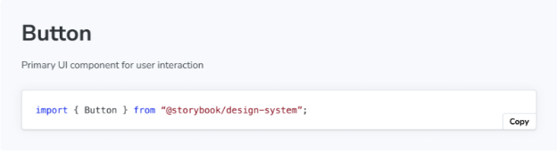

Markdown 블록을 사용하면 MDX 파일에 일반 마크다운을 가져와 포함할 수 있어요.



마크다운 파일을 가져올 때는 가져오는 경로에 ?raw 접미사를 사용하여 콘텐츠가 그대로 가져와지고 평가되지 않도록 해야 해요:

# 버튼

사용자 상호작용을 위한 기본 UI 구성 요소

```js
import { Button } from "@storybook/design-system";
```


```js
// 이렇게 하지 마시고, 에러가 발생합니다
import ReadMe from './README.md';
// 이렇게 하세요, 작동합니다
import ReadMe from './README.md?raw';

import { Markdown } from '@storybook/blocks';

# 헤더

<Markdown>{ReadMe}</Markdown>
```

## 마크다운

```js
import { Markdown } from '@storybook/blocks';
```

마크다운은 다음 속성과 함께 구성되어 있습니다:```


### 자식 요소

유형: 문자열

해석하고 표시할 마크다운 형식의 문자열을 제공합니다.

### 옵션


마크다운을 JSX로 변환하는 라이브러리에 전달되는 옵션을 지정합니다.

## 직접 마크다운을 가져오지 않는 이유는 무엇인가요?

순수하게 기술적인 측면에서, 우리는 이렇게 MDX 파일에 가져온 마크다운을 직접 포함시킬 수 있습니다:

```js
import ReadMe from './README.md';

# 제목

{ReadMe}
```


그러나 일반 마크다운과 MDX2 사이에는 작은 구문 차이가 있습니다. MDX2는 더 엄격하며 특정 콘텐츠를 JSX 표현식으로 해석합니다. 다음은 완벽히 유효한 마크다운 파일의 예시이며, 이를 MDX2가 직접 처리하면 오류가 발생할 수 있습니다:

```js
{ 일반 마크다운 파일에서는 유효하지만, MDX2는 이를 표현식으로 평가하려고 할 것입니다 }

<이것 또한 유효합니다. 그러나 MDX2는 이를 JSX 컴포넌트로 인식합니다 />
```

또한, MDX2는 새 줄에 있는 모든 문자열을 p 태그나 비슷한 태그로 감싸므로, 일반 .md 파일과 .mdx 파일 사이에 콘텐츠가 다르게 렌더링됩니다.

```js
<div>
  일부 텍스트
</div>

위의 예시는 일반 마크다운에서 그대로 유지되지만, MDX2는 이를 컴파일하여 다음과 같이 만듭니다:

# 제목

<div>
  <p>일부 텍스트</p>
</div>
```