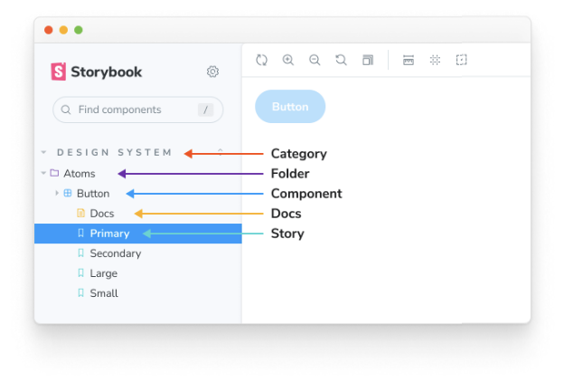
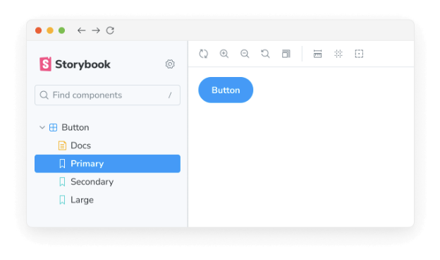
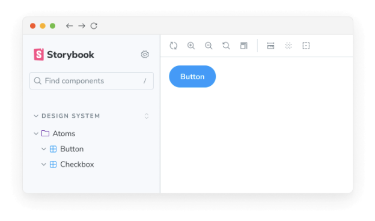
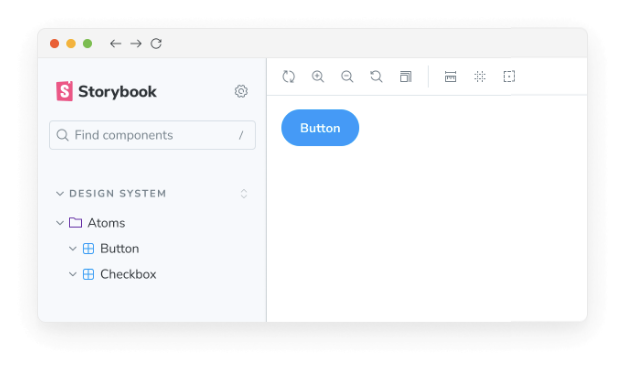

Storybook은 이야기를 구성하고 필요한 도구를 제공하여 이야기를 분류하고 조직의 요구사항과 선호에 따라 이야기를 검색하고 필터링할 수 있는 강력한 방법을 제공합니다.

## 구조와 계층

Storybook을 구성할 때 이야기를 구조화하는 두 가지 방법이 있습니다: 암시적 방법과 명시적 방법. 암시적 방법은 이야기의 물리적 위치에 의존하여 사이드바에 순서를 매기는 것을 의미하며, 명시적 방법은 제목 매개변수를 활용하여 이야기를 배치하는 것을 의미합니다.




Storybook을 구조화하는 방식에 따라 이야기 계층 구조가 다양한 부분으로 구성되어 있음을 확인할 수 있습니다:

- 카테고리: Storybook에서 생성된 이야기와 문서 페이지를 상위 그룹화하는 단위
- 폴더: 사이드바에 구성 요소와 이야기를 그룹화하는 중간 단계의 조직 단위로, 애플리케이션의 기능이나 섹션을 나타냄
- 구성 요소: 스토리가 테스트하는 구성 요소를 나타내는 하위 조직 단위
- 문서: 구성 요소에 대해 자동으로 생성된 문서 페이지
- 이야기: 특정 구성 요소 상태를 테스트하는 개별 이야기

## 이야기 명명

이야기를 만들 때, 타이틀 매개변수를 명시적으로 사용하여 사이드바에서 이야기의 위치를 정의할 수 있습니다. 또한 관련된 구성 요소를 확장 가능한 인터페이스에서 그룹화하는 데 사용하여 Storybook 구성을 돕고 사용자에게 더 직관적인 경험을 제공할 수 있습니다. 예시:


```typescript
// 'your-framework'을 사용하는 framework 이름으로 변경하세요
import type { Meta } from '@storybook/your-framework';

import { Button } from './Button';

const meta: Meta<typeof Button> = {
  /* 👇 title 속성은 옵션입니다.
   * 자동 제목을 생성하는 방법은 https://storybook.js.org/docs/configure/#configure-story-loading
   * 에서 확인해보세요.
   */
  title: 'Button',
  component: Button,
};

export default meta;
```

아래와 같이 나타납니다:



## Grouping


관련 컴포넌트를 확장 가능한 인터페이스로 묶어 Storybook 조직을 돕는 것도 가능합니다. 이를 위해서는 /를 구분자로 사용하세요:

```typescript
// your-framework을 사용하는 framework의 이름으로 바꿔주세요
import type { Meta } from '@storybook/your-framework';

import { Button } from './Button';

const meta: Meta<typeof Button> = {
  /* 👇 title 속성은 선택 사항입니다.
   * 자동 제목 생성 방법은 https://storybook.js.org/docs/configure/#configure-story-loading
   * 에서 확인할 수 있습니다.
   */
  title: 'Design System/Atoms/Button',
  component: Button,
};

export default meta;
```

```typescript
// your-framework을 사용하는 framework의 이름으로 바꿔주세요
import type { Meta } from '@storybook/your-framework';

import { CheckBox } from './CheckBox';

const meta: Meta<typeof CheckBox> = {
  /* 👇 title 속성은 선택 사항입니다.
   * 자동 제목 생성 방법은 https://storybook.js.org/docs/configure/#configure-story-loading
   * 에서 확인할 수 있습니다.
   */
  title: 'Design System/Atoms/Checkbox',
  component: CheckBox,
};

export default meta;
```

이렇게 나옵니다:




## 루트

기본적으로 상위 단계 그룹은 스토리북 UI에서 "루트"로 표시됩니다 (즉, 대문자로 표시된, 확장할 수 없는 항목입니다). 필요한 경우 Storybook을 구성하여이 동작을 비활성화 할 수 있습니다. 사용자에게 간소화된 경험을 제공해야하는 경우 유용합니다. 그러나 여러 컴포넌트 스토리로 구성된 큰 Storybook이 있는 경우 파일 계층 구조에 따라 컴포넌트의 이름을 지정하는 것이 좋습니다.

## 단일 스토리 호이스팅


단일 스토리 컴포넌트(즉, 형제 없는 컴포넌트 스토리)는 표시 이름이 컴포넌트 이름(타이틀의 마지막 부분)과 정확히 일치하는 경우 UI에서 부모 컴포넌트를 대체하기 위해 자동으로 호이스팅됩니다. 예를 들어:

```typescript
// 'your-framework'을 사용하고 있는 프레임워크의 이름으로 대체하세요
import type { Meta, StoryObj } from '@storybook/your-framework';

import { Button as ButtonComponent } from './Button';

const meta: Meta<typeof ButtonComponent> = {
  /* 👇 title 속성은 선택 사항입니다.
   * 자동 제목 생성 방법에 대해 알아보려면 https://storybook.js.org/docs/configure/#configure-story-loading 를 참조하세요
   */
  title: 'Design System/Atoms/Button',
  component: ButtonComponent,
};

export default meta;
type Story = StoryObj<typeof ButtonComponent>;

// 이 파일에서 유일하게 명명된 내보내기가 있으며, 컴포넌트 이름과 일치합니다
export const Button: Story = {};
```



스토리 내보내기는 자동으로 "start cased"로 변환됩니다(myStory는 "My Story"가 됨). 따라서 컴포넌트 이름은 해당 이름과 일치해야 합니다. 또는 컴포넌트 이름과 일치하도록 myStory.storyName = `...`을 사용하여 스토리 이름을 재정의할 수 있습니다.


## 이야기 정렬

Storybook은 기본적으로 이야기를 가져온 순서대로 정렬합니다. 그러나 preview.js 파일의 options 매개변수에 storySort를 추가하여 이 패턴을 사용자 정의하여 더 직관적인 경험을 제공할 수 있습니다.

```typescript
// 사용 중인 프레임워크에 맞게 ‘your-framework’를 해당 프레임워크로 바꿉니다 (예: react, vue3)
import { Preview } from '@storybook/your-framework';

const preview: Preview = {
  parameters: {
    options: {
      // 이 함수의 ‘a’와 ‘b’ 매개변수의 타입은 ‘import('@storybook/types').IndexEntry’입니다. 이 함수가 JavaScript 환경에서 실행되므로 IntelliSense를 위해 JSDoc을 사용해야 합니다.
      storySort: (a, b) =>
        a.id === b.id ? 0 : a.id.localeCompare(b.id, undefined, { numeric: true }),
    },
  },
};

export default preview;
```

storySort는 구성 객체도 수용할 수 있습니다.


```typescript
// 사용 중인 프레임워크(예: react, vue3)로 변경하세요
import { Preview } from '@storybook/your-framework';

const preview: Preview = {
  parameters: {
    options: {
      storySort: {
        method: '',
        order: [],
        locales: '',
      },
    },
  },
};

export default preview;
```

이야기들을 알파벳 순으로 정렬하려면 method를 `alphabetical`로 설정하고 선택적으로 로케일 문자열을 설정하세요. 사용자 정의 목록을 사용하여 이야기들을 정렬하려면 order 배열을 사용하세요. order 목록에 포함되지 않는 이야기들은 목록 항목 뒤에 나타납니다.

order 배열은 중첩 배열을 허용하여 2단계 이야기 종류를 정렬할 수 있습니다. 예를 들어:

```typescript
// 사용 중인 프레임워크(예: react, vue3)로 변경하세요
import { Preview } from '@storybook/your-framework';

const preview: Preview = {
  parameters: {
    options: {
      storySort: {
        order: ['Intro', 'Pages', ['Home', 'Login', 'Admin'], 'Components'],
      },
    },
  },
};

export default preview;
```


위의 이야기 정렬 순서가 다음과 같이 결정됩니다:

- 소개 그리고 소개/ * 이야기
- 페이지 이야기
- 페이지/홈 및 페이지/홈/ * 이야기
- 페이지/로그인 및 페이지/로그인/ * 이야기
- 페이지/관리자 및 페이지/관리자/ * 이야기
- 페이지/ * 이야기
- 컴포넌트 및 컴포넌트/ * 이야기
- 그 외 모든 이야기

특정 카테고리를 목록의 끝에 정렬하려면 * 를 순서 배열에 삽입하여 "그 외 모든 이야기"가 어디에 위치해야 하는지를 나타낼 수 있습니다:

```typescript
// 'your-framework'은 사용 중인 프레임워크로 대체하세요 (예: react, vue3)
import { Preview } from '@storybook/your-framework';

const preview: Preview = {
  parameters: {
    options: {
      storySort: {
        order: ['Intro', 'Pages', ['Home', 'Login', 'Admin'], 'Components', '*', 'WIP'],
      },
    },
  },
};

export default preview;
```


이 예시에서 WIP 카테고리는 목록의 끝에 표시됩니다.

주문 옵션은 방법 옵션과 독립적입니다. 이야기는 먼저 주문 배열에 따라 정렬되며 그 다음에는 방법: `alphabetical` 또는 기본 configure() 가져오기 순서에 따라 정렬됩니다.