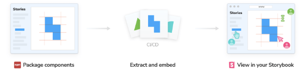
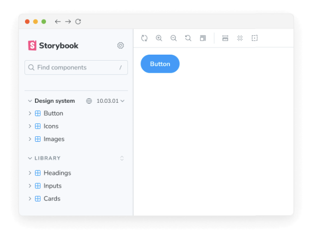

스토리북은 컴포넌트 라이브러리와 디자인 시스템에서 널리 사용됩니다. 디자인 시스템 작성자들은 소비자의 스토리북 내에서 자동으로 자신들의 디자인 시스템을 구성할 수 있습니다.

예를 들어, 디자인 시스템 패키지를 사용하면 해당 스토리들이 사용자의 스토리와 함께 나타날 수 있습니다. 이렇게 하면 스토리북을 떠나지 않고도 사용 문서를 교참하면서 편리하게 활용할 수 있습니다.

## 사용자들을 위해

패키지가 이를 지원하는 경우 자동으로 구성이 이루어집니다. 패키지를 설치하면 스토리북이 스토리북 내에 사용자의 스토리와 함께 해당 스토리를 로드합니다.




### 설정

만들어진 Storybook의 작동 방식을 구성하려면 .storybook/main.js에서 ref 요소를 비활성화할 수 있습니다.

```typescript
// 사용 중인 프레임워크와 함께 프레임워크를 바꿉니다 (예: react-webpack5, vue3-vite)
import type { StorybookConfig } from '@storybook/your-framework';

const config: StorybookConfig = {
  framework: '@storybook/your-framework',
  stories: ['../src/**/*.mdx', '../src/**/*.stories.@(js|jsx|mjs|ts|tsx)'],
  refs: {
    'package-name': { disable: true },
  },
};

export default config;
```


### 버전 변경

만들어진 스토리북의 버전을 변경하여 라이브러리가 어떻게 변하는지 확인해보세요. 이를 위해서는 패키지 작성자가 구성을 설정해야 합니다.



## 패키지 작성자를 위해


컴포넌트 라이브러리 제작자는 자신의 소비자 Storybooks에서 구성 요소를 작성함으로써 채택을 확대할 수 있습니다.

푸블리시된 package.json에 storybook 속성을 추가하고 url 필드를 포함하는 객체를 넣어주세요. URL 필드를 원하는 버전의 게시된 Storybook으로 지정해주세요.

```js
{
  "storybook": {
    "url": "https://host.com/your-storybook-for-this-version"
  }
}
```

### 자동 버전 선택


만약 Chromatic을 사용 중이라면, storybook.url 필드에 Storybook을 위한 단일 URL을 제공할 수 있습니다. 새 버전을 게시할 때마다 URL을 변경할 필요가 없습니다. Storybook은 자동으로 패키지에 대한 올바른 URL을 찾아줍니다. 예를 들어:

```js
{
  "storybook": {
    "url": "https://master--xyz123.chromatic.com"
  }
}
```

이 예시에서 xyz123은 여러분의 Chromatic 프로젝트 ID입니다. Storybook은 사용자가 설치한 버전과 해당 프로젝트에 게시된 Storybook을 자동으로 매칭시킵니다.

### 버전 선택기 표시하기


만약 크로매틱을 사용중이라면, 사용자가 다른 버전을 시도해볼 수 있도록 버전 목록을 제공할 수 있어요.