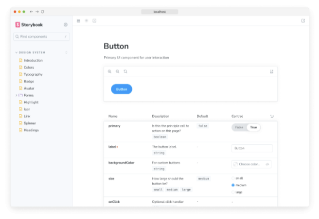

Storybook은 개발 과정에 관여하는 모든 이해관계자들이 도움을 받을 수 있는 풍부하고 포괄적인 문서를 생성할 수 있게 해줍니다. 기본적으로 필요한 도구를 갖추어 문서를 작성할 뿐만 아니라 미리 보기하고 구축할 수도 있습니다.

## Storybook 문서 미리 보기

개발 중에 작성한 문서를 언제든지 미리 볼 수 있습니다. --docs 플래그를 사용하여 최종 문서의 미리 보기를 생성할 수 있습니다. 이를 새로운 스크립트로 package.json에 포함하는 것을 권장합니다:

```js
{
  "scripts": {
    "storybook-docs": "storybook dev --docs"
  }
}
```


당신의 설정에 따라, storybook-docs 스크립트를 실행하는 경우에는 Storybook이 문서 모드로 전환되어 다른 빌드가 생성됩니다.

MDX 또는 CSF 형식의 이야기를 찾아 문서에 추가한 내용에 따라 그 내용이 표시됩니다...



평범한 Storybook 빌드와는 다르게 이 빌드 모드에는 몇 가지 주의해야 할 사항이 있습니다:


- 최상위 항목은 컴포넌트에 대한 주요 이야기를 가리킵니다.
- 각 개별 이야기는 이제 펼쳐진 표시 모드로 제공되며, 다른 세트의 아이콘이 있습니다. 이를 통해 문서 자체에 집중할 수 있습니다.
- Storybook의 레이아웃이 다르게 렌더링됩니다. 툴바는 표시되지 않습니다.

## Storybook의 문서 공개하기

Storybook을 공개하는 방식과 마찬가지로 문서를 공개할 수도 있습니다. build-storybook 명령어에 --docs 플래그를 사용할 수 있습니다. 또한 package.json 파일에 스크립트로 포함하는 것을 권장합니다:

```js
{
  "scripts": {
    "build-storybook-docs": "storybook build --docs"
  }
}
```


당신이 가진 설정에 따르면, build-storybook-docs 스크립트가 실행되면 Storybook은 다시 한 번 문서 모드로 전환되어 다른 빌드를 생성하고 문서를 storybook-static 폴더에 출력할 것입니다.

위에서 언급한 주의 사항이 여전히 적용됩니다.

문서를 배포하기 위해 다음과 같은 호스팅 제공자를 사용할 수 있습니다:

- Vercel
- Netlify
- S3


스토리북 문서에 대해 더 자세히 알아보세요

- 스토리를 위한 문서 작성을 위한 Autodocs
- 문서를 사용자 정의하기 위한 MDX
- 문서 작성을 위한 Doc Blocks
- 문서 게시를 자동화하는 문서 게시