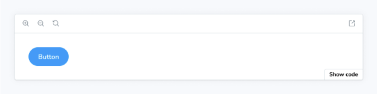

기본 블록은 스토리 파일에서 정의된 첫 번째 스토리를 Story 블록으로 표시합니다. 일반적으로 문서 항목의 제목 바로 아래에 바로 렌더링됩니다.



```js
import { Meta, Primary } from '@storybook/blocks';
import * as ButtonStories from './Button.stories';

<Meta of={ButtonStories} />

<Primary />
```

## Primary


```js
import { Primary } from '@storybook/blocks';
```

다음과 같은 prop으로 구성된 Primary:

### of

유형: CSF 파일 익스포트


첫 번째 이야기를 찾기 위해 사용되는 CSF 파일을 지정하며, 해당 블록에서 렌더링됩니다. CSF 파일에서 모든 익스포트를 전달하세요 (기본 익스포트가 아님!).