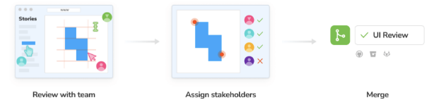
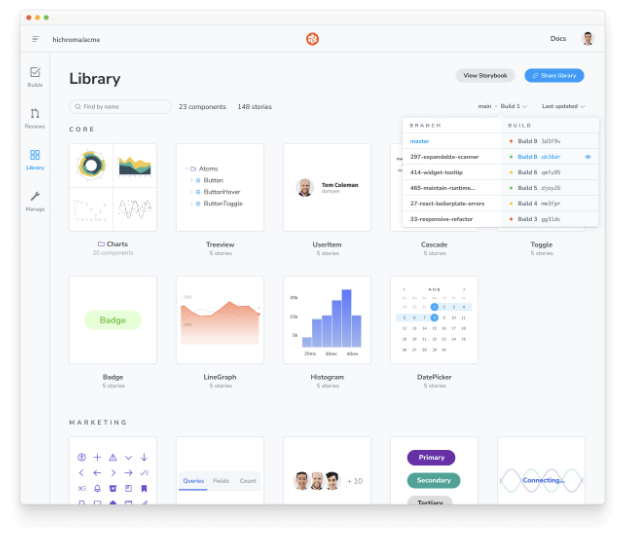

팀은 진행 중인 작업을 검토하고 협업하기 위해 Storybook을 온라인으로 게시합니다. 이를 통해 개발자, 디자이너, PM 및 기타 이해관계자들은 코드를 건드리지 않고 또는 로컬 개발 환경이 필요하지 않게 UI가 올바르게 보이는지 확인할 수 있습니다.

<video autoplay playsinline loop>
  <source src="@source/docs/Tech/2024-04-07-PublishStorybook/img/PublishStorybook_0.mp4" type="video/mp4">
</video>

## 정적 웹 애플리케이션으로 Storybook 빌드하기

먼저, Storybook을 정적 웹 애플리케이션으로 빌드해야 합니다. 대부분의 지원되는 프레임워크에 대해 기능은 이미 내장되어 있고 사전 구성되어 있습니다. 다른 프레임워크들은 약간의 사용자 정의가 필요합니다(예: Angular). 프로젝트의 루트 디렉토리에서 다음 명령을 실행하십시오:


```npm
npm run build-storybook
```

Storybook은 어떤 웹 서버에도 제공될 수 있는 정적 웹 응용 프로그램을 만들어 줍니다. 다음 명령을 실행하여 로컬에서 미리보기할 수 있습니다:

```npm
npx http-server ./path/to/build
```

### 성능을 위한 빌드 사용자 정의


기본적으로 Storybook의 프로덕션 빌드는 모든 스토리와 문서를 프로덕션 번들에 캡슐화합니다. 이는 작은 프로젝트에 이상적이지만 더 큰 프로젝트이거나 빌드 시간을 단축해야 할 때(예: 테스트, CI/CD) 성능 문제를 초래할 수 있습니다. 필요한 경우 main.js|ts 구성 파일에서 test 옵션을 사용하여 프로덕션 빌드를 사용자 정의하고 빌드 스크립트를 수정하여 --test 플래그로 최적화를 활성화할 수 있습니다.

```npm
npm run build-storybook -- --test
```

## Chromatic을 사용하여 Storybook 게시

Storybook을 정적 웹 애플리케이션으로 빌드한 후에는 해당 애플리케이션을 웹 호스트에 게시할 수 있습니다. 저희는 Chromatic을 추천합니다. Chromatic은 Storybook을 위한 무료 게시 서비스로, UI 구성 요소를 안전하게 문서화, 버전 관리 및 클라우드에 인덱싱해줍니다.


**이미지**

시작하려면 GitHub, GitLab, Bitbucket 또는 이메일로 가입하고 프로젝트에 대한 고유한 프로젝트 토큰을 생성하세요.

다음으로 npm을 통해 Chromatic CLI 패키지를 설치하세요:

```npm
npm install chromatic --save-dev
```


다음 명령을 실행하십시오. 패키지 설치가 완료되면 명령을 실행하십시오. 반드시 `--project-token`을 귀하의 프로젝트 토큰으로 교체해주십시오.

```js
npx chromatic --project-token=<귀하의-프로젝트-토큰>
```

Chromatic가 작업을 완료하면 Storybook을 성공적으로 배포했을 것입니다. 제공된 링크(예: https://random-uuid.chromatic.com)를 클릭하여 미리보기해보세요.

```js
1번 빌드가 게시되었습니다.

온라인에서 보려면 https://www.chromatic.com/build?appId=...&number=1. 을 클릭하세요.
```


``

### 자동으로 게시 설정하기

CI 환경을 구성하여 코드를 리포지토리에 푸시할 때 Storybook을 게시하고 Chromatic을 실행하도록 설정합니다. GitHub Actions을 사용하여 설정하는 방법을 살펴봅시다.

프로젝트의 루트 디렉토리에서 `.github/workflows` 디렉토리 안에 `chromatic.yml`이라는 새 파일을 추가하세요.


```typescript
# 워크플로 이름
이름: 'Chromatic Publish'

# 워크플로를 트리거할 이벤트
on: push

# 작업 목록
jobs:
  test:
    # 운영 체제
    runs-on: ubuntu-latest
    # 작업 단계
    steps:
      - uses: actions/checkout@v3
        with:
          fetch-depth: 0
      - uses: actions/setup-node@v3
        with:
          node-version: 18
          cache: 'yarn'
      - run: yarn
      #👇 워크플로에 Chromatic을 추가하는 단계
      - uses: chromaui/action@v1
        # Chromatic의 GitHub Action에 필요한 옵션
        with:
          #👇 Chromatic 프로젝트 토큰,
          projectToken: ${ secrets.CHROMATIC_PROJECT_TOKEN }
          token: ${ secrets.GITHUB_TOKEN }
```

파일을 커밋하고 푸시하세요. 축하합니다! 이제 스토리북을 자동으로 게시하는 것을 성공했습니다. 이제 PR을 열 때마다 PR 체크에서 게시된 스토리북에 대한 편리한 링크를 받게 됩니다.


### 팀과 함께 검토하기


Storybook을 개발 프로세스의 일부로 게시하면 팀 피드백을 빠르고 쉽게 수집할 수 있습니다.

검토를 요청하는 일반적인 방법은 게시된 Storybook 링크를 풀 리퀘스트나 Slack에 붙여넣는 것입니다.

Storybook을 Chromatic에 게시하면 UI Review 기능을 사용하여 PR에 대해 새롭게 업데이트된 스토리를 자동으로 스캔할 수 있습니다. 이렇게 하면 변경 사항을 쉽게 파악하고 피드백을 제공할 수 있습니다.




### 버전 및 기록

Storybook을 게시하면 커밋까지 컴포넌트 이력과 버전이 포함됩니다. 구현 리뷰 중에 브랜치/커밋 간 또는 이전 버전과 비교하기에 유용합니다.



## 다른 서비스에 Storybook 게시


Storybook은 정적 웹 응용 프로그램으로 구축되어 있으므로 GitHub Pages, Netlify, AWS S3 및 기타 웹 호스트로도 게시할 수 있습니다. 그러나 구성, 스토리 내장, 히스토리, 버전 관리 및 자산과 같은 기능을 사용하려면 Storybook API 및 안전한 인증과 더 밀접하게 통합해야 할 수도 있습니다. 머리글에 대해 더 알고 싶다면 이전 가이드를 참조하실 수 있습니다. 또한, 컴포넌트 게시 프로토콜(CPP)에 대해 알아보고 싶다면 아래 정보를 확인하세요.

### GitHub Pages

GitHub Pages에 Storybook을 배포하려면 커뮤니티에서 제공하는 GitHub Pages로 Storybook을 배포하는 작업을 사용하십시오. 이를 활성화하려면 다음 내용으로 .github/workflows 디렉토리 안에 새 워크플로 파일을 생성하십시오:

```typescript
# Workflow name
name: Build and Publish Storybook to GitHub Pages

on:
  # Event for the workflow to run on
  push:
    branches:
      - 'your-branch-name' # 배포할 브랜치로 대체

permissions:
  contents: read
  pages: write
  id-token: write

# List of jobs
jobs:
  deploy:
    runs-on: ubuntu-latest
    # Job steps
    steps:
      # Manual Checkout
      - uses: actions/checkout@v3

      # Set up Node
      - uses: actions/setup-node@v3
        with:
          node-version: '16.x'

      #👇 Add Storybook build and deploy to GitHub Pages as a step in the workflow
      - uses: bitovi/github-actions-storybook-to-github-pages@v1.0.1
        with:
          install_command: yarn install # default: npm ci
          build_command: yarn build-storybook # default: npm run build-storybook
          path: storybook-static # default: dist/storybook
          checkout: false # default: true
```


## 검색 엔진 최적화 (SEO)

만약 여러분의 Storybook이 공개적으로 볼 수 있는 상태라면, 검색 엔진 결과 페이지에서 어떻게 나타낼지 설정하고 싶을 겁니다.

### 설명

검색 엔진이 결과 목록에 표시할 설명을 제공할 수 있습니다. 단순히 config 디렉토리의 manager-head.html 파일에 다음을 추가하면 됩니다:


```typescript
<meta name="description" content="내 멋진 프로젝트를 위한 구성 요소" key="desc" />
```

### 스토리북이 크롤링되지 않게 하는 방법

검색 엔진 결과에 게시된 스토리북이 나타나지 않도록 하려면, config 디렉토리의 manager-head.html 파일에 다음 내용을 추가하여 noindex 메타 태그를 포함시킬 수 있습니다:

```typescript
<meta name="robots" content="noindex" />
```