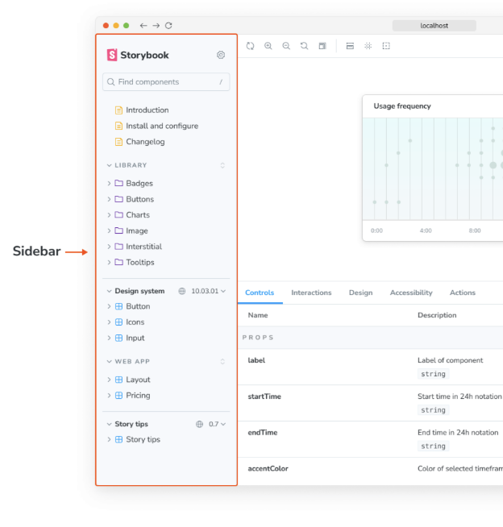
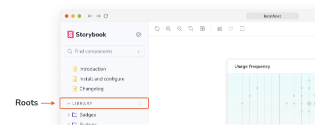

스토리북의 사이드바에는 컴포넌트별로 그룹화된 모든 스토리가 나열됩니다. 많은 컴포넌트가 있는 경우 이러한 컴포넌트들을 그룹화하고 싶을 수도 있습니다. 이를 위해 CSF 파일의 제목에 '/' 구분자를 추가하면 스토리북이 공통 접두사를 기반으로 스토리를 그룹화합니다.



컴포넌트의 파일시스템 경로를 반영하는 중첩 구조를 사용하는 것을 권장합니다. 예를 들어 components/modals/Alert.js 파일이 있는 경우, CSF 파일을 components/modals/Alert.stories.js로 명명하고 제목을 Components/Modals/Alert로 지정하세요.

## Roots


기본 설정으로 Storybook은 상위 노드를 "루트"로 취급합니다. 루트는 UI에 "계층"의 섹션으로 표시됩니다. 하위 레벨 그룹은 폴더로 표시됩니다:



상위 노드를 루트가 아닌 폴더로 표시하려면, `./storybook/manager.js` 파일에서 `sidebar.showRoots` 옵션을 `false`로 설정할 수 있습니다:

```typescript
import { addons } from '@storybook/manager-api';

addons.setConfig({
  sidebar: {
    showRoots: false,
  },
});
```


## 스토리에 대한 퍼머링크

기본적으로 Storybook은 각 스토리에 대한 ID를 생성하는데, 이는 컴포넌트 제목과 스토리 이름을 기반으로 합니다. 특히 이 ID는 각 스토리의 URL에서 사용되며, 해당 URL은 퍼머링크로 사용될 수 있습니다 (특히 Storybook을 게시할 때).

다음과 같은 스토리를 고려해 보세요:

```typescript
// "your-framework"을 사용하는 프레임워크의 이름으로 대체하세요
import type { Meta, StoryObj } from '@storybook/your-framework';

import { Foo } from './Foo';

const meta: Meta<typeof Foo> = {
  /* 👇 제목 속성은 선택 사항입니다.
   * 자동 제목 생성 방법에 대해 알아보려면 https://storybook.js.org/docs/configure/#configure-story-loading을 방문하세요
   */
  title: 'Foo/Bar',
  component: Foo,
};

export default meta;
type Story = StoryObj<typeof Foo>;

export const Baz: Story = {};
```


Storybook의 ID 생성 로직은 이것을 foo-bar--baz ID로 설정하므로, 링크는 ?path=/story/foo-bar--baz 가 됩니다.

스토리의 ID를 수동으로 설정할 수도 있습니다. 이는 퍼머링크를 깨지지 않고 스토리의 이름을 변경하고 싶을 때 유용합니다. 다음과 같이 계층 위치를 OtherFoo/Bar로 변경하고 스토리 이름을 Moo로 변경하고 싶다고 가정해봅시다:

```typescript
// 'your-framework'을 사용하고 있는 프레임워크명으로 교체하세요
import type { Meta, StoryObj } from '@storybook/your-framework';

import { Foo } from './Foo';

const meta: Meta<typeof Foo> = {
  /* 👇 title 속성은 선택 사항입니다.
   * 자동 타이틀 생성 방법에 대한 자세한 내용은 https://storybook.js.org/docs/configure/#configure-story-loading 을 참조하세요
   */
  title: 'OtherFoo/Bar',
  component: Foo,
  id: 'Foo/Bar', // 또는 선호하는 경우 'foo-bar'로 설정
};

export default meta;
type Story = StoryObj<typeof Foo>;

export const Baz: Story = {
  name: '여기에 이름 삽입',
};
```

Storybook은 ID 제공 시 ID 생성에 우선하고, 표시를 위해 story.name을 export 키보다 우선합니다.


## CSF 3.0 자동 타이틀

Storybook 6.4에서 실험적인 기능인 CSF 3.0을 소개했어요. 이를 통해 더 간결하게 이야기를 작성할 수 있어요. 이미 이 형식을 사용 중이라면, 기본 내보내기에서 title 요소를 생략하고 Storybook은 파일의 물리적 위치를 기반으로 자동으로 추론할 수 있어요. 예를 들어, 다음 구성과 이야기가 주어졌다면:

```typescript
// 사용하는 프레임워크로 your-framework을(를) 대체하세요 (예: react-webpack5, vue3-vite)
import type { StorybookConfig } from '@storybook/your-framework';

const config: StorybookConfig = {
  framework: '@storybook/your-framework',
  stories: ['../src'],
};

export default config;
```

Storybook을 로드할 때, 이야기는 사이드바에 components/My Component로 표시될 수 있어요.


자동 제목은 컴포넌트의 제목과 이야기의 이름과 같이 명시적인 제목 옵션과 함께 작동합니다:

```typescript
// 귀하의 프레임워크 이름으로 대체하십시오
import type { Meta, StoryObj } from '@storybook/your-framework';

import { Button } from './Button';

const meta: Meta<Button> = {
  // 이야기 컨테이너의 이름 설정
  title: 'components/Button',
  // `title`이 설정되지 않은 경우 컴포넌트 이름을 사용합니다
  component: Button,
};

export default meta;
type Story = StoryObj<typeof Button>;

// `name`이 설정되지 않은 경우 이야기 변수 이름을 사용합니다
const Primary: Story = {
  // 해당 이야기의 이름 설정
  name: 'Primary',
  args: {
    label: 'Button',
  },
};
```

### 자동 제목 파일 이름 케이스

Storybook 6.5부터 자동으로 생성된 이야기 제목은 더 이상 Lodash의 startCase에 의존하지 않습니다. 대신 파일 이름 케이스가 보존되어 이야기 제목에 대한 추가적인 제어가 가능해집니다. 예를 들어 components/My Component는 components/MyComponent으로 정의됩니다.


만약 필요하다면, 다음 구성을 추가함으로써 이전 패턴으로 되돌릴 수 있습니다:

```typescript
import { addons } from '@storybook/manager-api';

import startCase from 'lodash/startCase.js';

addons.setConfig({
  sidebar: {
    renderLabel: ({ name, type }) => (type === 'story' ? name : startCase(name)),
  },
});
```

### 자동 제목 중복 파일명

스토리 파일 이름 케이싱을 개선하는 것 외에도, 새로운 휴리스틱이 도입되어 중복 이름이 없도록 제거되었습니다. 파일 이름이 디렉토리 이름과 동일하거나 index.stories.js|ts로 불리는 경우 중복 이름이 제거됩니다. 예를 들어, 이전에 components/MyComponent/MyComponent.stories.js로 정의되었던 것이 Components/MyComponent/MyComponent으로 사이드바에 표시되었던 반면, 이제 Components/MyComponent으로 정의됩니다.


만약 네이밍 스키마를 유지하고 싶다면, 기본 내보내기에 title 요소를 추가할 수 있어. 예를 들어:

```typescript
// your-framework을 너의 프레임워크의 이름으로 바꿔
import type { Meta, StoryObj } from '@storybook/your-framework';

import { MyComponent } from './MyComponent';

const meta: Meta<typeof MyComponent> = {
  /* 👇 title 속성은 선택 사항이야.
   * 자동 제목을 생성하는 방법을 배우려면
   * https://storybook.js.org/docs/configure/#configure-story-loading
   * 를 참고해봐
   */
  component: MyComponent,
  title: 'components/MyComponent/MyComponent',
};

export default meta;
type Story = StoryObj<typeof MyComponent>;

export const Default: Story = {
  args: {
    something: 'Something else',
  },
};
```

### 자동 제목 접두사

게다가, Story를 구성 객체를 기반으로 로드하도록 Storybook을 사용자 정의한 경우 titlePrefix를 포함하는 경우, Storybook은 일치하는 Story의 모든 제목에 자동으로 접두사를 추가해. 예를 들어, 다음 구성을 가지고 있다고 가정해봐:


```typescript
// 템플릿을 사용하는 프레임워크로 바꿔주세요 (예: react-webpack5, vue3-vite)
import type { StorybookConfig } from '@storybook/your-framework';

const config: StorybookConfig = {
  framework: '@storybook/your-framework',
  stories: [
    {
      directory: '../src',
      titlePrefix: '사용자 정의', // 👈 타이틀 접두사를 설정하세요
    },
  ],
};

export default config;
```

Storybook이 일치하는 모든 스토리에 대한 제목을 생성할 때, 그것들은 '사용자 정의' 접두사가 유지됩니다.

### 스토리 인덱서

스토리 인덱서는 주어진 글로브 패턴을 기반으로 파일 시스템을 크롤링하는 데 사용되는 일련의 휴리스틱이며, 일치하는 스토리를 검색합니다. 이후 이 정보는 사이드바를 필요로하는 정보로 채우기 위해 index.json(이전에는 stories.json) 파일을 생성합니다. 기본적으로 이 휴리스틱은 다음 스키마를 포함하는 파일을 검색합니다: *.stories.@(js|jsx|mjs|ts|tsx).```


다른 네이밍 규칙을 사용하여 이야기를 포함하는 사용자 정의 인덱서를 제공하거나, 접두어 이상의 자동 제목 생성을 조정하거나, 기타 많은 경우에 대해 자신만의 인덱서를 제공할 수 있습니다. 더 많은 정보는 Story Indexers API 레퍼런스를 참조하세요.