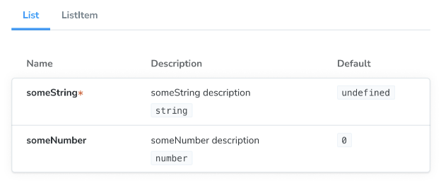

한꺼번에 두 개 이상의 컴포넌트를 렌더링하는 스토리를 작성하는 것은 해당 컴포넌트가 함께 작동하도록 설계된 경우에 유용합니다. 예를 들어 ButtonGroup, List 및 Page 컴포넌트 등입니다.

## 하위 컴포넌트

문서화하는 컴포넌트가 부모-자식 관계를 가지는 경우 subcomponents 속성을 사용하여 함께 문서화할 수 있습니다. 특히 자식 컴포넌트가 부모 컴포넌트의 일부로만 사용되어야 하지만 독립적으로 사용되지 않을 때 특히 유용합니다.

List 및 ListItem 컴포넌트를 사용한 예시를 확인해보세요:


```typescript
import React from 'react';
import type { Meta, StoryObj } from '@storybook/react';

import { List } from './List';
import { ListItem } from './ListItem';

const meta: Meta<typeof List> = {
  component: List,
  subcomponents: { ListItem }, //👈 ListItem 컴포넌트를 서브 컴포넌트로 추가합니다
};
export default meta;

type Story = StoryObj<typeof List>;

export const Empty: Story = {};

export const OneItem: Story = {
  render: (args) => (
    <List {...args}>
      <ListItem />
    </List>
  ),
};
```

디폴트 익스포트에 subcomponents 속성을 추가하면 ListItem의 프롭스를 나열하는 ArgTypes 및 Controls 테이블에 추가 패널이 표시됩니다:



서브컴포넌트는 주로 문서화 목적으로 사용되며 일부 제한 사항이 있습니다:```


- subcomponents의 argTypes은 추론되며(해당 기능을 지원하는 렌더러의 경우), 직접 정의하거나 무시할 수 없습니다.
- 각 문서화된 subcomponent에 대한 표에는 props의 값을 변경하는 컨트롤이 포함되어 있지 않습니다. 이는 컨트롤이 항상 주 컴포넌트의 args에 적용되기 때문입니다.

위 문제를 완화하는 데 사용할 수 있는 몇 가지 기술에 대해 이야기해 봅시다. 이 기술들은 더 복잡한 상황에서 특히 유용합니다.

## 스토리 정의 재사용

스토리 정의를 재사용함으로써 스토리에서 반복을 줄일 수도 있습니다. 여기서는 ListItem 스토리의 args를 List의 스토리에서 재사용할 수 있습니다:


```typescript
import type { Meta, StoryObj } from '@storybook/react';

import { List } from './List';
import { ListItem } from './ListItem';

//👇 ListItem에서 필요한 스토리를 가져오고 있습니다.
import { Selected, Unselected } from './ListItem.stories';

const meta: Meta<typeof List> = {
  component: List,
};

export default meta;
type Story = StoryObj<typeof List>;

export const ManyItems: Story = {
  render: (args) => (
    <List {...args}>
      <ListItem {...Selected.args} />
      <ListItem {...Unselected.args} />
      <ListItem {...Unselected.args} />
    </List>
  ),
};
```

Unselected 스토리를 해당 args와 함께 렌더링하여 ListItem 스토리의 입력 데이터를 List에서 재사용할 수 있습니다.

그러나 여전히 ListItem 스토리를 제어하기 위해 args를 사용하지 않고 있으므로 이를 컨트롤하여 변경하거나 다른 복잡한 컴포넌트 스토리에서 재사용할 수는 없습니다.

## children을 인수로 사용하기


해야할 상황을 개선하는 한 가지 방법은 렌더링된 하위 구성 요소를 children arg로 끌어내는 것입니다:

```typescript
import type { Meta, StoryObj } from '@storybook/react';

import { List } from './List';

//👇 ListItem을 가져오는 대신에 stories를 가져옵니다
import { Unchecked } from './ListItem.stories';

const meta: Meta<typeof List> = {
  /* 👇 title prop은 선택 사항입니다.
   * 자동 제목을 생성하는 방법에 대해 알아보려면 https://storybook.js.org/docs/configure/#configure-story-loading을 참조하세요
   */
  title: 'List',
  component: List,
};

export default meta;
type Story = StoryObj<typeof List>;

export const OneItem: Story = {
  args: {
    children: <Unchecked {...Unchecked.args} />,
  },
};
```

이제 children이 arg로 사용되므로 다른 이야기에서 재사용할 수 있습니다.

그러나 이 접근 방식을 사용할 때 주의해야 할 몇 가지 주의 사항이 있습니다.


자식인 arg도 모든 인수와 마찬가지로 JSON 직렬화 가능해야 합니다. 스토리북에서 오류를 피하려면 다음을 준수해야 합니다:

- 빈 값 사용을 피합니다
- 값 조정을 원하는 경우 매핑 사용
- 제3 자 라이브러리를 포함하는 컴포넌트 사용 시 주의

## 템플릿 컴포넌트 생성하기

"데이터" 중심의 더 특별한 "스토리 생성" 템플릿 컴포넌트를 생성하는 또 다른 옵션도 있습니다:


```typescript
import type { Meta, StoryObj } from '@storybook/react';

import { List } from './List';
import { ListItem } from './ListItem';

//👇 ListItem 스토리에서 특정 스토리를 가져옵니다.
import { Unchecked } from './ListItem.stories';

const meta: Meta<typeof List> = {
  /* 👇 title prop은 선택 사항입니다.
   * 자동 제목을 생성하는 방법은
   * https://storybook.js.org/docs/configure/#configure-story-loading을 참조하세요
   */
  title: 'List',
  component: List,
};

export default meta;
type Story = StoryObj<typeof List>;

//👇 ListTemplate 구조체는 기존 스토리에 펼쳐질 것입니다.
const ListTemplate: Story = {
  render: ({ items, ...args }) => {
    return (
      <List>
        {items.map((item) => (
          <ListItem {...item} />
        ))}
      </List>
    );
  },
};

export const Empty = {
  ...ListTemplate,
  args: {
    items: [],
  },
};

export const OneItem = {
  ...ListTemplate,
  args: {
    items: [{ ...Unchecked.args }],
  },
};
```

이 접근 방식은 설정이 조금 더 복잡하지만, 컴포지트 컴포넌트의 각 스토리에 args를 더 쉽게 재사용할 수 있음을 의미합니다. 또한, Controls 애드온을 사용하여 컴포넌트의 args를 변경할 수 있습니다.