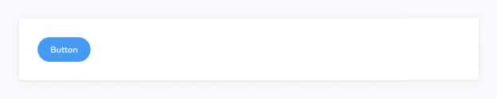

스토리(컴포넌트 테스트)는 Storybook의 기본적인 구성 요소입니다.

Storybook Docs에서는 MDX 파일의 컨텍스트 내에서 모든 주석(매개변수, args, 로더, 데코레이터, play 함수)가 적용된 CSF 파일의 어떤 이야기든 렌더링할 수 있습니다.



```js
import { Meta, Story } from '@storybook/blocks';
import * as ButtonStories from './Button.stories';

<Meta of={ButtonStories} />

<Story of={ButtonStories.Primary} />
```


## 이야기

```js
import { Story } from '@storybook/blocks';
```

### autoplay

타입: 불리언


기본값: parameters.docs.story.autoplay

이야기의 재생 함수가 실행되는지 여부를 결정합니다.

문서 항목에 모든 이야기가 동시에 렌더링되기 때문에, 재생 기능은 서로 상호 작용할 수 있는 임의의 작업을 수행할 수 있습니다(예: 포커스 훔치기 또는 화면 스크롤). 이러한 이유로, 기본적으로 이야기는 문서 모드에서 재생 함수를 실행하지 않습니다.

그러나 재생 함수가 문서에서 실행해도 "안전하다"고 판단된다면, 이 속성을 사용하여 자동으로 실행할 수 있습니다.


### 높이

유형: 문자열

기본값: parameters.docs.story.height

iframe에서 이야기를 그릴 때 또는 인라인으로 이야기를 렌더링할 때 최소 높이를 설정합니다 (iframe의 경우 실제 높이입니다). 이는 iframe의 경우 parameters.docs.story.iframeHeight를 재정의합니다.


### 인라인

유형: 부울

기본값: parameters.docs.story.inline 또는 true (지원되는 프레임워크의 경우)

이야기가 인라인으로 렌더링될지 (다른 문서 내용과 동일한 브라우저 프레임에) 아니면 iframe에 표시될지 결정합니다.


### 메타

유형: CSF 파일 내보내기

이야기가 연관된 CSF 파일을 지정합니다.

Meta를 통해 MDX 파일에 첨부하지 않은 CSF 파일에서 이야기를 렌더링할 수 있습니다. meta 속성을 사용하여 CSF 파일에서 내보낸 전체 세트를 전달하면 됩니다 (기본 내보내기가 아닙니다!).


```js
import { Meta, Story } from '@storybook/blocks';
import * as ButtonStories from './Button.stories';
import * as HeaderStories from './Header.stories';

<Meta of={ButtonStories} />

{/* 이 MDX 파일은 대부분 Button에 관련되어 있지만 Header 스토리도 렌더링할 수 있습니다 */}
<Story of={HeaderStories.LoggedIn} meta={HeaderStories} />
```

### of

유형: 스토리 내보내기

Story 블록에 의해 렌더링되는 스토리를 지정합니다. of가 정의되지 않았고 MDX 파일이 첨부된 경우, 기본(첫 번째) 스토리가 렌더링됩니다.