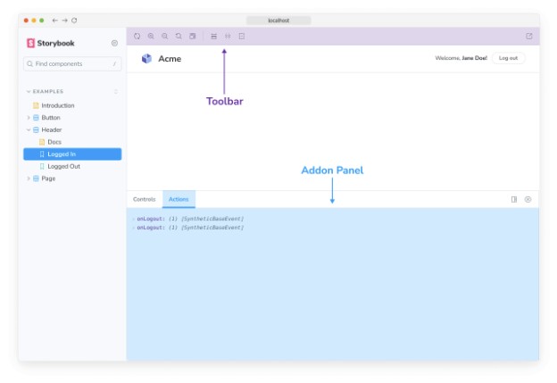

Storybook의 주요 장점 중 하나는 확장성입니다. 애드온을 사용하여 팀의 개발 워크플로에 맞게 Storybook을 확장하고 사용자 정의할 수 있습니다.

애드온은 Storybook이 작동하는 방식에서 중요한 역할을 합니다. Storybook의 핵심 기능 중 많은 부분이 애드온으로 구현되어 있습니다! 이러한 애드온은 필수 사항으로 기본적으로 설치됩니다.

## 애드온 기능

Storybook에서 애드온이 영향을 주는 가장 눈에 띄는 것은 Storybook 자체의 UI입니다. UI 내에서 툴바와 애드온 패널은 애드온이 나타나는 두 가지 주요 장소입니다.

애드온은 자신의 데코레이터를 주입하여 미리보기 창에서 이야기의 렌더링에도 연결할 수 있습니다.

마지막으로, 애드온은 자신만의 웹팩 구성을 주입하여 Storybook의 빌드 설정에 영향을 줄 수 있어 다른 도구를 Storybook에서 사용할 수 있게 합니다. 이런 일만 하는 애드온은 종종 프리셋이라고 불립니다.

## 필수, 핵심 및 커뮤니티 애드온

Storybook 애드온은 많고 다양하지만 대략 세 가지 범주로 나눌 수 있어요:

- **필수 애드온**은 코어 팀이 개발한 애드온으로 새 Storybook 설치에 기본으로 포함되는 사용자 경험의 일부로 간주돼요.
- **코어 애드온**은 코어 팀이 개발한 애드온으로 Storybook 자체 개발과 동기화되며, 다른 애드온의 템플릿으로서 현지식적으로 작성돼요. Storybook 모노 레포지토리 안에 있어요.
- **커뮤니티 애드온**은 Storybook 커뮤니티에 의해 작성된 애드온이에요. 저희 웹사이트, GitHub 및 npm에서 찾을 수 있어요.