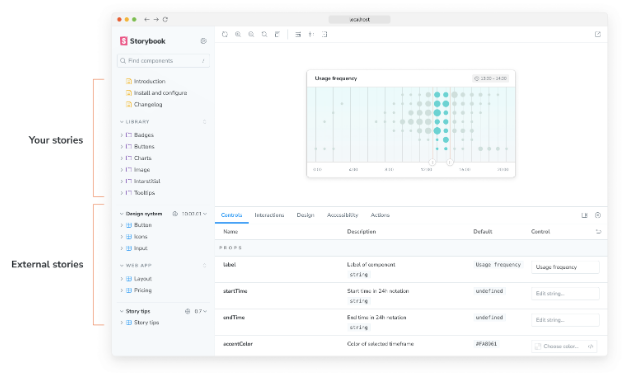
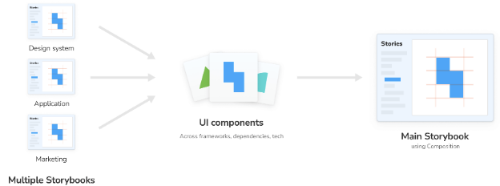

구성은 로컬 Storybook 내에서 URL을 통해 액세스할 수 있는 모든 Storybook 구성요소를 탐색할 수 있도록 해줍니다. 뷰 레이어, 기술 스택 또는 종속성에 관계없이 온라인으로 게시된 Storybook 또는 로컬로 실행 중인 Storybook을 구성할 수 있습니다.



구성된 Storybook의 스토리는 당신의 스토리 옆에 사이드바에 표시됩니다. 이를 통해 팀이 종종 고생하는 일반적인 작업 흐름을 해결할 수 있습니다:

- 👩‍💻 UI 개발자는 Storybook 간에 전환하지 않고 이전 아트를 빠르게 참조할 수 있습니다.
- 🎨 디자인 시스템은 사용자의 Storybook에 자신을 구성하여 채택도를 확대할 수 있습니다.
- 🛠 프론트엔드 플랫폼은 프로젝트 전체에서 구성요소가 사용되는 방식을 감사할 수 있습니다.
- 📚 서로 다른 기술 스택을 가진 여러 Storybook을 한 곳에서 볼 수 있습니다.




## 게시된 스토리북 구성

.storybook/main.js|ts 파일에 참조 스토리북에 관한 정보를 포함한 refs 필드를 추가하세요. 정적으로 빌드된 스토리북의 URL을 전달하세요.

```typescript
// 사용 중인 프레임워크에 맞게 your-framework를 교체하세요 (예: react-webpack5, vue3-vite)
import type { StorybookConfig } from '@storybook/your-framework';

const config: StorybookConfig = {
  framework: '@storybook/your-framework',
  stories: ['../src/**/*.mdx', '../src/**/*.stories.@(js|jsx|mjs|ts|tsx)'],
  refs: {
    'design-system': {
      title: 'Storybook Design System',
      url: 'https://master--5ccbc373887ca40020446347.chromatic.com/',
      expanded: false, // 옵션, 기본적으로 true
    },
  },
};

export default config;
```


## 로컬 스토리북 합성하기

로컬에서 실행 중인 여러 개의 스토리북을 합성할 수도 있어요. 예를 들어, React 스토리북과 Angular 스토리북이 다른 포트에서 실행 중인 경우, 설정 파일(.storybook/main.js|ts)을 업데이트하고 다음과 같이 참조할 수 있어요:

```typescript
// 사용 중인 프레임워크로 your-framework을 교체하세요 (예: react-webpack5, vue3-vite)
import type { StorybookConfig } from '@storybook/your-framework';

const config: StorybookConfig = {
  framework: '@storybook/your-framework',
  stories: ['../src/**/*.mdx', '../src/**/*.stories.@(js|jsx|mjs|ts|tsx)'],
  refs: {
    react: {
      title: 'React',
      url: 'http://localhost:7007',
    },
    angular: {
      title: 'Angular',
      url: 'http://localhost:7008',
    },
  },
};

export default config;
```

이 설정을 추가하면 React 및 Angular 스토리북을 현재 스토리북에 합칠 수 있어요. 이러면 이 변경 사항이 자동으로 적용되어, 두 프레임워크를 동시에 개발할 수 있어요.


## 환경별 스토리북 생성하기

현재 개발 환경(예: 개발, 스테이징, 프로덕션)에 따라 스토리북을 생성할 수도 있어요. 예를 들어, 이미 공개된 스토리북이 있지만 아직 릴리스되지 않은 최신 기능을 포함한 버전도 제공하는 프로젝트에 작업 중이라면, 그에 맞게 구성을 조정할 수 있어요. 

```typescript
// 사용 중인 프레임워크로 your-framework를 대체하십시오 (예: react-webpack5, vue3-vite)
import type { StorybookConfig } from '@storybook/your-framework';

const config: StorybookConfig = {
  framework: '@storybook/your-framework',
  stories: ['../src/**/*.mdx', '../src/**/*.stories.@(js|jsx|mjs|ts|tsx)'],

  // 👇 configType 인수에서 현재 환경을 가져올 수 있어요
  refs: (config, { configType }) => {
    if (configType === 'DEVELOPMENT') {
      return {
        react: {
          title: '개발 모드에서 작동하는 구성된 React 스토리북',
          url: 'http://localhost:7007',
        },
        angular: {
          title: '개발 모드에서 작동하는 구성된 Angular 스토리북',
          url: 'http://localhost:7008',
        },
      };
    }
    return {
      react: {
        title: '프로덕션에서 작동하는 구성된 React 스토리북',
        url: 'https://your-production-react-storybook-url',
      },
      angular: {
        title: '프로덕션에서 작동하는 구성된 Angular 스토리북',
        url: 'https://your-production-angular-storybook-url',
      },
    };
  },
};

export default config;
```

## 문제 해결


### 스토리북 구성이 내 프로젝트와 작동하지 않아요

만약 오래된 스토리북 버전을 사용하고 있거나 최신 버전으로 업데이트할 수 없는 프로젝트 특정 요구 사항이 있다면, 스토리북 CLI를 사용하여 스토리북을 최신 버전으로 업데이트하지 않고 배포할 때 index.json 파일을 생성할 수 있습니다. 예를 들면:

```npm
npx storybook@7.5.3 extract
```