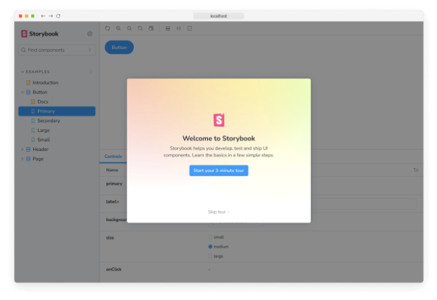

Storybook for Next.js은 Next.js 어플리케이션에서 UI 컴포넌트를 개별적으로 개발하고 테스트할 수 있는 프레임워크입니다. 다음과 같은 기능이 포함되어 있어요:

- 🔀 라우팅
- 🖼 이미지 최적화
- ⤵️ 절대 경로 임포트
- 🎨 스타일링
- 🎛 웹팩 & 바벨 구성
- 💫 그 외 등등!

## 요구 사항

- Next.js ≥ 13.5
- Storybook ≥ 7.0


## 시작하기

### Storybook이 없는 프로젝트의 경우

다음 명령을 Next.js 프로젝트의 루트 디렉토리에서 실행한 후 안내에 따라 진행하세요:

```npm
npx storybook@latest init
```


스토리북을 시작하는 더 많은 정보를 확인해보세요.

### 스토리북이 포함된 프로젝트에서

이 프레임워크는 스토리북 7+와 함께 작동하도록 설계되었습니다. 이미 v7을 사용하고 있지 않다면 다음 명령으로 업그레이드하세요:

```npm
npx storybook@latest upgrade
```


#### 자동 이전

위에 있는 업그레이드 명령을 실행할 때 @storybook/nextjs로 마이그레이션하라는 프롬프트가 표시됩니다. 이 작업은 모든 것을 자동으로 처리해줄 것입니다. 자동 마이그레이션이 프로젝트에서 작동하지 않으면 아래의 수동 마이그레이션을 참조하세요.

#### 수동 마이그레이션

먼저, 프레임워크를 설치하세요:


```npm
npm install --save-dev @storybook/nextjs
```

그런 다음, .storybook/main.js|ts 파일을 업데이트하여 framework 속성을 변경하세요:

```typescript
import { StorybookConfig } from '@storybook/nextjs';

const config: StorybookConfig = {
  // ...
  // framework: '@storybook/react-webpack5', 👈 이 부분 삭제
  framework: '@storybook/nextjs', // 👈 이 부분 추가
};

export default config;
```

마지막으로, Next.js와 통합하기 위해 Storybook 플러그인을 사용하고 있다면, 이 프레임워크를 사용할 때는 더 이상 필요하지 않으므로 삭제할 수 있습니다:```


```typescript
import { StorybookConfig } from '@storybook/nextjs';

const config: StorybookConfig = {
  // ...
  addons: [
    // ...
    // 👇 이 두 개는 모두 제거해도 됩니다
    // 'storybook-addon-next',
    // 'storybook-addon-next-router',
  ],
};

export default config;
```

## 설정 마법사 실행하기

만약 모든 것이 잘 되면, 시작하기 위한 설정 마법사가 나타날 것입니다. 이 마법사는 Storybook을 시작하는 데 도움을 주며, 주요 개념과 기능을 소개해줄 것입니다. UI가 어떻게 구성되는지, 첫 번째 스토리를 작성하는 방법, 그리고 컴포넌트가 다양한 입력에 대한 응답을 어떻게 테스트하는지 등을 소개합니다.


```


위자드를 건너 뛰었다면 예시 스토리가 여전히 사용 가능한 경우 Storybook 인스턴스 URL에 `?path=/onboarding` 쿼리 매개변수를 추가하여 언제든지 다시 실행할 수 있습니다.

## Next.js의 이미지 컴포넌트

본 프레임워크를 통해 구성 없이 Next.js의 `next/image`를 사용할 수 있습니다.

### 로컬 이미지


로컬 이미지가 지원됩니다.

```js
import Image from 'next/image';
import profilePic from '../public/me.png';

function Home() {
  return (
    <>
      <h1>내 홈페이지</h1>
      <Image
        src={profilePic}
        alt="저자의 사진"
        // width={500} 이미 자동으로 제공됨
        // height={500} 이미 자동으로 제공됨
        // blurDataURL="../public/me.png" 이미지와 같은 값으로 설정 (이 프레임워크에 대해)
        // placeholder="blur" // 로딩 중에 옵션 블러 처리
      />
      <p>내 홈페이지에 오신 것을 환영합니다!</p>
    </>
  );
}
```

### 원격 이미지

원격 이미지도 지원됩니다.


```js
import Image from 'next/image';

export default function Home() {
  return (
    <>
      <h1>나의 홈페이지</h1>
      <Image src="/me.png" alt="저자의 사진" width={500} height={500} />
      <p>내 홈페이지에 오신 것을 환영합니다!</p>
    </>
  );
}
```

## Next.js 폰트 최적화

Storybook에서 next/font는 일부 지원됩니다. next/font/google 및 next/font/local 패키지가 지원됩니다.

### next/font/google


무엇이든 할 필요 없어요. next/font/google이 기본적으로 지원됩니다.

### next/font/local

로컬 폰트를 사용하려면 src 속성을 정의해야 합니다. 경로는 폰트 로더 함수가 호출된 디렉토리를 기준으로 상대 경로로 지정해야 합니다.

다음 컴포넌트가 다음과 같이 localFont를 정의하고 있다고 가정해보겠습니다:


```js
import localFont from 'next/font/local';

const localRubikStorm = localFont({ src: './fonts/RubikStorm-Regular.ttf' });
```

Storybook에게 폰트 디렉토리가 어디에 있는지 알려주어야 합니다. 이는 staticDirs 구성을 통해 해야 합니다. from 값은 .storybook 디렉토리를 기준으로 상대적입니다. to 값은 Storybook 실행 컨텍스트를 기준으로 상대적입니다. 매우 가능성 높게는 프로젝트의 루트일 것입니다.

```typescript
import { StorybookConfig } from '@storybook/nextjs';

const config: StorybookConfig = {
  // ...
  staticDirs: [
    {
      from: '../src/components/fonts',
      to: 'src/components/fonts',
    },
  ],
};

export default config;
```

### next/font에서 지원되지 않는 기능들```


아래 기능들은 아직 지원되지 않습니다. 이러한 기능들을 위한 지원은 미래에 계획되어 있을 수도 있습니다:

- next.config.js에서의 폰트 로더 구성 지원
- fallback 옵션
- adjustFontFallback 옵션
- preload 옵션이 무시됩니다. Storybook은 자체적인 방법으로 폰트 로딩을 처리합니다.
- display 옵션이 무시됩니다. 모든 폰트는 display를 "block"으로 설정하여 Storybook이 폰트를 올바르게 로드하도록 합니다.

### 테스트 중 폰트 모의

가끔 Storybook 빌드 단계에서 Google로부터 폰트를 가져오는 것이 실패할 수 있습니다. 이러한 요청을 모의하는 것을 강력히 권장합니다. 이러한 실패로 인해 파이프라인이 실패할 수 있습니다. Next.js는 환경 변수 NEXT_FONT_GOOGLE_MOCKED_RESPONSES가 참조하는 위치에 있는 JavaScript 모듈을 통해 폰트를 모의하는 것을 지원합니다.


예를 들어, GitHub Actions를 사용할 때:

```js
- uses: chromaui/action@v1
  env:
    #👇 사용할 모의 폰트의 위치
    NEXT_FONT_GOOGLE_MOCKED_RESPONSES: ${github.workspace}/mocked-google-fonts.js
  with:
    projectToken: ${secrets.CHROMATIC_PROJECT_TOKEN}
    token: ${secrets.GITHUB_TOKEN}
```

모의 폰트는 다음과 같이 보일 것입니다:

```js
//👇 URL을 키로 한 구글 폰트의 모의 응답
module.exports = {
  'https://fonts.googleapis.com/css?family=Inter:wght@400;500;600;800&display=block': `
    /* cyrillic-ext */
    @font-face {
      font-family: 'Inter';
      font-style: normal;
      font-weight: 400;
      font-display: block;
      src: url(https://fonts.gstatic.com/s/inter/v12/UcCO3FwrK3iLTeHuS_fvQtMwCp50KnMw2boKoduKmMEVuLyfAZJhiJ-Ek-_EeAmM.woff2) format('woff2');
      unicode-range: U+0460-052F, U+1C80-1C88, U+20B4, U+2DE0-2DFF, U+A640-A69F, U+FE2E-FE2F;
    }
    /* 추가 폰트 선언은 여기에 */
    /* latin */
    @font-face {
      font-family: 'Inter';
      font-style: normal;
      font-weight: 400;
      font-display: block;
      src: url(https://fonts.gstatic.com/s/inter/v12/UcCO3FwrK3iLTeHuS_fvQtMwCp50KnMw2boKoduKmMEVuLyfAZ9hiJ-Ek-_EeA.woff2) format('woff2');
      unicode-range: U+0000-00FF, U+0131, U+0152-0153, U+02BB-02BC, U+02C6, U+02DA, U+02DC, U+0304, U+0308, U+0329, U+2000-206F, U+2074, U+20AC, U+2122, U+2191, U+2193, U+2212, U+2215, U+FEFF, U+FFFD;
    }`,
};
```


## Next.js 라우팅

Next.js의 라우터는 자동으로 스텁 처리되어 있어요. 라우터와 상호작용하는 모든 부분은 Storybook 액션 애드온이 설치되어 있다면 자동으로 Actions 패널에 기록되요.

### 기본값 재정의

각 스토리별로 재정의는 스토리 매개변수에 nextjs.router 속성을 추가함으로써 할 수 있어요. 프레임워크는 여기에 넣은 내용을 라우터에 얕은 병합(shallow merge)할 거에요.


```typescript
import { Meta, StoryObj } from '@storybook/react';

import RouterBasedComponent from './RouterBasedComponent';

const meta: Meta<typeof RouterBasedComponent> = {
  component: RouterBasedComponent,
};
export default meta;

type Story = StoryObj<typeof RouterBasedComponent>;

// 만약 액션 애드온을 사용하고있으면
// 링크와 라우트 변경 이벤트를 확인할 수 있습니다
export const Example: Story = {
  parameters: {
    nextjs: {
      router: {
        pathname: '/profile/[id]',
        asPath: '/profile/1',
        query: {
          id: '1',
        },
      },
    },
  },
};
```

### 기본 라우터

스턥된 라우터의 기본값은 아래와 같습니다 (글로벌에서 글로벌의 작동 방식에 대한 자세한 내용은 확인하십시오).

```js
const defaultRouter = {
  push(...args) {
    action('nextRouter.push')(...args);
    return Promise.resolve(true);
  },
  replace(...args) {
    action('nextRouter.replace')(...args);
    return Promise.resolve(true);
  },
  reload(...args) {
    action('nextRouter.reload')(...args);
  },
  back(...args) {
    action('nextRouter.back')(...args);
  },
  forward() {
    action('nextRouter.forward')();
  },
  prefetch(...args) {
    action('nextRouter.prefetch')(...args);
    return Promise.resolve();
  },
  beforePopState(...args) {
    action('nextRouter.beforePopState')(...args);
  },
  events: {
    on(...args) {
      action('nextRouter.events.on')(...args);
    },
    off(...args) {
      action('nextRouter.events.off')(...args);
    },
    emit(...args) {
      action('nextRouter.events.emit')(...args);
    },
  },
  // 로케일은 전역적으로 구성되어 있어야 합니다: https://storybook.js.org/docs/essentials/toolbars-and-globals#globals
  locale: globals?.locale,
  asPath: '/',
  basePath: '/',
  isFallback: false,
  isLocaleDomain: false,
  isReady: true,
  isPreview: false,
  route: '/',
  pathname: '/',
  query: {},
};
```


### 조치 통합 주의

함수를 재정의하면 자동 조치 탭 통합이 손실되며 직접 구축해야 합니다. 아래와 같이 구성해야 합니다 (@storybook/addon-actions 패키지를 설치했는지 확인하세요):

```typescript
import { Preview } from '@storybook/react';

const preview: Preview = {
  // ...
  parameters: {
    // ...
    nextjs: {
      router: {
        push(...args) {
          // 여기에 사용자 정의 로직을 넣을 수 있습니다
          // 이 명령은 작업 패널에 로깅됩니다
          action('nextRouter.push')(...args);
          // 원하는 것을 반환할 수 있습니다
          return Promise.resolve(true);
        },
      },
    },
  },
};

export default preview;
```

## Next.js 네비게이션


### nextjs.appDirectory을 true로 설정하세요

만약 스토리가 next/navigation을 사용하는 컴포넌트를 가져온다면, 해당 컴포넌트의 스토리에서 nextjs.appDirectory 매개변수를 true로 설정해야 합니다:

```typescript
import { Meta, StoryObj } from '@storybook/react';

import NavigationBasedComponent from './NavigationBasedComponent';

const meta: Meta<typeof NavigationBasedComponent> = {
  component: NavigationBasedComponent,
  parameters: {
    nextjs: {
      appDirectory: true, // 👈 이렇게 설정하세요
    },
  },
};
export default meta;
```

만약 Next.js 프로젝트가 모든 페이지에 대해 앱 디렉토리를 사용하는 경우 (다시 말해, 페이지 디렉토리가 없는 경우), 모든 스토리에 이를 적용하기 위해 .storybook/preview.js|ts 파일에서 nextjs.appDirectory 매개변수를 true로 설정할 수 있습니다.


```typescript
import { Preview } from '@storybook/react';

const preview: Preview = {
  // ...
  parameters: {
    // ...
    nextjs: {
      appDirectory: true,
    },
  },
};

export default preview;
```

### 기본값 재정의

각각의 스토리별로 다른 설정을 하려면 스토리 파라미터에 nextjs.navigation 속성을 추가하면 됩니다. 이 프레임워크는 여기에 넣은 내용을 라우터에 얕게 병합할 것입니다.

```typescript
import { Meta, StoryObj } from '@storybook/react';

import NavigationBasedComponent from './NavigationBasedComponent';

const meta: Meta<typeof NavigationBasedComponent> = {
  component: NavigationBasedComponent,
  parameters: {
    nextjs: {
      appDirectory: true,
    },
  },
};
export default meta;

type Story = StoryObj<typeof NavigationBasedComponent>;

// 만약 actions 애드온이 있다면,
// 링크와 라우트 변경 이벤트를 확인할 수 있습니다
export const Example: Story = {
  parameters: {
    nextjs: {
      navigation: {
        pathname: '/profile',
        query: {
          user: '1',
        },
      },
    },
  },
};
```


### useSelectedLayoutSegment, useSelectedLayoutSegments 및 useParams 훅

useSelectedLayoutSegment, useSelectedLayoutSegments 및 useParams 훅은 Storybook에서 지원됩니다. 사용하려면 nextjs.navigation.segments 매개변수를 설정하여 사용할 세그먼트 또는 매개변수를 반환해야 합니다.

```typescript
import { Meta, StoryObj } from '@storybook/react';

import NavigationBasedComponent from './NavigationBasedComponent';

const meta: Meta<typeof NavigationBasedComponent> = {
  component: NavigationBasedComponent,
  parameters: {
    nextjs: {
      appDirectory: true,
      navigation: {
        segments: ['dashboard', 'analytics'],
      },
    },
  },
};
export default meta;
```

위 구성을 사용하면 스토리에 렌더링된 컴포넌트가 다음 훅에서 다음 값들을 받게 됩니다:


```js
import { useSelectedLayoutSegment, useSelectedLayoutSegments, useParams } from 'next/navigation';

export default function NavigationBasedComponent() {
  const segment = useSelectedLayoutSegment(); // dashboard
  const segments = useSelectedLayoutSegments(); // ["dashboard", "analytics"]
  const params = useParams(); // {}
  // ...
}
```

useParams를 사용하려면, 각 요소가 두 개의 문자열을 포함하는 배열인 세그먼트 배열을 사용해야 합니다. 첫 번째 문자열은 매개변수 키이고 두 번째 문자열은 매개변수 값입니다.

```typescript
import { Meta, StoryObj } from '@storybook/react';

import NavigationBasedComponent from './NavigationBasedComponent';

const meta: Meta<typeof NavigationBasedComponent> = {
  component: NavigationBasedComponent,
  parameters: {
    nextjs: {
      appDirectory: true,
      navigation: {
        segments: [
          ['slug', 'hello'],
          ['framework', 'nextjs'],
        ],
      },
    },
  },
};
export default meta;
```

위 구성을 사용하면 이야기에 렌더링된 구성 요소는 훅에서 다음과 같은 값을 받게 됩니다:```


```js
import { useSelectedLayoutSegment, useSelectedLayoutSegments, useParams } from 'next/navigation';

export default function ParamsBasedComponent() {
  const segment = useSelectedLayoutSegment(); // 안녕
  const segments = useSelectedLayoutSegments(); // ["안녕", "넥스트JS"]
  const params = useParams(); // { slug: "안녕", framework: "넥스트JS" }
  ...
}
```

만약 설정되지 않았다면 nextjs.navigation.segments의 기본 값은 [] 입니다.

### 기본 네비게이션 컨텍스트

스텁된 네비게이션 컨텍스트의 기본 값은 다음과 같습니다:```


```js
const defaultNavigationContext = {
  push(...args) {
    action('nextNavigation.push')(...args);
  },
  replace(...args) {
    action('nextNavigation.replace')(...args);
  },
  forward(...args) {
    action('nextNavigation.forward')(...args);
  },
  back(...args) {
    action('nextNavigation.back')(...args);
  },
  prefetch(...args) {
    action('nextNavigation.prefetch')(...args);
  },
  refresh: () => {
    action('nextNavigation.refresh')();
  },
  pathname: '/',
  query: {},
};
```

### 작업 통합 경고사항

함수를 덮어쓰면 자동 액션 탭 통합을 잃게 되며 직접 빌드해야 합니다. 아래와 같이 작성해야 합니다(@storybook/addon-actions 패키지를 설치했는지 확인해주세요):

```typescript
import { Preview } from '@storybook/react';

const preview: Preview = {
  // ...
  parameters: {
    // ...
    nextjs: {
      navigation: {
        push(...args) {
          // 여기에 사용자 정의 로직을 추가할 수 있습니다
          // 이것은 Actions 패널에 로그를 남깁니다
          action('nextNavigation.push')(...args);
          // 여기에 반환할 내용을 작성해주세요
          return Promise.resolve(true);
        },
      },
    },
  },
};

export default preview;
```


## Next.js Head

next/head은 기본적으로 지원됩니다. Next.js 애플리케이션에서 사용하는 것과 같은 방식으로 이야기에서 사용할 수 있습니다. Storybook이 이야기를 렌더링하는데 사용하는 iframe의 헤드 요소 안에 Head 자식 요소가 배치된다는 점을 기억해 주세요.

## Sass/Scss

글로벌 Sass/Scss 스타일시트는 추가 구성 없이 지원됩니다. .storybook/preview.js|ts으로 import하기만 하면 됩니다.


```js
import '../styles/globals.scss';
```

이렇게 하면 다음 config.js 파일에 사용자 정의 Sass 구성요소를 자동으로 포함합니다.

```js
import * as path from 'path';

export default {
  // 여기에 있는 옵션은 이야기를 위한 Sass 컴파일에 포함됩니다
  sassOptions: {
    includePaths: [path.join(__dirname, 'styles')],
  },
};
```

## CSS/Sass/Scss 모듈


CSS 모듈이 기대대로 작동합니다.

```js
// 이 임포트는 스토리북에서 작동합니다
import styles from './Button.module.css';
// Sass/Scss도 지원됩니다
// import styles from './Button.module.scss'
// import styles from './Button.module.sass'

export function Button() {
  return (
    <button type="button" className={styles.error}>
      삭제
    </button>
  );
}
```

## Styled JSX

Next.js의 내장 CSS-in-JS 솔루션은 styled-jsx이며, 해당 프레임워크도 기본 제공되며 구성이 필요하지 않습니다.


```js
// Storybook에서 작동합니다
function HelloWorld() {
  return (
    <div>
      안녕하세요
      <p>로컬 스코프!</p>
      <style jsx>{`
        p {
          color: blue;
        }
        div {
          background: red;
        }
        @media (max-width: 600px) {
          div {
            background: blue;
          }
        }
      `}</style>
      <style global jsx>{`
        body {
          background: black;
        }
      `}</style>
    </div>
  );
}

export default HelloWorld;
```

내장 babel 구성을 사용할 수도 있습니다. styled-jsx를 사용자 정의하는 방법의 예시입니다.

```js
{
  "presets": [
    [
      "next/babel",
      {
        "styled-jsx": {
          "plugins": ["@styled-jsx/plugin-sass"]
        }
      }
    ]
  ]
}
```

## PostCSS


Next.js를 사용하면 PostCSS 구성을 사용자 정의할 수 있습니다. 따라서이 프레임워크는 자동으로 PostCSS 구성을 처리해 줍니다.

이를 통해 제로 구성 (Zero-config) Tailwind와 같은 멋진 기능을 사용할 수 있습니다! (Next.js의 예시를 참조하세요)

## 절대 경로 불러오기

루트 디렉토리에서의 절대 경로 불러오기가 지원됩니다.


```js
// 전부 좋아요!
import Button from 'components/button';
// 또 괜찮아요!
import styles from 'styles/HomePage.module.css';

export default function HomePage() {
  return (
    <>
      <h1 className={styles.title}>Hello World</h1>
      <Button />
    </>
  );
}
```

.storybook/preview.js|ts에 전역 스타일 설정도 괜찮아요!

```js
import 'styles/globals.scss';

// ...
```

## 런타임 설정


Next.js는 런타임 구성을 허용하며, 특정 구성을 런타임에 next.config.js 파일에서 정의된 구성을 가져오도록 도와주는 유용한 getConfig 함수를 가져올 수 있습니다.

이 프레임워크를 사용하는 Storybook의 맥락에서는 Next.js의 런타임 구성 기능이 정상적으로 작동할 것으로 예상할 수 있습니다.

다만, Storybook은 컴포넌트를 서버 측 렌더링하지 않기 때문에 컴포넌트에서는 클라이언트 측에서 보는 것만 보게 됩니다(serverRuntimeConfig은 볼 수 없지만 publicRuntimeConfig은 볼 수 있음).

다음은 다음 Next.js 구성을 고려해보세요:


```js
module.exports = {
  serverRuntimeConfig: {
    mySecret: '비밀',
    secondSecret: process.env.SECOND_SECRET, // 환경 변수를 통과시킴
  },
  publicRuntimeConfig: {
    staticFolder: '/static',
  },
};
```

Storybook 내에서 getConfig를 호출하면 다음 객체가 반환됩니다:

```js
{
  "serverRuntimeConfig": {},
  "publicRuntimeConfig": {
    "staticFolder": "/static"
  }
}
```

## 사용자 정의 Webpack 구성


Next.js에는 Sass 지원 같은 여러 기능이 기본으로 제공되지만 때로는 Next.js에 사용자 정의 Webpack 구성 수정을 추가해야 합니다. 이 프레임워크는 원하는 대부분의 Webpack 수정을 처리합니다. Next.js가 기본적으로 지원하는 기능이 있으면 해당 기능은 Storybook에서도 작동합니다. Next.js가 기본적으로 지원하지 않지만 구성을 쉽게 할 수 있다면, 이 프레임워크는 Storybook에서도 동일하게 작동합니다.

Storybook에 대한 원하는 Webpack 수정은 .storybook/main.js|ts에서 수행해야 합니다.

참고: 모든 Webpack 수정이 next.config.js와 .storybook/main.js|ts 간에 복사하여 붙여넣기가 가능한 것은 아닙니다. Storybook의 Webpack 구성 변경을 올바르게 수행하는 방법과 Webpack 작업에 대해 연구하는 것을 권장합니다.

아래는 이 프레임워크를 사용하여 Storybook에 SVGR 지원을 추가하는 예시입니다.


```typescript
import { StorybookConfig } from '@storybook/nextjs';

const config: StorybookConfig = {
  // ...
  webpackFinal: async (config) => {
    config.module = config.module || {};
    config.module.rules = config.module.rules || [];

    // 기존 이미지 rule을 수정하여 .svg 파일을 제외하도록 합니다
    // .svg 파일은 @svgr/webpack으로 처리할 예정이기 때문입니다
    const imageRule = config.module.rules.find((rule) => rule?.['test']?.test('.svg'));
    if (imageRule) {
      imageRule['exclude'] = /\.svg$/;
    }

    // .svg 파일을 @svgr/webpack으로 로드하도록 설정합니다
    config.module.rules.push({
      test: /\.svg$/,
      use: ['@svgr/webpack'],
    });

    return config;
  },
};

export default config;
```

## Typescript

Storybook은 대부분의 Typescript 구성을 처리하지만, 이 프레임워크는 Next.js의 Absolute Imports 및 Module 경로 별칭에 대한 추가 지원을 제공합니다. 간단히 말해, tsconfig.json의 baseUrl 및 paths를 고려합니다. 따라서 아래와 같은 tsconfig.json이 문제없이 작동할 것입니다.

```js
{
  "compilerOptions": {
    "baseUrl": ".",
    "paths": {
      "@/components/*": ["components/*"]
    }
  }
}
```


## React Server Components (RSC)

(⚠️ 실험 중)

만약 당신의 앱이 React Server Components (RSC)를 사용하고 있다면, Storybook은 브라우저에서 스토리들을 렌더링할 수 있습니다.

이를 활성화하려면 .storybook/main.js|ts 설정 파일에서 experimentalRSC 기능 플래그를 설정하세요:


```typescript
import { StorybookConfig } from '@storybook/nextjs';

const config: StorybookConfig = {
  // ...
  features: {
    experimentalRSC: true,
  },
};

export default config;
```

이 플래그를 설정하면 이제 스토리가 NextJS 버전의 React에서 비동기 컴포넌트를 렌더링할 수 있는 Suspense 래퍼로 자동으로 래핑됩니다.

이 래퍼가 기존 스토리 중 문제를 일으킨다면 react.rsc 매개변수를 사용하여 전역/컴포넌트/스토리 레벨에서 선택적으로 비활성화할 수 있습니다:

```typescript
import { Meta, StoryObj } from '@storybook/react';

import MyServerComponent from './MyServerComponent';

const meta: Meta<typeof MyServerComponent> = {
  component: MyServerComponent,
  parameters: {
    react: { rsc: false },
  },
};
export default meta;
```


서버 구성 요소를 Suspense로 감싸는 것은 서버 구성 요소가 파일 시스템이나 노드 전용 라이브러리와 같은 서버 측 리소스에 액세스하는 경우 도움이 되지 않습니다. 이 문제를 해결하기 위해서는 Webpack alias나 storybook-addon-module-mock과 같은 애드온을 사용하여 데이터 액세스 레이어를 가상화해야 합니다.

서버 구성 요소가 네트워크를 통해 데이터에 액세스하는 경우, MSW Storybook Addon을 사용하여 네트워크 요청을 가상화하는 것을 권장합니다.

앞으로, Storybook에서 더 나은 가상화 지원과 서버 액션 지원을 제공할 예정입니다.

## Yarn v2 및 v3 사용자를 위한 참고 사항


Yarn v2 또는 v3을 사용 중이라면 Storybook이 style-loader 또는 css-loader를 해결하지 못하는 문제에 직면할 수 있습니다. 예를 들어 다음과 같은 오류가 발생할 수 있습니다:

```js
Module not found: Error: Can't resolve 'css-loader'
Module not found: Error: Can't resolve 'style-loader'
```

이는 해당 Yarn 버전이 Yarn v1.x와 다른 패키지 해결 규칙을 가지고 있기 때문입니다. 이 경우 해당 패키지를 직접 설치해주시기 바랍니다.

## FAQ


### 데이터를 가져 오는 페이지 / 컴포넌트를위한 이야기

Next.js 페이지는 앱 디렉토리의 서버 컴포넌트 내에서 직접 데이터를 가져올 수 있습니다. 이는 주로 노드 환경에서만 실행되는 모듈 가져오기를 포함하는 경우가 많습니다. 그러나 이는 현재 Storybook에서 작동하지 않습니다. 왜냐하면 Next.js 페이지 파일에서 해당 노드 모듈을 가져와 다른 페이지의 stories에 사용하면 Storybook의 Webpack이 충돌 할 것입니다. 왜냐하면 해당 모듈은 브라우저에서 실행되지 않기 때문입니다. 이 문제를 해결하기 위해 페이지 파일의 컴포넌트를 별도의 파일로 추출하여 stories에서 순수 컴포넌트를 가져올 수 있습니다. 또는 그것이 실행 불가능한 경우에는 Storybook의 webpackFinal 구성에서 해당 모듈을 폴리필 할 수 있습니다.

Before

```js
async function getData() {
  const res = await fetch(...);
  // ...
}

// 사용자 stories에서 이 컴포넌트를 사용하면 Storybook 빌드가 실패합니다
export default async function Page() {
  const data = await getData();

  return // ...
}
```


위 코드를 다음과 같이 변경해 주세요.

```js
// 해당 컴포넌트를 스토리에서 사용하세요
import MyPage from './components/MyPage';

async function getData() {
  const res = await fetch(...);
  // ...
}

export default async function Page() {
  const data = await getData();

  return <MyPage {...data} />;
}
```

### 정적으로 가져온 이미지가 로드되지 않을 때

이미지 가져오기를 다룰 때 next/image를 사용할 때와 같은 방식으로 다루고 있는지 확인해주세요.


이 프레임워크를 사용하기 전에는 이미지 임포트에서 이미지의 원시 경로를 가져왔습니다(예: `static/media/stories/assets/logo.svg`). 이제 이미지 임포트는 "Next.js 방식"으로 작동하여 이미지를 가져올 때 객체를 반환합니다. 예를 들어:

```js
{
  "src": "static/media/stories/assets/logo.svg",
  "height": 48,
  "width": 48,
  "blurDataURL": "static/media/stories/assets/logo.svg"
}
```

따라서 Storybook에서 이미지가 제대로 표시되지 않는 경우, 이미지 임포트에서 객체가 반환되는 것을 기대해야 하며 자산 경로만 반환하는 것이 아닌지 확인하십시오.

Next.js가 정적 이미지 임포트를 다루는 방법에 대한 자세한 내용은 로컬 이미지를 확인해주세요.


### 모듈을 찾을 수 없음: 오류: 패키지 이름을 해결할 수 없음

Yarn v2 또는 v3을 사용하는 경우 이 오류 메시지를 받을 수 있습니다. 자세한 내용은 Yarn v2 및 v3 사용자를 위한 노트를 참조해 주세요.

### Vite 빌더를 사용 중이라면?

@storybook/nextjs 패키지는 Webpack 5 빌더를 추상화하고 Next.js에서 필요한 모든 Webpack 구성을 제공합니다. 현재 Next.js에서는 Webpack이 공식 빌더이며 Vite는 지원되지 않습니다. 따라서 @storybook/nextjs에서 Vite를 사용하는 것은 불가능합니다. 대신 @storybook/react-vite 프레임워크를 사용할 수는 있지만, 사용 경험에 손상이 있을 수 있고, 우리는 공식 지원을 제공할 수 없습니다.


## API

### 매개변수

이 프레임워크는 다음과 같은 매개변수를 Storybook에 기여하며, 이는 nextjs 네임스페이스 아래에 있습니다:

#### appDirectory


종류: boolean

기본값: false

만약 당신의 이야기가 next/navigation을 사용하는 컴포넌트를 가져온다면, nextjs.appDirectory 매개변수를 true로 설정해야 합니다. 이 매개변수는 단일 이야기에 적용할 수도 있고, 컴포넌트의 모든 이야기에 적용할 수도 있습니다. 또는 Storybook의 모든 이야기에 적용할 수도 있습니다. 더 많은 세부 정보는 Next.js Navigation을 참조하세요.

#### 네비게이션


```js
{
  asPath?: string;
  pathname?: string;
  query?: Record<string, string>;
  segments?: (string | [string, string])[];
}
```

기본 값:

```js
{
  segments: [];
}
```


다음/네비게이션 컨텍스트로 전달된 라우터 객체입니다. 자세한 내용은 Next.js의 네비게이션 문서를 참조해주세요.

#### router

유형:

```js
{
  asPath?: string;
  pathname?: string;
  query?: Record<string, string>;
}
```


다음은 next/router 컨텍스트에 전달된 router 객체입니다. 자세한 내용은 Next.js의 router 문서를 참조해주세요.

### 옵션

필요한 경우 추가 구성을 위해 옵션 객체를 전달할 수 있습니다:

```js
import * as path from 'path';

export default {
  // ...
  framework: {
    name: '@storybook/nextjs',
    options: {
      image: {
        loading: 'eager',
      },
      nextConfigPath: path.resolve(__dirname, '../next.config.js'),
    },
  },
};
```


사용 가능한 옵션은:

#### 빌더

유형: 레코드`문자열, 모든`

프레임워크의 빌더를 구성하는 옵션입니다. Next.js의 경우, 사용 가능한 옵션은 웹팩 빌더 문서에서 찾을 수 있습니다.


#### 이미지

유형: 객체

각 next/image 인스턴스에 전달할 속성입니다. 더 자세한 내용은 next/image 문서를 참조하십시오.

#### nextConfigPath


유형: 문자열

다음.config.js 파일로의 절대 경로입니다. 프로젝트의 루트 디렉토리에 없는 사용자 정의 next.config.js 파일이 있는 경우에 필요합니다.