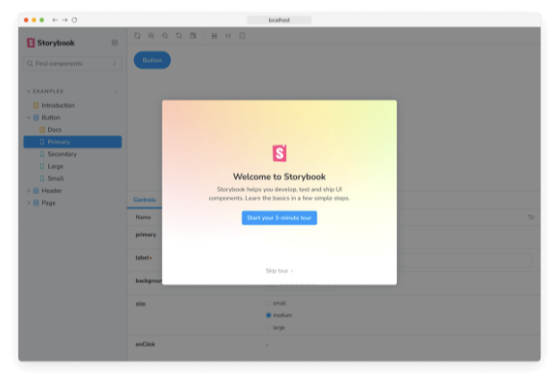

Storybook을 사용하면 React 및 Vite로 구축된 애플리케이션의 UI 구성 요소를 격리하여 개발하고 테스트할 수 있습니다. Storybook은 다음과 같은 내용을 포함합니다:

- 🏎️ 성능을 위해 미리 번들링
- 🪄 구성이 필요 없음
- 💫 등등!

## 요구 사항

- React ≥ 16.8
- Vite ≥ 4.0
- Storybook ≥ 8.0

## 시작하기

### Storybook이 없는 프로젝트에서

React 프로젝트의 루트 디렉토리에서 다음 명령어를 실행한 후 안내에 따르세요:

```npm
npx storybook@latest init
```

Storybook 시작하기에 대해 더 알아보세요.

### Storybook이 포함된 프로젝트에서

이 프레임워크는 Storybook 7+와 함께 작동하도록 설계되었습니다. 이미 v7을 사용하고 있지 않다면 다음 명령을 사용하여 업그레이드하세요:

```npm
npx storybook@latest upgrade
```

#### 자동 이관

위의 업그레이드 명령을 실행할 때 @storybook/react-vite로 마이그레이션하라는 프롬프트가 표시될 것입니다. 자동 이관이 프로젝트에 작동하지 않는 경우 수동 이관을 참조하십시오.

#### 수동 이관

먼저 프레임워크를 설치하십시오:

```npm
npm install --save-dev @storybook/react-vite
```

그런 다음, .storybook/main.js|ts 파일을 업데이트하여 framework 속성을 변경하세요:

```typescript
import { StorybookConfig } from "@storybook/react-vite";

const config: StorybookConfig = {
  // ...
  // framework: '@storybook/react-webpack5', 👈 이 부분 삭제
  framework: "@storybook/react-vite", // 👈 이 부분 추가
};

export default config;
```

## 설정 마법사 실행

만약 모든 것이 순조롭게 진행된다면, 스토리북을 시작하는 데 도움이 되는 설정 마법사를 볼 수 있을 겁니다. 이 마법사는 주요 개념과 기능을 소개해주며 UI의 구성 방법, 첫 번째 스토리 작성 방법, 그리고 컴포넌트가 다양한 입력에 대해 어떻게 반응하는지를 테스트하는 방법을 설명해줍니다.



만약 마법사를 건너뛰었다면, Storybook 인스턴스 URL에 ?path=/onboarding 쿼리 매개변수를 추가하여 언제든 다시 실행할 수 있습니다. 단, 예제 스토리가 여전히 제공되는 상태여야 합니다.

## API

### 옵션

필요 시 추가 구성을 위해 옵션 객체를 전달할 수 있습니다:

```js
import type { StorybookConfig } from "@storybook/react-vite";

const config: StorybookConfig = {
  framework: {
    name: "@storybook/react-vite",
    options: {
      // ...
    },
  },
};

export default config;
```

#### 빌더

유형: 레코드`문자열, 모두`

프레임워크 빌더를 위한 구성 옵션입니다. 해당 프레임워크에서 사용 가능한 옵션은 Vite 빌더 문서에서 찾을 수 있습니다.
