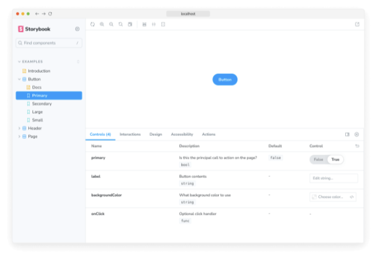

레이아웃 매개변수를 사용하면 Storybook의 캔버스 탭에 이야기가 배치되는 방식을 구성할 수 있습니다.

## 전역 레이아웃

다음과 같이 ./storybook/preview.js에 매개변수를 추가할 수 있습니다:

```typescript
// 사용 중인 프레임워크(예: react, vue3)로 your-framework를 대체해주세요
import { Preview } from '@storybook/your-framework';

const preview: Preview = {
  parameters: {
    layout: 'centered',
  },
};

export default preview;
```  




위의 예시에서 Storybook은 UI에서 모든 스토리를 가운데 정렬합니다. 레이아웃은 아래 옵션들을 받습니다:

- centered: 컴포넌트를 캔버스의 수평 및 수직으로 가운데 정렬
- fullscreen: 컴포넌트를 캔버스의 전체 너비와 높이로 확장
- padded: (기본값) 컴포넌트 주변에 여분의 패딩 추가

## 컴포넌트 레이아웃


위와 같이 구성 요소 수준에서도 설정할 수 있습니다.

```typescript
// your-framework을 사용하는 
@storybook/your-framework' 

import { Button } from './Button';

const meta: Meta<typeof Button> = {
  component: Button,
  // 레이아웃 파라미터를 전체 구성 요소에 적용합니다.
  parameters: {
    layout: 'centered',
  },
};

export default meta;
```

## 스토리 레이아웃

또는 다음과 같이 특정 스토리에도 적용할 수 있습니다:


```typescript
// 여러분이 사용하시는 프레임워크의 이름을 'your-framework' 자리에 넣어주세요
import type { Meta, StoryObj } from '@storybook/your-framework';

import { Button } from './Button';

const meta: Meta<typeof Button> = {
  component: Button,
};

export default meta;
type Story = StoryObj<typeof Button>;

export const WithLayout: Story = {
  parameters: {
    layout: 'centered',
  },
};
```