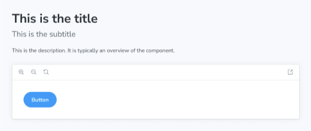

부제목 블록은 문서 항목의 보조 제목으로 사용할 수 있어요.



```js
import { Subtitle } from '@storybook/blocks';

<Subtitle>This is the subtitle</Subtitle>
```

## 부제목


```js
import { Subtitle } from '@storybook/blocks';
```

Subtitle은 다음과 같은 props으로 구성되어 있습니다:

### children

유형: JSX.Element | string
```


기본값: parameters.componentSubtitle

내용을 제공합니다.