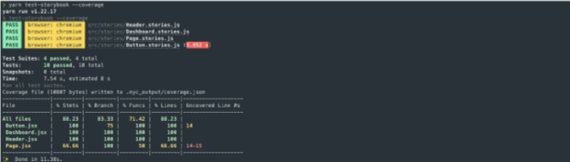

테스트 커버리지는 기존 테스트가 코드 전체를 충분히 다루고 있는지 측정하는 실천 방법입니다. 이것은 현재 테스트되지 않고 있는 영역을 식별하는 것을 의미합니다. 예를 들어, 조건, 논리 분기, 함수 및 변수와 같은 부분입니다.

커버리지 테스트는 인기 있는 업계 표준을 기반으로 계기 코드를 분석합니다. 이것들은 QA의 마지막 라인 역할을 하여 테스트 스위트의 품질을 향상시킵니다.

<video autoplay playsinline loop>
  <source src="@source/docs/Tech/2024-04-07-Testcoverage/img/Testcoverage_0.mp4" type="video/mp4">
</video>

## 커버리지 애드온을 사용한 코드 계기 설정


Storybook은 공식 테스트 커버리지 애드온을 제공합니다. Istanbul을 사용하여 JavaScript 생태계에서 가장 일반적으로 사용되는 프레임워크와 빌더에 대한 코드 인스트루먼테이션을 즉시 제공합니다.

### 커버리지 애드온 설정

현대적인 테스팅 도구(e.g., Playwright)와 함께 작동하도록 설계된 커버리지 애드온은 코드를 자동으로 인스트루먼트하고 코드 커버리지 데이터를 생성합니다. 최상의 경험을 위해, 테스트 러너를 커버리지 애드온과 함께 사용하여 테스트를 실행하는 것을 권장합니다.

애드온을 설치하려면 다음 명령을 실행하세요.


```npm
npm install @storybook/addon-coverage --save-dev
```

 Storybook 구성을 업데이트하세요(.storybook/main.js|ts) coverage 애드온을 포함하도록.

```typescript
// 사용중인 framework과 builder로 교체하세요. (예: react-webpack5, vue3-webpack5)
import type { StorybookConfig } from '@storybook/your-framework';

const config: StorybookConfig = {
  stories: [],
  addons: [
    // 다른 Storybook 애드온들
    '@storybook/addon-coverage', //👈 애드온 등록
  ],
};

export default config;
```

Storybook을 시작하세요:```


```npm
npm run storybook
```

마지막으로 새 터미널 창을 열고 다음 명령을 실행하여 테스트 러너를 실행합니다:

```npm
npm run test-storybook -- --coverage
```




### 설정

기본적으로 @storybook/addon-coverage는 Storybook을 위해 zero-config 지원을 제공하며 Webpack을 통해 코드를 instrument하는 istanbul-lib-instrument 또는 Vite를 위한 vite-plugin-istanbul을 사용합니다. 그러나 Storybook 구성 파일(.storybook/main.js|ts)을 확장하고 애드온에 추가 옵션을 제공할 수 있습니다. 아래에 사용 가능한 옵션과 그 사용법 예시가 나와 있습니다.

```typescript
// Vite 지원을 위해 다음 import를 추가
// import type { AddonOptionsVite } from '@storybook/addon-coverage';

import type { AddonOptionsWebpack } from '@storybook/addon-coverage';

// 사용 중인 프레임워크 및 빌더(예: react-webpack5, vue3-webpack5)로 교체
import type { StorybookConfig } from '@storybook/your-framework';

const coverageConfig: AddonOptionsWebpack = {
  istanbul: {
    include: ['**/stories/**'],
    exclude: ['**/exampleDirectory/**'],
  }
};

const config: StorybookConfig = {
  stories: [],
  addons: [
    // 다른 Storybook 애드온들
    {
      name: '@storybook/addon-coverage',
      options: coverageConfig,
    },
  ],
};

export default config;
```

프로젝트가 Webpack5를 사용하는 경우 사용 가능한 옵션은 아래와 같습니다:


> 참고: TypeScript를 사용하는 경우 옵션에 대한 타입을 다음과 같이 가져올 수 있습니다:
import type { AddonOptionsWebpack } from `@storybook/addon-coverage`;

프로젝트가 Vite를 사용하는 경우 사용 가능한 옵션은 다음과 같습니다:

> 참고: TypeScript를 사용하는 경우 옵션에 대한 타입을 다음과 같이 가져올 수 있습니다:
import type { AddonOptionsVite } from `@storybook/addon-coverage`;

## 다른 커버리지 보고 도구는 어떻게 되나요?


기본적으로 코드 커버리지 테스트는 Storybook의 테스트 러너와 @storybook/addon-coverage와 매끄럽게 작동합니다. 하지만 이것은 추가적인 보고 도구(예: Codecov)를 사용할 수 없다는 것을 의미하지는 않습니다. 예를 들어, LCOV를 사용하는 경우에는 생성된 출력물(coverage/storybook/coverage-storybook.json)을 사용하여 다음과 같이 자체 보고서를 생성할 수 있습니다:

```typescript
npx nyc report --reporter=lcov -t coverage/storybook --report-dir coverage/storybook
```

## 문제 해결

### 다른 프레임워크에서 테스트 커버리지 실행하기


만약 Vue 3 또는 Svelte 같은 특수 파일이 있는 프레임워크에서 커버리지 테스트를 실행하려면 설정을 조정하고 필요한 파일 확장자를 활성화해야 합니다. 예를 들어, Vue를 사용 중이라면 nyc 구성 파일 (즉, .nycrc.json 또는 nyc.config.js)에 아래 내용을 추가해야 합니다:

```typescript
{
  "extension": [".js", ".cjs", ".mjs", ".ts", ".tsx", ".jsx", ".vue"]
}
```

### 커버리지 애드온은 최적화된 빌드를 지원하지 않습니다

성능을 위해 최적화된 프로덕션 빌드를 생성했으며 --test 플래그를 사용 중이고 커버리지 애드온을 사용하여 Storybook에 대한 테스트를 실행하려는 경우, 커버리지 애드온이 코드를 계측하지 않는 상황에 마주칠 수 있습니다. 이는 플래그가 동작하는 방식 때문에 발생하는 것으로, 성능에 영향을 미치는 애드온 (예: Docs, 커버리지 애드온)을 제거합니다. 이 문제를 해결하려면 Storybook 구성 파일 (즉, .storybook/main.js|ts)을 조정하고 disabledAddons 옵션을 포함하여 애드온이 느린 빌드를 감수하면서 테스트를 실행할 수 있도록 허용해야 합니다.


```typescript
// 사용 중인 프레임워크를 (예: react-webpack5, vue3-vite)로 바꿔주세요
import type { StorybookConfig } from '@storybook/your-framework';

const config: StorybookConfig = {
  framework: '@storybook/your-framework',
  stories: ['../src/**/*.mdx', '../src/**/*.stories.@(js|jsx|mjs|ts|tsx)'],
  addons: [
    '@storybook/addon-links',
    '@storybook/addon-essentials',
    '@storybook/addon-interactions',
    '@storybook/addon-coverage',
  ],
  build: {
    test: {
      disabledAddons: ['@storybook/addon-docs', '@storybook/addon-essentials/docs'],
    },
  },
};

export default config;
```

### 커버리지 애드온은 instrumented 코드를 지원하지 않습니다

커버리지 애드온은 Webpack5 로더와 Vite 플러그인을 사용하여 코드 계측을 하기 때문에, 이러한 라이브러리를 사용하지 않는 프레임워크(e.g., Webpack으로 구성된 Angular)는 코드 계측을 활성화하려면 추가 구성이 필요합니다. 이 경우, 더 많은 정보를 위해 다음 저장소를 참조할 수 있습니다.

다른 UI 테스트에 대해 알아보기


- 테스트 실행을 자동화하는 테스트 러너
- 외관을 위한 시각적 테스트
- 접근성을 위한 접근성 테스트
- 사용자 동작 시뮬레이션을 위한 상호작용 테스트
- 코드 커버리지를 측정하기 위한 커버리지 테스트
- 렌더링 오류 및 경고를 위한 스냅샷 테스트
- 실제 사용자 시나리오를 시뮬레이션하기 위한 end-to-end 테스트
- 기능성을 위한 단위 테스트