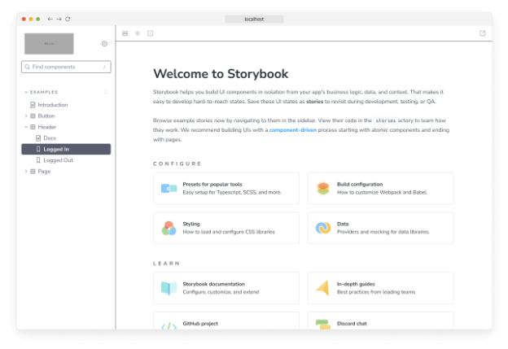

스토리북은 가볍게 테마를 설정할 수 있는 테마 API를 활용할 수 있어요.

## 전역 테마

스토리북을 전역적으로 테마를 설정할 수 있어요.

스토리북에는 기본적으로 "라이트(light)"와 "다크(dark)" 두 가지 테마를 포함하고 있어요. 사용자가 선호하는 색상 테마를 "다크"로 설정한 경우를 제외하고는 기본적으로 "라이트" 테마를 사용할 거에요.


@storybook/manager-api과 @storybook/theming 패키지가 설치되어 있는지 확인해주세요.

```npm
npm install --save-dev @storybook/manager-api @storybook/theming
```

예를 들어, "dark" 테마를 사용하도록 Storybook에 지시할 수 있습니다. 이를 위해 .storybook/manager.js를 수정하세요:

```typescript
import { addons } from '@storybook/manager-api';
import { themes } from '@storybook/theming';

addons.setConfig({
  theme: themes.dark,
});
```


테마를 설정할 때 완전한 테마 객체를 설정하세요. 테마는 추가되는 것이 아니라 교체됩니다.

## 테마 설정 문서

Storybook Docs는 Storybook의 UI와 동일한 테마 시스템을 사용하지만 메인 UI와는 독립적으로 테마가 지정됩니다.

main UI를 위해 .storybook/manager.js에 정의된 Storybook 테마가 있는 경우를 상정해보겠습니다:


```typescript
import { addons } from '@storybook/manager-api';
import { themes } from '@storybook/theming';

addons.setConfig({
  theme: themes.dark,
});
```

이제 .storybook/preview.js에서 동일한 테마를 문서에 지정하는 방법을 보여 드리겠습니다:

```typescript
// 사용 중인 프레임워크(예: react, vue3)로 your-framework를 교체하십시오
import { Preview } from '@storybook/your-framework';

import { themes } from '@storybook/theming';

const preview: Preview = {
  parameters: {
    docs: {
      theme: themes.dark,
    },
  },
};

export default preview;
```

자신만의 테마를 만드는 방법을 알고 싶다면 계속 읽어보세요.


## 테마 퀵 스타트 만들기

Storybook을 사용자 정의하는 가장 쉬운 방법은 storybook/theming에서 create() 함수를 사용하여 새 테마를 생성하는 것입니다. 이 함수에는 가장 일반적인 테마 변수에 대한 단축키가 포함되어 있습니다. 다음은 그 사용 방법입니다:

.storybook 디렉토리 내에서 YourTheme.js라는 새 파일을 만들고 다음을 추가하세요:

```typescript
import { create } from '@storybook/theming/create';

export default create({
  base: 'light',
  brandTitle: '나만의 Storybook',
  brandUrl: 'https://example.com',
  brandImage: 'https://storybook.js.org/images/placeholders/350x150.png',
  brandTarget: '_self',
});
```


위에서는 다음과 같은 새 테마를 만들고 있습니다:

- Storybook의 라이트 테마를 기본으로 사용할 것입니다.
- 사이드바에 Storybook 로고를 우리 자체 로고로 바꿀 것입니다(brandImage 변수에 정의됨).
- 사용자 정의 브랜딩 정보를 추가할 것입니다.
- 브랜드 링크를 새 창이 아닌 동일한 창에서 여는 것으로 설정할 것입니다.

마지막으로, 이 테마를 Storybook에 가져와야 합니다. .storybook 디렉토리에 manager.js라는 새 파일을 만들고 다음을 추가하세요:

```typescript
import { addons } from '@storybook/manager-api';
import yourTheme from './YourTheme';

addons.setConfig({
  theme: yourTheme,
});
```


이제 사용자 정의 테마가 Storybook의 기본 테마를 대체하고, UI에서 비슷한 변경 사항을 볼 수 있을 거예요.


더 복잡한 예제를 살펴봐요. 아래 코드를 복사해서 .storybook/YourTheme.js에 붙여넣기하세요.

```typescript
import { create } from '@storybook/theming/create';

export default create({
  base: 'light',
  // Typography
  fontBase: '"Open Sans", sans-serif',
  fontCode: 'monospace',

  brandTitle: '내 맞춤 Storybook',
  brandUrl: 'https://example.com',
  brandImage: 'https://storybook.js.org/images/placeholders/350x150.png',
  brandTarget: '_self',

  //
  colorPrimary: '#3A10E5',
  colorSecondary: '#585C6D',

  // UI
  appBg: '#ffffff',
  appContentBg: '#ffffff',
  appPreviewBg: '#ffffff',
  appBorderColor: '#585C6D',
  appBorderRadius: 4,

  // Text colors
  textColor: '#10162F',
  textInverseColor: '#ffffff',

  // Toolbar default and active colors
  barTextColor: '#9E9E9E',
  barSelectedColor: '#585C6D',
  barHoverColor: '#585C6D',
  barBg: '#ffffff',

  // Form colors
  inputBg: '#ffffff',
  inputBorder: '#10162F',
  inputTextColor: '#10162F',
  inputBorderRadius: 2,
});
```


위에서 우리는 다음 변경 사항으로 테마를 업데이트하고 있습니다:

- 앱 및 색상 변수에서 정의된 사용자 정의 색상 팔레트.
- 폰트 및 텍스트 변수에서 정의된 사용자 정의 글꼴.

새 변경 사항을 도입하면 사용자 정의 테마가 유사한 결과를 내야합니다.




@storybook/theming 패키지는 TypeScript를 사용하여 구축되었으며, TypeScript 사용자를 위한 유효한 테마를 생성하는 데 도움이 될 것입니다. 타입은 해당 패키지의 일부입니다.

## CSS 이스케이프 헤칭

Storybook 테마 API는 의도적으로 좁게 설계되어 있습니다. CSS에 세부적인 제어를 원한다면, 모든 UI 및 문서 구성 요소에는 이를 가능하게 하는 클래스 이름이 태그가 달려 있습니다. 이 기능은 고급 기능이므로 주의해서 사용하세요.

이러한 요소에 스타일을 지정하려면 다음에 스타일 태그를 삽입하세요:


- Storybook UI에는 .storybook/manager-head.html을 사용하세요.
- Storybook Docs에는 .storybook/preview-head.html을 사용하세요.

## MDX 컴포넌트 재정의

만약 문서 작성을 위해 MDX를 사용한다면, "테마 설정"에 관한 한 가지 더 있습니다. MDX를 사용하면 Markdown에서 렌더링된 컴포넌트를 완전히 재정의할 수 있습니다. components 매개변수를 사용하면 됩니다. 이것은 공식적으로 Storybook에서 지원되지는 않지만, 필요할 때 강력한 구조입니다.

다음은 페이지의 코드 블록을 위해 사용자 지정 코드 렌더러를 삽입하는 방법입니다. .storybook/preview.js에서:


```typescript
// 사용중인 프레임워크(예: 리액트, 뷰3)로 교체하세요
import { 미리보기 } from '@storybook/your-framework';

import { 코드블록 } from './CodeBlock';

const 미리보기: 미리보기 = {
  parameters: {
    docs: {
      components: {
        code: 코드블록,
      },
    },
  },
};

export default 미리보기;
```

Storybook 블록 컴포넌트를 재정의할 수도 있습니다.

다음은 사용자 지정 `Canvas` 블록을 삽입하는 방법입니다:

```typescript
// 사용중인 프레임워크(예: 리액트, 뷰3)로 교체하세요
import { 미리보기 } from '@storybook/your-framework';

import { 내캔버스 } from './MyCanvas';

const 미리보기: 미리보기 = {
  parameters: {
    docs: {
      components: {
        Canvas: 내캔버스,
      },
    },
  },
};

export default 미리보기;
```


## 애드온 및 테마 생성

일부 애드온은 Storybook 사용자가 추가해야 하는 특정 테마 변수가 필요합니다. 커뮤니티와 테마를 공유할 때는 공식 API와 인기 있는 애드온을 지원하여 사용자가 일관된 경험을 할 수 있도록 해주세요.

예를 들어, 인기 있는 Actions 애드온은 react-inspector를 사용하는데, 그 자체의 테마를 가지고 있습니다. 아래와 같이 스타일을 지정하기 위해 추가 테마 변수를 제공할 수 있습니다:

```typescript
addonActionsTheme: {
  ...chromeLight,
  BASE_FONT_FAMILY: typography.fonts.mono,
  BASE_BACKGROUND_COLOR: 'transparent',
}
```


## 애드온 작성자를 위한 테마 사용

위의 테마 변수를 사용하여 네이티브 Storybook 개발자 경험을 재사용하세요. 테마 엔진은 CSS-in-JS 라이브러리인 emotion에 의존합니다.

```typescript
import { styled } from '@storybook/theming';
```

객체 표기법으로 테마 변수를 사용하세요.


```typescript
const Component = styled.div(({ 테마 }) => ({
  배경: 테마.background.app,
  너비: 0,
}));
```

또는 템플릿 리터럴을 사용하면:

```typescript
const Component = styled.div`
  background: `${props => props.theme.background.app}`
  width: 0;
`;
```