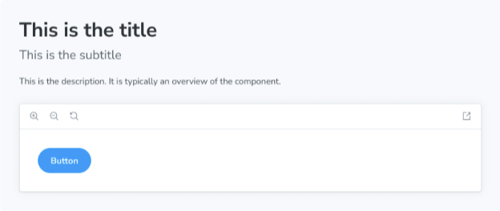

제목 블록은 문서 항목의 주요 제목으로 기능합니다. 일반적으로 컴포넌트 또는 페이지 이름을 제공하는 데 사용됩니다.



```js
import { Title } from '@storybook/blocks';

<Title>This is the title</Title>
```

## Title


```js
import { Title } from '@storybook/blocks';
```

Title은 다음과 같은 속성으로 구성됩니다:

### children

유형: JSX.Element | string


내용을 제공합니다. 첨부된 CSF 파일의 제목 값(또는 autotitle에서 파생된 값)으로 반환됩니다. 마지막 세그먼트로 잘립니다. 예를 들어, 제목 값이 `path/to/components/Button`이면 기본 내용은 `Button`입니다.