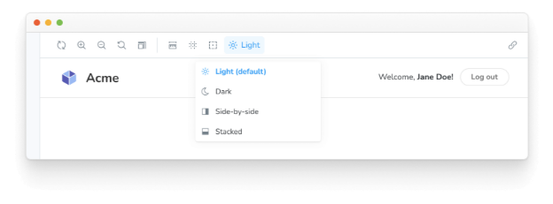

Storybook에는 스토리가 렌더링되는 뷰포트 및 백그라운드를 제어하는 툴바 애드온이 함께 제공됩니다. 또한 본문 렌더링을 제어하는 특수 “글로벌”을 제어하는 사용자 지정 툴바 항목을 만들 수도 있습니다.



## 글로벌

Storybook의 글로벌은 스토리 렌더링의 “글로벌”(스토리별이 아닌) 입력을 나타냅니다. 스토리와 관련이 없기 때문에 이러한 글로벌들은 스토리 함수에 args 인수로 전달되지 않습니다(그러나 context.globals로 접근할 수 있습니다). 일반적으로 모든 스토리에 적용되는 데코레이터에서 사용됩니다.


Global 값이 변경되면 이야기가 다시 렌더링되고 데코레이터가 새 값으로 다시 실행됩니다. Global 값을 변경하는 가장 쉬운 방법은 툴바 항목을 생성하는 것입니다.

## Global 유형 및 툴바 주석

Storybook은 툴바 메뉴를 구성하는 간단한 선언적 구문을 가지고 있습니다. .storybook/preview.js|ts에서 `toolbar` 주석을 사용하여 자체 툴바를 추가할 수 있습니다.

```typescript
// 사용 중인 프레임워크에 해당하는 your-framework을 지정해주세요 (예: react, vue3)
import { Preview } from '@storybook/your-framework';

const preview: Preview = {
  globalTypes: {
    theme: {
      description: '컴포넌트 전역 테마',
      defaultValue: 'light',
      toolbar: {
        // 이 툴바 항목을 위해 보여줄 라벨
        title: '테마',
        icon: 'circlehollow',
        // 일반 문자열 값 또는 MenuItem 모양의 배열 (아래 참조)
        items: ['light', 'dark'],
        // 선택한 값에 따라 제목 변경
        dynamicTitle: true,
      },
    },
  },
};

export default preview;
```


Storybook을 시작하면 툴바에 빛과 어두운 옵션이 있는 새 드롭다운이 표시됩니다.

## 데코레이터 만들기

우리는 전역 구현을 가지고 있습니다. 이를 연결해 봅시다! context.globals.theme 값을 사용하여 데코레이터에서 새 테마 전역을 사용할 수 있습니다.

예를 들어, styled-components를 사용하는 경우 .storybook/preview.js|ts 구성에 테마 제공자 데코레이터를 추가할 수 있습니다:


```typescript
import type { Preview } from '@storybook/react';

import { ThemeProvider } from 'styled-components';

import { MyThemes } from '../my-theme-folder/my-theme-file';

const preview: Preview = {
  decorators: [
    (Story, context) => {
      const theme = MyThemes[context.globals.theme];
      return (
        <ThemeProvider theme={theme}>
          <Story />
        </ThemeProvider>
      );
    },
  ],
};

export default preview;
```

## 고급 사용법

지금까지 Storybook에서 전역 객체를 생성하고 사용하는 방법을 살펴보았습니다.

이제 좀 더 복잡한 예제를 살펴봅시다. 국제화를 위한 locale이라는 새로운 전역 객체를 구현하고 툴바 오른쪽에 국기를 표시하고 싶다고 가정해 봅시다.


.storybook/preview.js 또는 .storybook/preview.ts 파일에 다음을 추가해 주세요:

```typescript
// 사용 중인 프레임워크(예: react, vue3)로 your-framework를 교체하세요
import { Preview } from '@storybook/your-framework';

const preview: Preview = {
  globalTypes: {
    locale: {
      description: '국제화 로캘',
      defaultValue: 'en',
      toolbar: {
        icon: 'globe',
        items: [
          { value: 'en', right: '🇺🇸', title: '영어' },
          { value: 'fr', right: '🇫🇷', title: '프랑스어' },
          { value: 'es', right: '🇪🇸', title: '스페인어' },
          { value: 'zh', right: '🇨🇳', title: '중국어' },
          { value: 'kr', right: '🇰🇷', title: '한국어' },
        ],
      },
    },
  },
};

export default preview;
```

설정 요소를 추가하면 데코레이터에 연결하면 텍스트가 툴바 메뉴 오른쪽에 표시됩니다.

아래는 가능한 구성 옵션 목록입니다.


## 이야기 내에서 전역 속성 사용하기

우리는 모든 이야기에 대한 전역 설정을 정의하기 위해 데코레이터 내에서 전역을 사용하는 것을 권장합니다.

그러나 때로는 이야기별로 툴바 옵션을 사용하는 것이 더 유익할 수도 있음을 알고 있습니다.

위의 예제를 사용하여 이야기마다 Locale 전역을 이야기 컨텍스트에서 가져오도록 수정할 수 있습니다:


```typescript
import type { Meta, StoryObj } from '@storybook/react';

import { MyComponent } from './MyComponent';

const meta: Meta<typeof MyComponent> = {
  component: MyComponent,
};

export default meta;
type Story = StoryObj<typeof MyComponent>;

const getCaptionForLocale = (locale) => {
  switch (locale) {
    case 'es':
      return 'Hola!';
    case 'fr':
      return 'Bonjour!';
    case 'kr':
      return '안녕하세요!';
    case 'zh':
      return '你好!';
    default:
      return 'Hello!';
  }
};

export const StoryWithLocale = {
  render: (args, { globals: { locale } }) => {
    const caption = getCaptionForLocale(locale);
    return <p>{caption}</p>;
  },
};
```

## 애드온 내에서 글로벌 값 사용하기

만약 Storybook 애드온을 개발 중이고 글로벌 값을 가져와야 하는 경우가 있다면 @storybook/manager-api 패키지를 사용하면 가능합니다. 이 시나리오를 위한 훅이 제공됩니다. useGlobals() 훅을 사용하여 원하는 글로벌 값을 검색할 수 있습니다.

위의 ThemeProvider 예제를 사용하여, 어떤 테마가 활성화되어 있는지를 나타내는 패널을 확장할 수 있습니다.```


```typescript
import React from 'react';

import { useGlobals } from '@storybook/manager-api';

import { AddonPanel, Placeholder, Separator, Source, Spaced, Title } from '@storybook/components';

import { MyThemes } from '../my-theme-folder/my-theme-file';

// 특정 테마를 가져오는 함수
const getTheme = (themeName) => {
  return MyThemes[themeName];
};

const ThemePanel = (props) => {
  const [{ theme: themeName }] = useGlobals();

  const selectedTheme = getTheme(themeName);

  return (
    <AddonPanel {...props}>
      {selectedTheme ? (
        <Spaced row={3} outer={1}>
          <Title>{selectedTheme.name}</Title>
          <p>전체 테마 객체</p>
          <Source
            code={JSON.stringify(selectedTheme, null, 2)}
            language="js"
            copyable
            padded
            showLineNumbers
          />
        </Spaced>
      ) : (
        <Placeholder>선택된 테마가 없습니다</Placeholder>
      )}
    </AddonPanel>
  );
};
```

## 애드온 내부에서 글로벌 값을 업데이트하는 방법

애드온에서 글로벌 값을 업데이트하고 UI를 새로 고칠 필요가 있는 경우가 있습니다. 이 경우를 위해 @storybook/manager-api 패키지에서 필요한 후크를 제공합니다. updateGlobals 함수를 사용하여 필요한 모든 글로벌 값을 업데이트할 수 있습니다.

예를 들어, 툴바 애드온을 작업 중이고 사용자가 버튼을 클릭했을 때 UI를 새로 고치고 글로벌을 업데이트하고 싶은 경우:```


```typescript
import React, { useCallback } from 'react';

import { FORCE_RE_RENDER } from '@storybook/core-events';
import { useGlobals } from '@storybook/manager-api';

import { IconButton } from '@storybook/components';
import { OutlineIcon } from '@storybook/icons';

import { addons } from '@storybook/preview-api';

const ExampleToolbar = () => {
  const [globals, updateGlobals] = useGlobals();

  const isActive = globals['my-param-key'] || false;

  // Function that will update the global value and trigger a UI refresh.
  const refreshAndUpdateGlobal = () => {
    // Updates Storybook global value
    updateGlobals({
      ['my-param-key']: !isActive,
    }),
      // Invokes Storybook's addon API method (with the FORCE_RE_RENDER) event to trigger a UI refresh
      addons.getChannel().emit(FORCE_RE_RENDER);
  };

  const toggleOutline = useCallback(() => refreshAndUpdateGlobal(), [isActive]);

  return (
    <IconButton
      key="Example"
      active={isActive}
      title="Storybook 툴바 보이기"
      onClick={toggleOutline}
    >
      <OutlineIcon />
    </IconButton>
  );
};
```