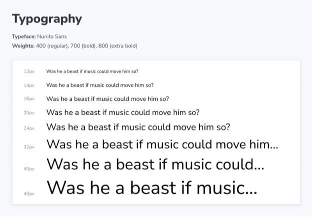

Typeset 블록은 프로젝트 전반에 걸쳐 사용된 글꼴을 문서화하는 데 도움이 됩니다.



```js
import { Meta, Typeset } from '@storybook/blocks';

<Meta title="Typography" />

export const typography = {
  type: {
    primary: '"누니토 산스", "헬베티카 뉴", 헬베티카, Arial, sans-serif',
  },
  weight: {
    regular: '400',
    bold: '700',
    extrabold: '800',
    black: '900',
  },
  size: {
    s1: 12,
    s2: 14,
    s3: 16,
    m1: 20,
    m2: 24,
    m3: 28,
    l1: 32,
    l2: 40,
    l3: 48,
  },
};

export const SampleText = 'Lorem ipsum dolor sit amet, consectetur adipiscing elit.';

# Typography

**글꼴:** 누니토 산스

**굵기:** 400(보통), 700(굵게), 800(엄격함), 900(진한검은색)

<Typeset
  fontSizes={[
    Number(typography.size.s1),
    Number(typography.size.s2),
    Number(typography.size.s3),
    Number(typography.size.m1),
    Number(typography.size.m2),
    Number(typography.size.m3),
    Number(typography.size.l1),
    Number(typography.size.l2),
    Number(typography.size.l3),
  ]}
  fontWeight={typography.weight.black}
  sampleText={SampleText}
  fontFamily={typography.type.primary}
/>
```

## Typeset


```js
import { Typeset } from '@storybook/blocks';
```

Typeset은 다음과 같은 프롭으로 구성되어 있어요:

### fontFamily

타입: 문자열


표 태그를 마크다운 형식으로 변경해주세요.

### fontSizes

유형: number[]

사용 가능한 글꼴 크기 목록(픽셀 단위)을 제공합니다.


### fontWeight

유형: 숫자

표시할 글꼴의 두께를 지정합니다.

### sampleText


유형: 문자열

표시할 텍스트를 설정합니다.