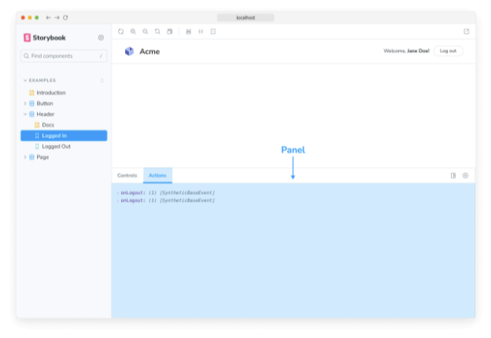
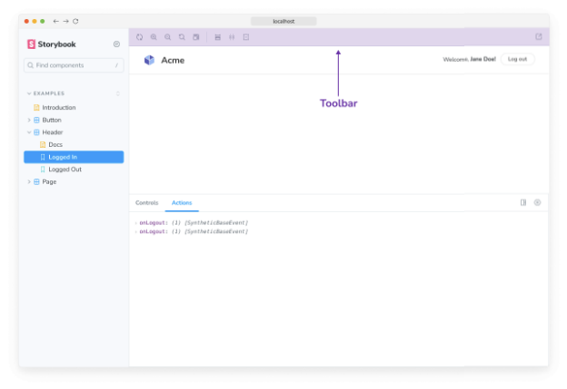
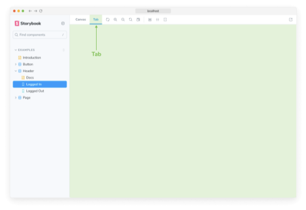

각 Storybook 애드온은 UI 기반 또는 프리셋 두 가지 일반 범주로 분류됩니다. 각 종류의 애드온 기능이 여기에 문서화되어 있습니다. 애드온을 만들 때 참고하세요.

## UI 기반 애드온

UI 기반 애드온은 다음 요소로 Storybook의 UI를 사용자 정의할 수 있습니다.

### 패널


패널 애드온을 사용하면 Storybook의 애드온 패널에 자체 UI를 추가할 수 있어요. 이것은 생태계에서 가장 일반적인 애드온 유형입니다. 예를 들어, 공식 @storybook/actions 및 @storybook/a11y가 이 패턴을 사용합니다.



다음 보일러플레이트 코드를 사용하여 Storybook의 UI에 새로운 패널을 추가하세요:

```typescript
import React from 'react';

import { AddonPanel } from '@storybook/components';

import { useGlobals, addons, types } from '@storybook/manager-api';

addons.register('my/panel', () => {
  addons.add('my-panel-addon/panel', {
    title: 'Example Storybook panel',
    //👇 Storybook에서 UI 요소의 유형을 설정합니다
    type: types.PANEL,
    render: ({ active }) => (
      <AddonPanel active={active}>
        <h2>Storybook의 패널 애드온입니다</h2>
      </AddonPanel>
    ),
  });
});
```


### 툴바

툴바 애드온을 사용하면 Storybook의 툴바에 사용자 지정 도구를 추가할 수 있습니다. 예를 들어, 공식 @storybook/backgrounds 및 @storybook/addon-outline이 이 패턴을 사용합니다.



다음 보일러플레이트 코드를 사용하여 Storybook의 툴바에 새 버튼을 추가할 수 있습니다:


```typescript
import React from 'react';

import { addons, types } from '@storybook/manager-api';
import { IconButton } from '@storybook/components';
import { OutlineIcon } from '@storybook/icons';

addons.register('my-addon', () => {
  addons.add('my-addon/toolbar', {
    title: 'Example Storybook toolbar',
    //👇 스토리북에서 UI 요소의 유형을 설정합니다.
    type: types.TOOL,
    //👇 이야기 캔버스를 보고 있는 경우 툴바 UI 요소를 표시합니다.
    match: ({ tabId, viewMode }) => !tabId && viewMode === 'story',
    render: ({ active }) => (
      <IconButton active={active} title="스토리북 툴바 보이기">
        <OutlineIcon />
      </IconButton>
    ),
  });
});
```

### 탭

탭 애드온을 사용하면 스토리북에서 사용자 지정 탭을 만들 수 있습니다. 예를 들어, 공식 @storybook/addon-docs는 이러한 패턴을 사용합니다.


```


이 보일러플레이트 코드를 사용하여 Storybook의 UI에 새로운 탭을 추가하세요:

```typescript
import React from 'react';

import { addons, types } from '@storybook/manager-api';

addons.register('my-addon', () => {
  addons.add('my-addon/tab', {
    type: types.TAB,
    title: 'Example Storybook tab',
    render: () => (
      <div>
        <h2>Storybook에서 탭 형식의 애드온입니다</h2>
      </div>
    ),
  });
});
```

## 프리셋 애드온

Storybook 프리셋 애드온은 babel, webpack 및 애드온 구성의 그룹화된 컬렉션으로, Storybook과 다른 기술을 통합하는 데 사용됩니다. 예를 들어 공식 프리셋-create-react-app이 있습니다.


이 보일러플레이트 코드를 사용하여 나만의 프리셋 애드온을 작성할 때 참고하세요.

```typescript
export default {
  managerWebpack: async (config, options) => {
    // 여기서 config 업데이트
    return config;
  },
  webpackFinal: async (config, options) => {
    return config;
  },
  babel: async (config, options) => {
    return config;
  },
};
```

Storybook 애드온 생태계에 대해 더 알아보세요.

- 다른 종류의 애드온 유형
- 애드온 개발의 기본을 위한 애드온 작성
- 프리셋 개발을 위한 프리셋
- 요구 사항 및 사용 가능한 레시피에 대한 통합 카탈로그
- 사용 가능한 API에 대해 알아보는 API 참조 페이지