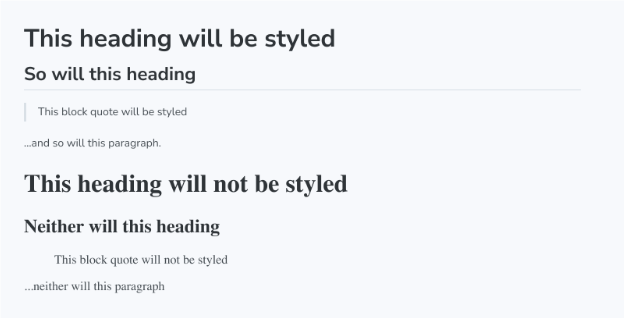

Unstyled 블록은 MDX 문서에서 Storybook의 기본 스타일을 비활성화하는 특수 블록입니다.

기본적으로 문서의 대부분의 요소 (예: h1, p 등)에는 문서가 잘 보이도록 몇 가지 기본 스타일이 적용됩니다. 그러나 때로는 내용 중 일부에 이러한 스타일을 적용하고 싶지 않을 수도 있습니다. 이런 경우에는 내용을 Unstyled 블록으로 감싸서 기본 스타일을 제거할 수 있습니다.

```js
import { Meta, Unstyled } from "@storybook/blocks";
import { Header } from "./Header.tsx";

<Meta title="Unstyled" />

> 이 블록 인용문은 스타일이 입혀집니다

... 그리고 이 단락도 스타일이 적용됩니다.

<Unstyled>
  > 이 블록 인용문은 스타일이 적용되지 않습니다

  ... 그리고 이 단락도, 다음 구성 요소 (h1을 포함하는 구성 요소)도 스타일이 적용되지 않습니다.

  <Header />

</Unstyled>
```

결과:




```js
<div>
  <Unstyled>
    <CustomComponent/>
  </Unstyled>
</div>
```

## Unstyled

```js
import { Unstyled } from '@storybook/blocks';
```


Unstyled은 다음과 같은 props로 구성됩니다:

### children

유형: React.ReactNode

기본 문서 스타일을 적용하고 싶지 않은 콘텐츠를 제공합니다.