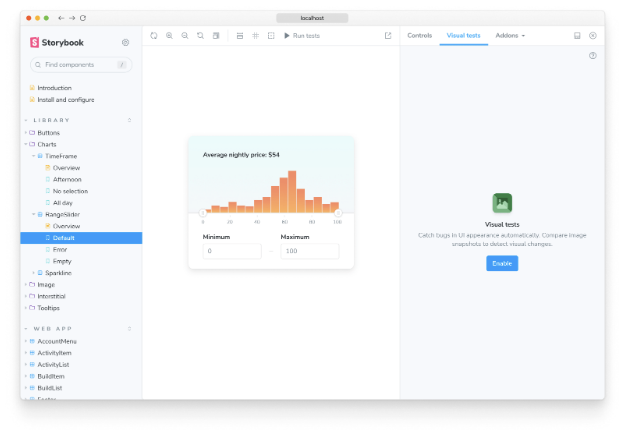
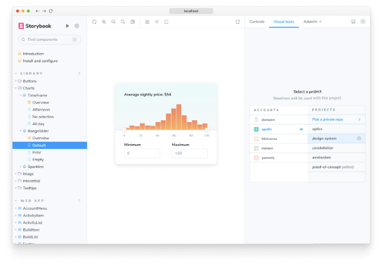
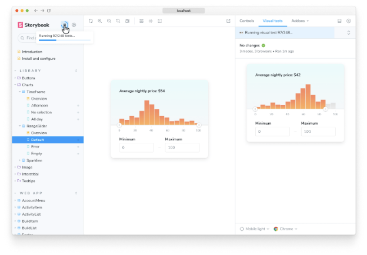
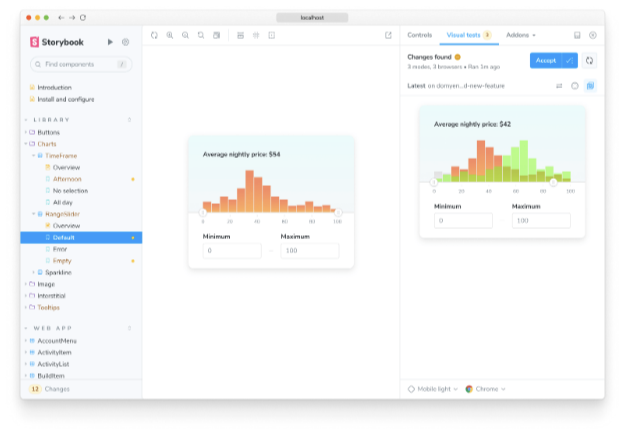
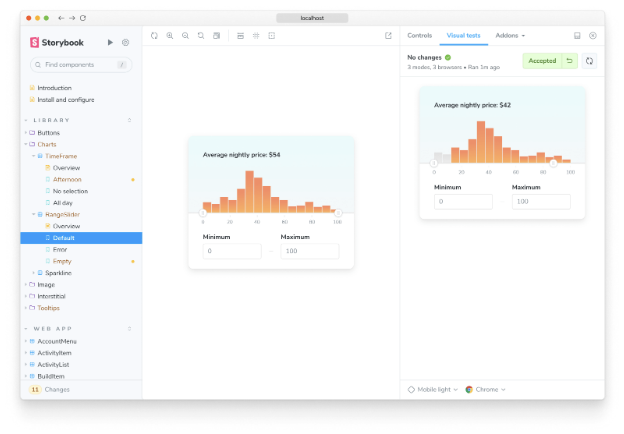

시각 테스트는 UI 모습에서 버그를 찾아내요. 각각의 이야기를 스크린샷을 찍어 이전 버전과 비교하여 시각적인 변화를 식별하는 방식으로 작동해. 이는 레이아웃, 색상, 크기, 대비, 그리고 UI의 다른 시각적 측면을 확인하는 데 이상적이야.

Storybook은 Storybook 팀이 만든 클라우드 서비스인 Chromatic을 사용하여 내장된 크로스 브라우저 시각 테스트를 지원해. 시각 테스트를 활성화하면 모든 이야기가 자동적으로 테스트로 전환돼. 이를 통해 Storybook에서 UI 버그에 대한 즉각적인 피드백을 받을 수 있어.

<video autoplay playsinline loop>
  <source src="@source/docs/Tech/2024-04-07-Visualtests/img/Visualtests_0.mp4" type="video/mp4">
</video>

### 애드온 설치


프로젝트에 시각적 테스트를 추가하려면, Storybook 유지보수자가 제공하는 공식 애드온인 @chromatic-com/storybook을 설치해주세요:

```npm
npx storybook@latest add @chromatic-com/storybook
```

### 시각적 테스트 활성화

Storybook을 시작하면, 시각적 테스트용 새로운 애드온 패널이 표시됩니다. 여기에서 테스트를 실행하고 결과를 확인할 수 있습니다.




시각 테스트를 활성화하려면 Chromatic에 가입하고 프로젝트를 생성하세요. 이렇게 하면 클라우드 브라우저의 풀에 액세스할 수 있습니다.



설정을 완료하려면 프로젝트 목록에서 프로젝트를 선택하세요. 애드온을 처음으로 설정하는 경우 구성 파일과 필요한 프로젝트 식별자가 자동으로 추가됩니다.


### 설정

애드온은 대부분의 사용 사례를 커버하는 기본 구성 옵션을 포함하고 있습니다. 또한 ./chromatic.config.json 파일을 통해 프로젝트 요구 사항에 맞게 애드온 구성을 세밀하게 조정할 수도 있습니다. 아래에 사용 가능한 옵션과 어떻게 사용하는지의 예시가 나와 있습니다.

```js
{
  "buildScriptName": "deploy-storybook",
  "debug": true,
  "projectId": "Project:64cbcde96f99841e8b007d75",
  "zip": true
}
```

### 시각적인 테스트 실행


스토리북 사이드바의 ▶️ 재생 버튼을 클릭하여 시각적 테스트를 실행하세요. 이렇게 하면 이야기가 클라우드로 전송되어 스냅샷을 촬영하고 시각적 변경 사항을 감지합니다.



### 변경 사항 검토

만약 이야기에서 시각적 변경 사항이 발생하면 사이드바에 🟡 강조 표시됩니다. 이야기를 클릭하여 시각적 테스트 애드온 패널로 이동하여 어떤 픽셀이 변경되었는지 확인하세요.


만약 변경 사항이 의도한 대로라면, ✅ 지역에서 기준으로 수락하세요. 변경 사항이 의도치 않았다면, 이야기를 수정하고 ▶️ 재생 버튼을 사용하여 테스트를 다시 실행하세요.



애드온에서 변경 사항을 기준으로 수락한 후, 코드를 원격 저장소로 푸시할 준비가 되었습니다. 이렇게 하면 클라우드에 기준이 동기화되어 브랜치를 체크아웃하는 사용자에게 제공됩니다.




### CI로 자동화하기

이 애드온은 CI와 함께 사용하도록 설계되었습니다. 개발 중 변경 사항을 확인하고 CI에서 시각적 테스트를 실행하여 병합할 준비를 할 때 애드온을 사용하는 것을 추천합니다.

애드온에서 기준으로 인정하는 변경 사항은 CI에서도 자동으로 기준으로 인정되므로 두 번 검토할 필요가 없습니다.

- CI 워크플로우에 Chromatic 실행 단계를 추가하세요.
   - GitHub Actions
   - GitLab Pipelines
   - Bitbucket Pipelines
   - CircleCI
   - Travis CI
   - Jenkins
   - Azure Pipelines
   - 사용자 지정 CI 제공업체
- CI를 구성하여 Chromatic(프로젝트 토큰)로 인증할 수 있도록 환경 변수를 포함하세요.


#### PR 체크

CI에서 Chromatic를 성공적으로 설정하고 나면, 여러분의 풀/머지 요청은 UI 테스트 체크로 배지가 달리게 될 것입니다. 이 배지는 여러분의 팀이 검증해야 할 테스트 오류 또는 UI 변경 사항을 알려줍니다. 실수로 UI 버그가 병합되는 것을 방지하기 위해 귀하의 Git 공급업체에서 이 체크를 필수로 설정하세요.


### 시각 테스트와 스냅샷 테스트의 차이는 무엇인가요?


스냅샷 테스트는 각 스토리의 렌더링된 마크업을 알려진 기준과 비교합니다. 이는 테스트가 HTML 코드 덩어리를 비교하고 사용자가 실제로 본 것이 아니라는 것을 의미합니다. 결과적으로 코드 변경이 컴포넌트에서 시각적 변화를 일으키지 않는 경우 거짓 양성이 증가할 수 있습니다.

시각적 테스트는 각 스토리의 렌더링된 픽셀을 알려진 기준과 비교합니다. 사용자가 실제로 경험하는 것을 테스트하므로 여러분의 테스트는 더 풍부하고 유지보수하기 쉬울 것입니다.

다른 UI 테스트에 대해 알아보기

- 테스트 실행 자동화를 위한 테스트 러너
- 외형을 위한 시각적 테스트
- 접근성을 위한 접근성 테스트
- 사용자 동작 시뮬레이션을 위한 상호작용 테스트
- 코드 커버리지 측정을 위한 커버리지 테스트
- 렌더링 오류 및 경고에 대한 스냅샷 테스트
- 실제 사용자 시나리오 시뮬레이션을 위한 End-to-end 테스트
- 기능성을 위한 단위 테스트