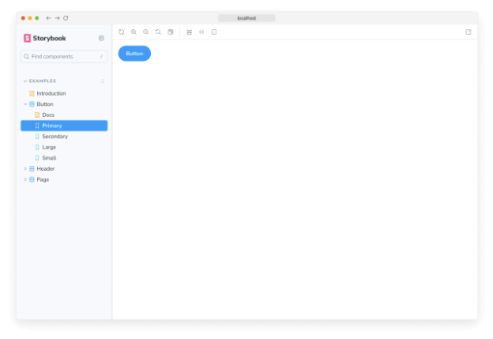
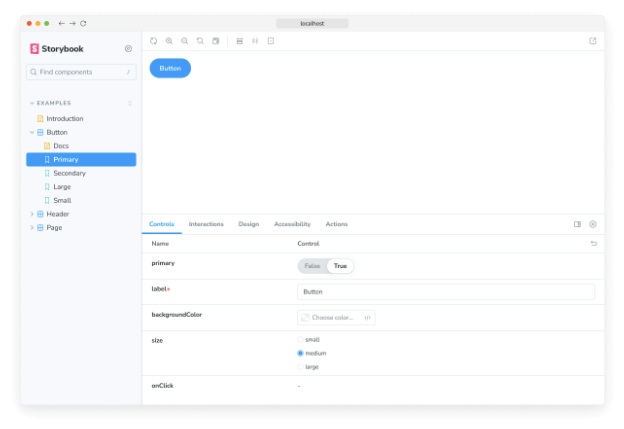

이야기는 UI 구성 요소의 렌더링 상태를 캡처합니다. 개발자들은 구성 요소별로 여러 이야기를 작성하여 구성 요소가 지원할 수 있는 모든 "흥미로운" 상태를 설명합니다.

CLI는 예제 구성 요소를 생성하여, Button, Header, 그리고 Page와 같은 Storybook으로 구성할 수 있는 구성 요소 유형을 보여줍니다.

각 예제 구성 요소에는 지원하는 상태를 보여주는 이야기의 집합이 있습니다. UI에서 이야기를 찾아볼 수 있으며, .stories.js 또는 .stories.ts로 끝나는 파일에 이들의 코드를 볼 수 있습니다. 이야기는 구성 요소 예제를 작성하기 위한 ES6 모듈 기반 표준인 Component Story Format (CSF)로 작성됩니다.

Button 구성 요소부터 시작해봅시다. 이야기는 해당 구성 요소를 어떻게 렌더링할 지 설명하는 객체입니다. "primary" 상태로 Button을 렌더링하고 Primary라는 이야기를 내보내는 방법은 다음과 같습니다.


```typescript
import type { Meta, StoryObj } from '@storybook/react';

import { Button } from './Button';

const meta: Meta<typeof Button> = {
  component: Button,
};

export default meta;
type Story = StoryObj<typeof Button>;

/*
 *👇 렌더 함수는 컴포넌트가 어떻게 렌더링되는지 제어하는 특정 기능입니다.
 * 렌더 함수를 사용하는 방법은 https://storybook.js.org/docs/api/csf
 * 에서 확인할 수 있습니다.
 */
export const Primary: Story = {
  render: () => <Button primary label="Button" />,
};
```



Storybook 사이드바에서 버튼을 클릭하여 렌더링된 버튼을 확인할 수 있습니다.

위의 스토리 정의는 Storybook의 "args" 컨셉을 활용하여 더 개선될 수 있습니다. Args는 Button에 대한 인수를 기계가 이해할 수 있는 방식으로 설명합니다. 이를 통해 Storybook의 인수를 동적으로 변경하고 결합하는 기능을 활용할 수 있습니다.```


```typescript
import type { Meta, StoryObj } from '@storybook/react';

import { Button, ButtonProps } from './Button';

const meta: Meta<typeof Button> = {
  component: Button,
};

export default meta;
type Story = StoryObj<typeof Button>;

export const Primary: Story = {
  args: {
    primary: true,
    label: 'Button',
  },
};
```



양 story 예시는 둘 다 똑같은 것을 렌더링합니다. 왜냐하면 Storybook이 주어진 args 속성을 이야기를 렌더링하는 동안 전달하기 때문입니다. 하지만 args로 인해 시간을 절약할 수 있습니다:

- Button 콜백은 Actions 탭에 로그됩니다. 시도하려면 클릭하세요.
- Button의 인수들은 Controls 탭에서 동적으로 편집할 수 있습니다. 컨트롤을 조절하세요.


### 이야기 편집

Storybook은 한 번에 한 컴포넌트의 한 상태(즉, 이야기)에서 작업하기 쉽게 해줍니다. 버튼 코드나 이야기를 편집할 때 Storybook은 브라우저에서 즉시 다시 렌더링됩니다. 수동으로 새로 고침할 필요가 없습니다.

기본 이야기의 레이블을 업데이트한 후 Storybook에서 변경 사항을 확인해보세요.

<video autoplay playsinline loop>
  <source src="@source/docs/Tech/2024-04-07-Whatsastory/img/Whatsastory_0.mp4" type="video/mp4">
</video>


이야기는 변경 사항을 만들면서 UI가 계속 올바르게 보이는지 확인하는 데도 도움이 됩니다. 버튼 구성 요소에는 다양한 사용 사례로 표시되는 네 가지 이야기가 있습니다. 다른 이야기들에 의도하지 않은 버그가 도입되지 않았는지 확인하기 위해 이제 해당 이야기들을 확인해보세요.

<video autoplay playsinline loop>
  <source src="@source/docs/Tech/2024-04-07-Whatsastory/img/Whatsastory_1.mp4" type="video/mp4">
</video>

구성 요소 이야기를 개발 중에 확인하면 실수로 발생하는 회귀를 예방할 수 있습니다. Storybook과 통합되는 도구들은 이를 자동화할 수 있습니다.

이제 기본적인 이야기의 해부학을 살펴보았으니, Storybook의 UI를 사용하여 이야기를 개발하는 방법을 보겠습니다.