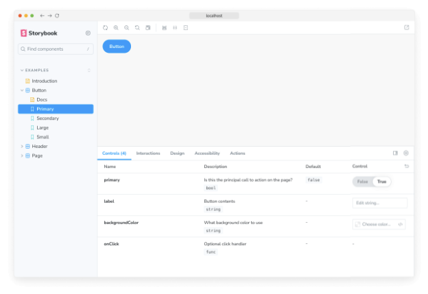
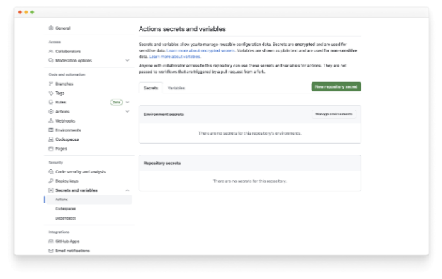

Storybook 애드온은 Storybook의 기능을 확장하고 개발 경험을 맞춤화하는 강력한 방법입니다. 새로운 기능을 추가하거나 UI를 맞춤화하거나 제3자 도구와 통합하는 데 사용할 수 있습니다.

## 무엇을 만들 것인가요?

이 참조 가이드는 인기 있는 Outline 애드온을 기반으로 한 간단한 애드온을 만들면서 Storybook 애드온이 어떻게 작동하는지에 대한 개념 모델을 개발하는 데 도움을 주는 것입니다. 이 가이드에서는 애드온의 구조, Storybook의 API, 로컬에서 애드온을 테스트하는 방법 및 발행하는 방법에 대해 배울 수 있습니다.

<video autoplay playsinline loop>
  <source src="@source/docs/Tech/2024-04-07-Writeanaddon/img/Writeanaddon_0.mp4" type="video/mp4">
</video>


## 애드온 구성

애드온에는 각각의 역할을 가진 두 가지 주요 범주가 있습니다:

- UI 기반: UI 기반 애드온은 인터페이스를 사용자 정의하거나 일반 작업에 바로 가기를 제공하거나 UI에 추가 정보를 표시하는 것을 담당합니다.
- 프리셋: 이들은 미리 구성된 설정 또는 구성으로, 개발자가 특정 기능, 기능 또는 기술 집합으로 환경을 빠르게 설정하고 사용자 정의할 수 있도록 합니다.

### UI 기반 애드온


위 가이드에 포함된 애드온은 UI 기반의 애드온으로, 구체적으로는 툴바 애드온으로, 사용자가 단축키를 누르거나 버튼을 클릭하여 이야기의 각 요소 주위에 외곽선을 그릴 수 있게 해줍니다. UI 애드온은 패널과 탭처럼 다른 종류의 UI 요소를 생성할 수 있으며, 각각의 기능에 따라 사용자가 UI와 상호 작용할 수 있는 다양한 방법을 제공합니다.

```typescript
import React, { memo, useCallback, useEffect } from 'react';

import { useGlobals, useStorybookApi } from '@storybook/manager-api';
import { IconButton } from '@storybook/components';
import { LightningIcon } from '@storybook/icons';

import { ADDON_ID, PARAM_KEY, TOOL_ID } from './constants';

export const Tool = memo(function MyAddonSelector() {
  const [globals, updateGlobals] = useGlobals();
  const api = useStorybookApi();

  const isActive = [true, 'true'].includes(globals[PARAM_KEY]);

  const toggleMyTool = useCallback(() => {
    updateGlobals({
      [PARAM_KEY]: !isActive,
    });
  }, [isActive]);

  useEffect(() => {
    api.setAddonShortcut(ADDON_ID, {
      label: 'Toggle Measure [O]',
      defaultShortcut: ['O'],
      actionName: 'outline',
      showInMenu: false,
      action: toggleMyTool,
    });
  }, [toggleMyTool, api]);

  return (
    <IconButton key={TOOL_ID} active={isActive} title="내 애드온 활성화" onClick={toggleMyTool}>
      <LightningIcon />
    </IconButton>
  );
});
```

## 설정

첫 번째 애드온을 만들기 위해 Addon Kit을 사용할 예정입니다. Addon Kit은 필요한 모든 구성 요소, 종속성 및 구성 요소를 갖춘 준비된 템플릿으로, 애드온 제작을 시작하는 데 도움이 되는 코드가 준비되어 있습니다. Addon Kit 리포지토리에서 "이 템플릿 사용" 버튼을 클릭하여 Addon Kit 코드를 기반으로 새 리포지토리를 생성하세요.```


<video autoplay playsinline loop>
  <source src="@source/docs/Tech/2024-04-07-Writeanaddon/img/Writeanaddon_1.mp4" type="video/mp4">
</video>

방금 생성한 저장소를 복제하고 필요한 종속 항목을 설치하세요. 설치 과정이 완료되면 애드온을 구성하는 질문이 나옵니다. 이에 대답하고 애드온 개발을 시작할 준비가 되면 다음 명령어를 실행하여 스토리북을 개발 모드로 시작하고 애드온을 감시 모드로 개발하세요:

```npm
npm run start
```

### 빌드 시스템 이해


Storybook 생태계에 내장된 애드온은 브라우저에서 실행할 수 있는 모던 JavaScript로 애드온 코드를 변환하기 위해 esbuild를 기반으로 한 빠르고 구성이 필요하지 않은 번들러인 tsup에 의존합니다. Addon Kit에는 미리 구성된 tsup 구성 파일이 함께 제공되며, 이를 사용하여 애드온의 빌드 프로세스를 사용자 정의할 수 있습니다.

빌드 스크립트가 실행될 때, 구성 파일을 찾아 제공된 구성에 따라 애드온 코드를 미리 번들링합니다. 애드온은 Storybook과 다양한 방식으로 상호작용할 수 있습니다. 구성을 수정하기 위해 프리셋을 정의하거나 매니저 UI에 행동을 추가하거나 미리보기 iframe에 행동을 추가할 수 있습니다. 이러한 다른 사용 사례들은 다른 런타임과 환경을 대상으로 하기 때문에 다른 번들 출력이 필요합니다. 프리셋은 Node 환경에서 실행됩니다. Storybook의 매니저 및 미리보기 환경은 전역 범위에서 특정 패키지를 제공하므로 애드온은 이를 번들링하거나 package.json 파일의 의존성으로 포함할 필요가 없습니다.

tsup 구성은 기본적으로 이러한 복잡성을 처리하지만 요구 사항에 맞게 사용자 지정할 수 있습니다. 사용된 번들링 기술에 대한 자세한 설명은 애드온 킷의 README를 참조하고 여기에서 기본 tsup 구성을 확인하세요.

## 애드온 등록


기본적으로 UI 기반 애드온의 코드는 다음과 같은 파일 중 하나에 위치합니다. 빌드한 애드온의 종류에 따라 달라집니다: src/Tool.tsx, src/Panel.tsx 또는 src/Tab.tsx. 우리는 툴바 애드온을 구축하고 있으므로 Panel 및 Tab 파일을 안전하게 삭제하고 남아 있는 파일을 다음과 같이 업데이트할 수 있습니다:

```typescript
import React, { memo, useCallback, useEffect } from 'react';

import { useGlobals, useStorybookApi } from '@storybook/manager-api';
import { IconButton } from '@storybook/components';
import { LightningIcon } from '@storybook/icons';

import { ADDON_ID, PARAM_KEY, TOOL_ID } from './constants';

export const Tool = memo(function MyAddonSelector() {
  const [globals, updateGlobals] = useGlobals();
  const api = useStorybookApi();

  const isActive = [true, 'true'].includes(globals[PARAM_KEY]);

  const toggleMyTool = useCallback(() => {
    updateGlobals({
      [PARAM_KEY]: !isActive,
    });
  }, [isActive]);

  useEffect(() => {
    api.setAddonShortcut(ADDON_ID, {
      label: 'Toggle Addon [8]',
      defaultShortcut: ['8'],
      actionName: 'myaddon',
      showInMenu: false,
      action: toggleMyTool,
    });
  }, [toggleMyTool, api]);

  return (
    <IconButton key={TOOL_ID} active={isActive} title="내 애드온 활성화" onClick={toggleMyTool}>
      <LightningIcon />
    </IconButton>
  );
});
```

시퀀스에 있는 코드 블록을 따라 갑니다:

```js
import { useGlobals, useStorybookApi } from '@storybook/manager-api';
import { IconButton } from '@storybook/components';
import { LightningIcon } from '@storybook/icons';
```


manager-api 패키지에서 사용하는 useGlobals 및 useStorybookApi 훅은 Storybook의 API에 액세스하는 데 사용됩니다. 이를 통해 사용자는 애드온과 상호 작용할 수 있으며 활성화 또는 비활성화할 수 있습니다.

@storybook/components 패키지의 IconButton 또는 Button 컴포넌트를 사용하여 툴바에 버튼을 렌더링할 수 있습니다. @storybook/icons 패키지는 적절한 크기와 스타일의 아이콘을 다양하게 제공합니다.

```js
export const Tool = memo(function MyAddonSelector() {
  const [globals, updateGlobals] = useGlobals();
  const api = useStorybookApi();

  const isActive = [true, 'true'].includes(globals[PARAM_KEY]);

  const toggleMyTool = useCallback(() => {
    updateGlobals({
      [PARAM_KEY]: !isActive,
    });
  }, [isActive]);

  useEffect(() => {
    api.setAddonShortcut(ADDON_ID, {
      label: 'Toggle Addon [8]',
      defaultShortcut: ['8'],
      actionName: 'myaddon',
      showInMenu: false,
      action: toggleMyTool,
    });
  }, [toggleMyTool, api]);

  return (
    <IconButton key={TOOL_ID} active={isActive} title="Enable my addon" onClick={toggleMyTool}>
      <LightningIcon />
    </IconButton>
  );
});
```

Tool 컴포넌트는 애드온의 진입점입니다. 툴바에 UI 요소를 렌더링하고 키보드 단축키를 등록하며 애드온을 활성화 또는 비활성화하는 논리를 처리합니다.


매니저로 넘어가면, Storybook을 고유한 이름과 식별자를 사용하여 애드온에 등록합니다. Panel과 Tab 파일을 제거했기 때문에, 빌드 중인 애드온만을 참조하도록 파일을 조정해야 합니다.

```typescript
import { addons, types } from '@storybook/manager-api';
import { ADDON_ID, TOOL_ID } from './constants';
import { Tool } from './Tool';

// 애드온 등록
addons.register(ADDON_ID, () => {
  // 툴 등록
  addons.add(TOOL_ID, {
    type: types.TOOL,
    title: '내 애드온',
    match: ({ tabId, viewMode }) => !tabId && viewMode === 'story',
    render: Tool,
  });
});
```

### 애드온을 조건부로 렌더링하기

match 속성에 주목하세요. 이를 통해 툴바 애드온이 표시되는 뷰 모드(스토리 또는 문서) 및 탭(스토리 캔버스 또는 사용자 정의 탭)을 제어할 수 있습니다. 예를 들어:


- ({ tabId }) =` tabId === `my-addon/tab` 이면 ID가 my-addon/tab인 탭을 볼 때 애드온이 표시됩니다.
- ({ viewMode }) =` viewMode === `story` 이면 캔버스에서 이야기를 볼 때 애드온이 표시됩니다.
- ({ viewMode }) =` viewMode === `docs` 이면 구성 요소 설명서를 볼 때 애드온이 표시됩니다.
- ({ tabId, viewMode }) =` !tabId && viewMode === `story` 이면 캔버스에서 이야기를 보고 사용자 정의 탭이 아닌 경우(즉, tabId === undefined일 때) 애드온이 표시됩니다.

시작 스크립트를 실행하여 Storybook을 빌드하고 시작한 후 애드온이 올바르게 등록되어 UI에 표시되는지 확인하세요.



### 애드온 스타일링


Storybook에서 애드온에 스타일을 적용하는 것은 부작용으로 간주됩니다. 따라서 애드온이 활성화될 때 스타일을 사용하고 비활성화될 때는 제거할 수 있도록 애드온을 수정해야 합니다. 이를 처리하기 위해 두 가지 Storybook 기능인 데코레이터(decorators)와 전역 변수(globals)을 활용할 것입니다. CSS 로직을 처리하기 위해 DOM에서 스타일시트를 주입하고 제거할 수 있는 도우미 함수를 포함해야 합니다. 먼저 다음과 같은 내용으로 도우미 파일을 생성해 보세요:

```typescript
import { global } from '@storybook/global';

export const clearStyles = (selector: string | string[]) => {
  const selectors = Array.isArray(selector) ? selector : [selector];
  selectors.forEach(clearStyle);
};

const clearStyle = (input: string | string[]) => {
  const selector = typeof input === 'string' ? input : input.join('');
  const element = global.document.getElementById(selector);
  if (element && element.parentElement) {
    element.parentElement.removeChild(element);
  }
};

export const addOutlineStyles = (selector: string, css: string) => {
  const existingStyle = global.document.getElementById(selector);
  if (existingStyle) {
    if (existingStyle.innerHTML !== css) {
      existingStyle.innerHTML = css;
    }
  } else {
    const style = global.document.createElement('style');
    style.setAttribute('id', selector);
    style.innerHTML = css;
    global.document.head.appendChild(style);
  }
};
```

그 다음, 다음 내용으로 주입할 스타일을 포함하는 파일을 생성하세요:

```typescript
import { dedent } from 'ts-dedent';

export default function outlineCSS(selector: string) {
  return dedent/* css */ `
    ${selector} table {
      outline: 1px solid #00cc99 !important;
    }

    ${selector} caption {
      outline: 1px solid #37ffc4 !important;
    }

    ${selector} thead {
      outline: 1px solid #98daca !important;
    }

    ... (이하 계속)
    
    ${selector} rp {
      outline: 1px solid #803e49 !important;
    }

    ${selector} span {
      outline: 1px solid #cc2643 !important;
    }

    ${selector} br {
      outline: 1px solid #db687d !important;
    }

    ${selector} wbr {
      outline: 1px solid #db175b !important;
    }`;
}
```


애드온은 스토리와 문서 모드에서 활성화될 수 있기 때문에, Storybook의 미리보기 iframe의 DOM 노드는 이 두 모드에서 다릅니다. 실제로 Storybook은 문서 모드에서 여러 이야기 미리보기를 한 페이지에 렌더링합니다. 따라서 우리는 스타일이 주입될 DOM 노드에 대한 올바른 셀렉터를 선택하고 해당 셀렉터에 스코프가 적용된 CSS를 보장해야 합니다. 이 메커니즘은 src/withGlobals.ts 파일 내에서 예제로 제공되며, 이를 사용하여 스타일링 및 헬퍼 함수를 애드온 로직에 연결할 것입니다. 파일을 다음과 같이 업데이트하세요:

```typescript
import type { Renderer, PartialStoryFn as StoryFunction, StoryContext } from '@storybook/types';

import { useEffect, useMemo, useGlobals } from '@storybook/preview-api';
import { PARAM_KEY } from './constants';

import { clearStyles, addOutlineStyles } from './helpers';

import outlineCSS from './outlineCSS';

export const withGlobals = (StoryFn: StoryFunction<Renderer>, context: StoryContext<Renderer>) => {
  const [globals] = useGlobals();

  const isActive = [true, 'true'].includes(globals[PARAM_KEY]);

  // 문서 패널에서 애드온을 사용 중인지 확인
  const isInDocs = context.viewMode === 'docs';

  const outlineStyles = useMemo(() => {
    const selector = isInDocs ? `#anchor--${context.id} .docs-story` : '.sb-show-main';

    return outlineCSS(selector);
  }, [context.id]);
  useEffect(() => {
    const selectorId = isInDocs ? `my-addon-docs-${context.id}` : `my-addon`;

    if (!isActive) {
      clearStyles(selectorId);
      return;
    }

    addOutlineStyles(selectorId, outlineStyles);

    return () => {
      clearStyles(selectorId);
    };
  }, [isActive, outlineStyles, context.id]);

  return StoryFn();
};
```

## 패키징과 게시

Storybook 애드온은 자바스크립트 생태계의 대부분 패키지와 유사하게 NPM 패키지로 배포됩니다. 그러나 NPM에 발행되고 통합 카탈로그에서 검색될 수 있도록 충족시켜야 하는 특정 기준이 있습니다:```


- transpiled 코드를 포함하는 dist 폴더를 가지고 있습니다.
- 패키지.json 파일에는 다음을 선언합니다:
  - 모듈 관련 정보
  - 통합 카탈로그 메타데이터
- 모듈 관련 정보
- 통합 카탈로그 메타데이터

### 모듈 메타데이터

메타데이터의 첫 번째 카테고리는 애드온 자체와 관련된 것입니다. 이에는 모듈에 대한 entry, 애드온이 발행될 때 포함할 파일 및 Storybook과 통합할 때 필요한 구성이 포함됩니다.

```js
{
  "exports": {
    ".": {
      "types": "./dist/index.d.ts",
      "node": "./dist/index.js",
      "require": "./dist/index.js",
      "import": "./dist/index.mjs"
    },
    "./manager": "./dist/manager.mjs",
    "./preview": "./dist/preview.mjs",
    "./package.json": "./package.json"
  },
  "main": "dist/index.js",
  "module": "dist/index.mjs",
  "types": "dist/index.d.ts",
  "files": ["dist/**/*", "README.md", "*.js", "*.d.ts"],
  "devDependencies": {
    "@storybook/blocks": "^7.0.0",
    "@storybook/components": "^7.0.0",
    "@storybook/core-events": "^7.0.0",
    "@storybook/manager-api": "^7.0.0",
    "@storybook/preview-api": "^7.0.0",
    "@storybook/theming": "^7.0.0",
    "@storybook/types": "^7.0.0"
  },
  "bundler": {
    "exportEntries": ["src/index.ts"],
    "managerEntries": ["src/manager.ts"],
    "previewEntries": ["src/preview.ts"]
  }
}
```


### 통합 카탈로그 메타데이터

두 번째 메타데이터 카테고리는 통합 카탈로그와 관련이 있습니다. 이 정보의 대부분은 이미 애드온 킷에 의해 미리 구성되어 있습니다. 그러나 디스플레이 이름, 아이콘 및 프레임워크와 같은 항목들은 카탈로그에 표시되기 위해 스토리북 속성을 통해 구성되어야 합니다.

```js
{
  "name": "my-storybook-addon",
  "version": "1.0.0",
  "description": "나의 첫 스토리북 애드온",
  "author": "당신의 이름",
  "storybook": {
    "displayName": "나의 스토리북 애드온",
    "unsupportedFrameworks": ["react-native"],
    "icon": "https://yoursite.com/link-to-your-icon.png"
  },
  "keywords": ["storybook-addons", "외형", "스타일", "CSS", "레이아웃", "디버그"]
}
```

주목해야 할 중요한 항목은 키워드 속성으로, 카탈로그의 태그 시스템에 매핑됩니다. storybook-addons를 추가하면 애드온이 카탈로그에서 애드온을 검색할 때 발견되도록 보장합니다. 나머지 키워드들은 애드온의 검색 및 분류에 도움을 줍니다.


### NPM에 발행하기

애드온을 NPM에 발행할 준비가 되었다면, Addon Kit은 릴리즈 관리를 위한 Auto 패키지로 미리 구성되어 있습니다. 이 패키지는 자동으로 변경 로그를 생성하고 패키지를 NPM과 GitHub에 업로드합니다. 따라서 두 곳에 액세스를 구성해야 합니다.

- npm adduser를 사용하여 인증
- 읽기 및 게시 권한이 있는 액세스 토큰 생성
- repo 및 workflow 범위 권한이 있는 개인 액세스 토큰 생성
- 프로젝트 루트에 .env 파일을 만들어 다음을 추가합니다:

```js
GH_TOKEN=깃허브에서 얻은 값
NPM_TOKEN=npm에서 얻은 값
```


다음으로, GitHub에서 레이블을 만들기 위해 다음 명령을 실행해보세요. 이러한 레이블을 사용하여 패키지 변경 사항을 분류할 수 있습니다.

```js
npx auto create-labels
```

마지막으로, 애드온을 위한 릴리즈를 만들기 위해 다음 명령을 실행해주세요. 이 명령은 애드온 코드를 빌드하고 패키징하며, 버전을 업데이트하고, 릴리즈를 GitHub 및 npm에 푸시하고 변경 사항 로그를 생성합니다.

```npm
npm run release
```


### CI 자동화

기본적으로 Addon Kit은 GitHub Actions workflow로 미리 구성되어 있어 릴리즈 관리 프로세스를 자동화할 수 있습니다. 이를 통해 패키지가 항상 최신 변경 사항에 맞추어 업데이트되고 변경 로그가 적절히 업데이트됩니다. 그러나 NPM 및 GitHub 토큰을 사용하여 패키지를 성공적으로 게시하려면 추가 구성이 필요합니다. 귀하의 저장소에서 설정 탭을 클릭한 다음 시크릿 및 변수 드롭다운을 클릭한 후 Actions 항목을 클릭하세요. 다음과 같은 화면이 표시됩니다:



그런 다음 New repository secret를 클릭하여 NPM_TOKEN이라고 명명하고 이전에 생성한 토큰을 붙여넣으세요. 기본 브랜치로 풀 리퀘스트를 병합할 때마다 workflow가 실행되어 새 릴리스를 게시하며, 버전 번호를 자동으로 증가시키고 변경 로그를 업데이트합니다.


Storybook 애드온 생태계에 대해 더 알아보세요

- 다른 유형의 애드온을 위한 애드온 유형
- 애드온 개발 기초를 위한 애드온 작성
- 프리셋 개발을 위한 프리셋
- 요구 사항 및 사용 가능한 레시피에 대한 통합 카탈로그
- 사용 가능한 API에 대해 배울 수 있는 API 참조