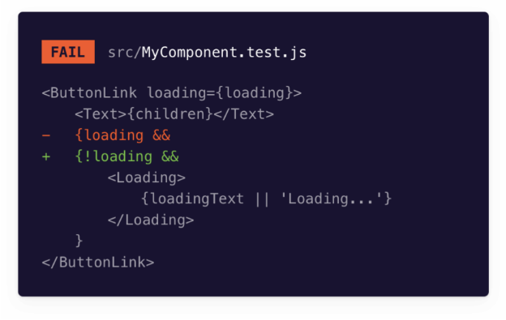

스냅샷 테스트는 모든 스토리의 렌더링 된 마크업을 사전에 알려진 베이스 라인과 비교합니다. 렌더링 오류와 경고를 일으키는 마크업 변경을 식별하는 방법입니다.

Storybook은 각 스토리가 본질적으로 테스트 사양이기 때문에 스냅샷 테스트에 유용한 도구입니다. 스토리를 작성하거나 업데이트할 때마다 스냅샷 테스트를 무료로 얻을 수 있습니다.



## 테스트 러너를 사용하여 스냅샷 테스트 자동화하기


Storybook 테스트 러너는 모든 이야기를 실행 가능한 테스트로 변환합니다. Jest와 Playwright로 구동됩니다. 독립적이고 프레임워크에 중립적인 유틸리티로 Storybook과 병렬로 실행됩니다. 이를 통해 play 함수를 사용하여 상호 작용 테스트, DOM 스냅샷 및 접근성 테스트를 포함한 다중 브라우저 환경에서 여러 테스팅 패턴을 실행할 수 있습니다.

### 설정

테스트 러너를 사용하여 스냅샷 테스트를 활성화하려면 올바르게 설정하는 추가 단계가 필요합니다. 나머지 필요한 구성 작업을 진행하기 전에 테스트 러너 문서를 정독하고 사용 가능한 옵션 및 API에 대해 더 알아 보시기를 권장합니다.

다음 내용을 포함하여 Storybook 디렉토리 내에 새 구성 파일을 추가하십시오:


```typescript
import type { TestRunnerConfig } from '@storybook/test-runner';

const config: TestRunnerConfig = {
  async postVisit(page, context) {
    // #storybook-root 요소는 이야기를 감쌀 때 사용됩니다. Storybook 6.x에서 선택기는 #root입니다.
    const elementHandler = await page.$('#storybook-root');
    const innerHTML = await elementHandler.innerHTML();
    expect(innerHTML).toMatchSnapshot();
  },
};

export default config;
```

테스트 러너를 실행하면(yarn test-storybook와 같이), 모든 이야기를 실행하고 스냅샷 테스트를 수행하여 프로젝트의 각 이야기에 대한 스냅샷 파일을 생성하여 __snapshots__ 디렉토리에 저장합니다.

### 구성

기본 설정으로, 테스트 러너는 대부분의 사용 사례를 다루는 내장된 스냅샷 테스트 구성을 제공합니다. test-storybook --eject를 통해 구성을 세밀하게 조정하거나 프로젝트 루트에 test-runner-jest.config.js 파일을 만들어 필요에 맞게 구성할 수 있습니다.```


#### 기본 스냅샷 디렉토리 재정의하기

테스트 러너는 기본적으로 생성된 스냅샷 파일에 대해 특정한 명명 규칙과 경로를 사용합니다. 스냅샷 디렉토리를 사용자 정의해야 하는 경우, 사용자 정의 스냅샷 리졸버를 정의하여 저장된 스냅샷이 위치한 디렉토리를 지정할 수 있습니다.

사용자 정의 스냅샷 리졸버를 구현하려면 snapshot-resolver.js 파일을 만드세요:
```typescript
import path from 'path';

export default {
  resolveSnapshotPath: (testPath) => {
    const fileName = path.basename(testPath);
    const fileNameWithoutExtension = fileName.replace(/\.[^/.]+$/, '');
    // 스냅샷 파일의 확장자를 정의합니다
    const modifiedFileName = `${fileNameWithoutExtension}.snap`;

    // Jest를 구성하여 다음 규칙에 따라 스냅샷 파일을 생성하도록 지정합니다 (./src/test/__snapshots__/Button.stories.snap)
    return path.join('./src/test/__snapshots__', modifiedFileName);
  },
  resolveTestPath: (snapshotFilePath, snapshotExtension) =>
    path.basename(snapshotFilePath, snapshotExtension),
  testPathForConsistencyCheck: 'example',
};
```


테스트 실행기인 test-runner-jest.config.js 파일을 업데이트하고 사용자 지정 스냅샷 리졸버를 사용하도록 설정하세요:

```typescript
import { getJestConfig } from '@storybook/test-runner';

const defaultConfig = getJestConfig();

const config = {
  // 기본 Jest 구성은 @storybook/test-runner에서 가져옵니다
  ...defaultConfig,
  snapshotResolver: './snapshot-resolver.js',
};

export default config;
```

테스트 실행기가 실행되면 모든 스토리를 순환하고 스냅샷 테스트를 실행하여 프로젝트의 각 스토리에 대한 스냅샷 파일을 생성하고 지정한 사용자 정의 디렉토리에 저장합니다.

#### 스냅샷 직렬화 사용자 정의


기본 설정으로 테스트 러너는 jest-serializer-html을 사용하여 HTML 스냅샷을 직렬화합니다. 이는 Emotion과 같은 특정 CSS-in-JS 라이브러리, Angular의 ng 속성 또는 CSS 클래스에 대한 해시 기반 식별자를 생성하는 유사한 라이브러리를 사용할 경우 문제를 일으킬 수 있습니다. 스냅샷을 사용자 정의 직렬화해야 하는 경우에는 스냅샷이 어떻게 직렬화되는지 지정하는 사용자 정의 스냅샷 직렬화기를 정의할 수 있습니다.

사용자 정의 스냅샷 직렬화기를 구현하려면 snapshot-serializer.js 파일을 만드세요:
```typescript
// 테스트 러너의 종속성으로 jest-serializer-html 패키지를 사용할 수 있습니다
const jestSerializerHtml = require('jest-serializer-html');

const DYNAMIC_ID_PATTERN = /"react-aria-\d+(\.\d+)?"/g;

module.exports = {
  /*
   * 테스트 러너는 테스트가 expect(SomeHTMLElement).toMatchSnapshot()에 도달했을 때 serialize 함수를 호출합니다.
   * 모든 동적 ID를 정적 ID로 대체하여 스냅샷이 일관되게 유지됩니다.
   * 예를 들어 <label id="react-aria970235672-:rl:" for="react-aria970235672-:rk:">Favorite color</label>를 <label id="react-mocked_id" for="react-mocked_id">Favorite color</label>로 변환합니다.
   */
  serialize(val) {
    const withFixedIds = val.replace(DYNAMIC_ID_PATTERN, 'mocked_id');
    return jestSerializerHtml.print(withFixedIds);
  },
  test(val) {
    return jestSerializerHtml.test(val);
  },
};
```

test-runner-jest.config.js 파일을 업데이트하고 snapshotSerializers 옵션을 활성화하여 사용자 정의 스냅샷 리졸버를 사용하세요:


```typescript
import { getJestConfig } from '@storybook/test-runner';

const defaultConfig = getJestConfig();

const config = {
  ...defaultConfig,
  snapshotSerializers: [
    // 테스트 러너가 실행될 때, 결과 HTML을 섬세하게 살펴보고, 컴포넌트를 스냅샷하며 스태틱 속성으로 변경합니다.
    './snapshot-serializer.js',
    ...defaultConfig.snapshotSerializers,
  ],
};

export default config;
```

테스트 러너가 테스트를 실행할 때 결과 HTML을 조사하여, 커스텀 직렬화 파일에서 제공된 정규 표현식에 따라 동적으로 생성된 속성을 정적인 속성으로 대체합니다. 이를 통해 스냅샷이 다른 테스트 실행간에 일관되게 유지됩니다.

## Portable Stories로 스냅샷 테스트하기

Storybook은 composeStories 유틸리티를 제공하여 테스트 파일에서 스토리를 렌더링 가능한 요소로 변환하는 데 도움을 줍니다. 이것은 Node 테스트에서 JSDOM을 사용하여 Storybook의 다른 기능(예: 데코레이터, args)을 테스트에 적용할 수 있도록 해줍니다. 이를 통해 스토리를 다시 작성할 필요 없이 테스팅 환경(예: Jest, Vitest)에서 스토리를 재사용하여 항상 스토리와 테스트가 동기화되도록 보장할 수 있습니다. 이것이 바로 Storybook의 Portable Stories입니다.


### 설정

기본적으로, Storybook은 React, Vue 및 다른 프레임워크에 대해 제로구성 설정을 제공하며, 애드온을 통해 스토리를 테스트로 실행할 수 있게 해줍니다. 이를 통해 테스팅 환경을 선택할 수 있습니다. 그러나, 테스트를 실행하고 Storybook 인스턴스에서 특정 구성 (예: 전역 데코레이터, 매개변수)을 설정했다면 테스트에서 사용하려면 이러한 구성을 포함시킨 테스트 환경을 확장해야 합니다. 이를 위해 다음과 같이 setup.js|ts 파일을 생성해주세요:

```typescript
// Storybook의 미리보기 파일 위치
import * as globalStorybookConfig from './.storybook/preview';

import { setProjectAnnotations } from '@storybook/react';

setProjectAnnotations(globalStorybookConfig);
```

Vitest를 사용 중이라면 테스트 구성 파일 (예: vite.config.js|ts)을 업데이트하거나 Jest를 사용 중이라면 테스트 스크립트를 업데이트해주세요:


```typescript
/// <reference types="vitest" />
import { defineConfig } from 'vitest/config';
import { mergeConfig } from 'vite';

import viteConfig from './vite.config';

export default mergeConfig(
  viteConfig,
  defineConfig({
    test: {
      globals: true,
      environment: 'jsdom',
      clearMocks: true,
      setupFiles: './src/setupTests.ts', //👈 여기에 활성화된 설정 파일
    },
  }),
);
```

### 하나의 스토리에서 테스트 실행하기

하나의 스토리에서 테스트를 실행해야 하는 경우, 관련 프레임워크의 composeStories 함수를 사용하여 처리하고 스토리에서 정의한 구성 (예: 데코레이터, args)을 적용하고 테스트 환경과 결합하여 스냅샷 파일을 생성할 수 있습니다. 예를 들어, 컴포넌트에서 작업하고 기본 상태를 테스트하고 예상된 DOM 구조가 변경되지 않았는지 확인하려면 다음과 같이 테스트를 작성할 수 있습니다:

```typescript
// @vitest-environment jsdom

import { expect, test } from 'vitest';

import { render } from '@testing-library/react';

import { composeStories } from '@storybook/react';

import * as stories from '../stories/Button.stories';

const { Primary } = composeStories(stories);
test('Button snapshot', async () => {
  const mounted = render(Primary());
  expect(mounted.container).toMatchSnapshot();
});
```


### 여러 이야기에 대한 테스트 실행

composeStories 함수를 사용하여 여러 이야기에 대해 테스트를 실행할 수도 있어요. 이것은 프로젝트의 컴포넌트의 다른 상태에 대한 스냅샷을 생성하여 테스트 범위를 확장하고 싶을 때 유용해요. 다음과 같이 테스트를 작성할 수 있어요:

```typescript
// @vitest-environment jsdom

// 지원하는 Storybook 프레임워크 중 하나로 'your-framework'을(를) 바꿔주세요 (예: react, vue3)
import type { Meta, StoryFn } from '@storybook/your-framework';

import path from 'path';
import { describe, expect, test } from 'vitest';

// 지원하는 테스팅 라이브러리 중 하나로 'your-testing-library'를(를) 바꿔주세요 (예: react, vue)
import { render } from '@testing-library/your-testing-library';

// 지원하는 프레임워크나 Storybook의 테스팅 라이브러리에 따라 import를 조정해주세요 (예: react, vue3)
import { composeStories } from '@storybook/your-framework';

type StoryFile = {
  default: Meta;
  [name: string]: StoryFn | Meta;
};

const compose = (entry: StoryFile): ReturnType<typeof composeStories<StoryFile>> => {
  try {
    return composeStories(entry);
  } catch (e) {
    throw new Error(
      `모듈에 대한 이야기를 합성하는 중에 문제가 발생했습니다: ${JSON.stringify(entry)}, ${e}`,
    );
  }
};

function getAllStoryFiles() {
  // 이야기 파일과 일치시키려는 glob을 넣어주세요
  const storyFiles = Object.entries(
    import.meta.glob<StoryFile>('./stories/**/*.(stories|story).@(js|jsx|mjs|ts|tsx)', {
      eager: true,
    }),
  );

  return storyFiles.map(([filePath, storyFile]) => {
    const storyDir = path.dirname(filePath);
    const componentName = path.basename(filePath).replace(/\.(stories|story)\.[^/.]+$/, '');
    return { filePath, storyFile, componentName, storyDir };
  });
}

describe('이야기 스냅샷', () => {
  getAllStoryFiles().forEach(({ storyFile, componentName }) => {
    const meta = storyFile.default;
    const title = meta.title || componentName;

    describe(title, () => {
      const stories = Object.entries(compose(storyFile)).map(([name, story]) => ({ name, story }));

      if (stories.length <= 0) {
        throw new Error(
          `이 모듈에 대한 이야기를 찾을 수 없어요: ${title}. 이 모듈에 유효한 이야기가 적어도 하나 있도록 확인해주세요.`,
        );
      }

      stories.forEach(({ name, story }) => {
        test(name, async () => {
          const mounted = render(story());
          // 스냅샷을 찍기 전에 컴포넌트가 렌더링될 수 있도록 1밀리초 지연을 추가하여 일관된 스냅샷을 보장합니다.
          await new Promise((resolve) => setTimeout(resolve, 1));
          expect(mounted.container).toMatchSnapshot();
        });
      });
    });
  });
});
```

테스트 환경에서 테스트를 실행하면 프로젝트의 모든 이야기에 대한 단일 스냅샷 파일을 생성할 거에요 (예:storybook.test.ts|js.snap). 그러나 필요하다면, Vitest의 toMatchFileSnapshot API나 Jest의 jest-specific-snapshot 패키지를 사용하여 프로젝트의 각 이야기에 대한 개별 스냅샷 파일을 생성하도록 테스트 파일을 확장할 수 있어요. 예를 들어:


```typescript
// @vitest-environment jsdom

// 지원되는 Storybook 프레임워크 중 하나(react, vue3)로 your-framework를 대체하세요
import type { Meta, StoryFn } from '@storybook/your-framework';

import path from 'path';
import { describe, expect, test } from 'vitest';

// 지원되는 테스팅 라이브러리 중 하나(예: react, vue)로 your-testing-library를 대체하세요
import { render } from '@testing-library/your-testing-library';

// 지원되는 framework 또는 Storybook의 테스팅 라이브러리에 따라 import를 조정하세요(예: react, vue3)
import { composeStories } from '@storybook/your-framework';

type StoryFile = {
  default: Meta;
  [name: string]: StoryFn | Meta;
};

const compose = (entry: StoryFile): ReturnType<typeof composeStories<StoryFile>> => {
  try {
    return composeStories(entry);
  } catch (e) {
    throw new Error(
      `모듈의 스토리를 작성하는 중 문제가 발생했습니다: ${JSON.stringify(entry)}, ${e}`,
    );
  }
};

function getAllStoryFiles() {
  // 매칭하려는 스토리 파일에 대한 glob을 입력하세요
  const storyFiles = Object.entries(
    import.meta.glob<StoryFile>('./stories/**/*.(stories|story).@(js|jsx|mjs|ts|tsx)', {
      eager: true,
    }),
  );

  return storyFiles.map(([filePath, storyFile]) => {
    const storyDir = path.dirname(filePath);
    const componentName = path.basename(filePath).replace(/\.(stories|story)\.[^/.]+$/, '');
    return { filePath, storyFile, componentName, storyDir };
  });
}

describe('Stories Snapshots', () => {
  getAllStoryFiles().forEach(({ storyFile, componentName }) => {
    const meta = storyFile.default;
    const title = meta.title || componentName;

    describe(title, () => {
      const stories = Object.entries(compose(storyFile)).map(([name, story]) => ({ name, story }));

      if (stories.length <= 0) {
        throw new Error(
          `이 모듈에는 스토리가 없습니다: ${title}. 이 모듈에 유효한 스토리가 최소 하나 이상 있는지 확인하세요.`,
        );
      }

      stories.forEach(({ name, story }) => {
        test(name, async () => {
          const mounted = render(story());
          // 구성 요소가 렌더링되기 전에 1ms의 지연시간을 추가하여 일관된 스냅샷을 보장합니다.
          await new Promise((resolve) => setTimeout(resolve, 1));
          // 사용자 지정 스냅샷 경로 및 파일 이름을 정의합니다
          const customSnaphotPath = `./__snapshots__/${componentName}.spec.ts.snap`;
          expect(mounted.container).toMatchFileSnapshot(customSnaphotPath);
        });
      });
    });
  });
});
```

#### 스냅샷 테스트와 시각 테스트의 차이점은 무엇인가요?

시각 테스트는 스토리의 이미지를 캡쳐하고 이미지 기준선과 비교합니다. 반면 스냅샷 테스트는 DOM 스냅샷을 캡처하고 DOM 기준선과 비교합니다. 시각 테스트는 외관을 확인하는 데 더 적합합니다. 스냅샷 테스트는 스모크 테스팅 및 DOM이 변경되지 않음을 보장하는 데 유용합니다.

#### 다른 UI 테스트에 대해 알아보기


- 테스트 러너로 테스트 실행 자동화
- 외관을 위한 시각적 테스트
- 접근성을 위한 접근성 테스트
- 사용자 동작 시뮬레이션을 위한 상호 작용 테스트
- 코드 커버리지 측정을 위한 커버리지 테스트
- 렌더링 오류와 경고를 위한 스냅샷 테스트
- 실제 사용자 시나리오를 시뮬레이션하기 위한 end-to-end 테스트
- 기능을 위한 유닛 테스트