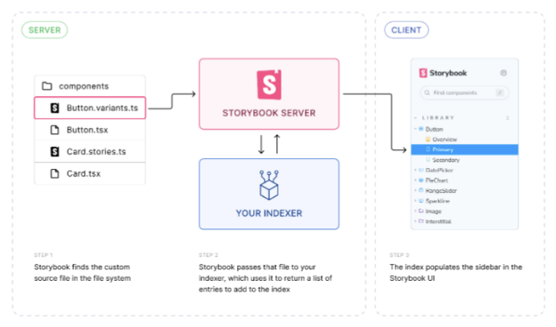

(⚠️ 실험 중)

부모: main.js|ts 구성

유형: (existingIndexers: Indexer[]) =`Promise`Indexer[]`

인덱서는 Storybook의 이야기 목록 - id, 제목, 태그 및 기타 메타데이터 하위 집합뿐만 아니라 모든 이야기 목록을 작성하는 데 책임이 있습니다. 인덱스는 Storybook의 /index.json 경로에서 읽을 수 있습니다.


인덱서 API는 Storybook이 파일을 스토리 엔트리로 색인하고 파싱하는 방식을 지시하는 인덱서를 사용자 임의로 설정할 수 있는 고급 기능입니다. 이를 통해 스토리를 작성하는 방법, 스토리가 정의된 언어, 그리고 스토리를 가져올 위치를 더 자유롭게 조정할 수 있습니다.

인덱서는 기존 인덱서를 포함한 전체 인덱서 목록을 반환하는 함수로 정의됩니다. 이를 통해 사용자는 목록에 자체 인덱서를 추가하거나 기존 인덱서를 바꿀 수 있습니다:

```typescript
// 사용 중인 프레임워크와 함께 'your-framework' 부분을 해당 프레임워크로 바꿔주세요 (예: react-webpack5, vue3-vite)
import type { StorybookConfig } from '@storybook/your-framework';

const config: StorybookConfig = {
  framework: '@storybook/your-framework',
  stories: [
    '../src/**/*.mdx',
    '../src/**/*.stories.@(js|jsx|mjs|ts|tsx)',
    // 👇 `stories`에 색인할 파일이 포함되어 있는지 확인해주세요
    '../src/**/*.custom-stories.@(js|jsx|ts|tsx)',
  ],
  experimental_indexers: async (existingIndexers) => {
    const customIndexer = {
      test: /\.custom-stories\.[tj]sx?$/,
      createIndex: // API 및 아래 예제 참조...
    };
    return [...existingIndexers, customIndexer];
  },
};

export default config
```

인덱서가 비교적 간단한 작업(예: 다른 네이밍 규칙으로 스토리 색인)을 하는 것이 아니라면, 파일을 색인하는 것 외에도 브라우저에서 해당 파일을 읽을 수 있도록 CSF로 변환해야 할 것입니다.


## Indexer

타입:

```js
{
  test: RegExp;
  createIndex: (fileName: string, options: IndexerOptions) => Promise<IndexInput[]>;
}
```

어떤 파일을 색인화하고 그것들을 스토리로 어떻게 색인화할지를 지정합니다.


### 테스트

(필수)

유형: 정규 표현식

이 인덱서에서 처리할 파일에 대응해야 하는 스토리 구성에 포함된 파일 이름에 대해 실행되는 정규 표현식입니다.


### createIndex

(필수)

타입: (fileName: string, options: IndexerOptions) => `Promise<IndexInput[]>`

단일 CSF 파일을 허용하고 색인할 항목 목록을 반환하는 함수입니다.


#### 파일 이름

유형: 문자열

인덱스에 항목을 생성하는 데 사용된 CSF 파일의 이름입니다.

#### IndexerOptions


```js
{
  makeTitle: (userTitle?: string) => string;
}
```

파일을 색인하는 옵션입니다.

타입: (userTitle?: string) = `string`


사이드바에서 사용되는 색인 항목의 서식이 지정된 제목을 반환하는 사용자 제공 제목을 가져오는 함수입니다. 사용자 제공 제목이 없으면 파일 이름 및 경로를 기반으로 자동으로 생성됩니다.

IndexInput.title 사용 예시를 확인하세요.

#### IndexInput

타입:


```js
{
  exportName: string;
  importPath: string;
  type: 'story';
  metaId?: string;
  name?: string;
  tags?: string[];
  title?: string;
  __id?: string;
}
```

스토리 인덱스에 추가할 스토리를 나타내는 객체입니다.

(필수)

유형: 문자열


각 IndexInput에 대해 색인기는 이 내보내기(임포트 경로에서 찾은 파일)를 색인에 항목으로 추가합니다.

(필수)

유형: 문자열

임포트할 파일, 예를 들어 CSF 파일.


우선적으로 색인된 파일 이름이 CSF가 아닐 가능성이 있습니다. 이 경우 브라우저에서 Storybook이 해당 파일을 읽을 수 있도록 CSF로 변환해야 합니다.

(필수)

타입: `story`

항목의 유형.


유형: 문자열

기본값: 제목에서 자동 생성

엔트리의 메타에 대한 사용자 정의 ID를 정의합니다.

지정된 경우 CSF 파일의 내보내기 기본값 (메타)은 해당 ID 속성을 가지고 있어야 하며, 올바르게 일치해야 합니다.


종류: 문자열

기본값: exportName에서 자동 생성

엔트리의 이름입니다.

종류: 문자열[]


Storybook 및 해당 도구에서 항목을 필터링하는 태그입니다.

유형: 문자열

기본값: importPath의 기본 내보내기에서 자동 생성됨

사이드바에서 항목의 위치를 결정합니다.


대부분의 경우에는 제목을 지정하지 않는 것이 좋습니다. 그러면 인덱서가 기본 명명 동작을 사용할 것입니다. 제목을 지정하는 경우에는 IndexerOptions에서 제공하는 makeTitle 함수를 사용해야 합니다. 예를 들어, 파일 이름에서 파생된 제목에 "Custom" 접두사를 단순히 추가하는 인덱서를 보여드리겠습니다:

```typescript
// 사용 중인 프레임워크에 맞게 your-framework을(를) 교체하세요 (예: react-webpack5, vue3-vite)
import type { StorybookConfig } from '@storybook/your-framework';
import type { Indexer } from '@storybook/types';

const combosIndexer: Indexer = {
  test: /\.stories\.[tj]sx?$/,
  createIndex: async (fileName, { makeTitle }) => {
    // 👇 파일 이름에서 제목 가져오기
    const title = fileName.match(/\/(.*)\.stories/)[1];

    // 파일 읽고 엔트리 생성 ...

    return entries.map((entry) => ({
      type: 'story',
      // 👇 제목 서식 지정을 위해 makeTitle 사용
      title: `${makeTitle(title)} Custom`,
      importPath: fileName,
      exportName: entry.name,
    }));
  },
};

const config: StorybookConfig = {
  framework: '@storybook/your-framework',
  stories: ['../src/**/*.mdx', '../src/**/*.stories.@(js|jsx|ts|tsx)'],
  experimental_indexers: async (existingIndexers) => [...existingIndexers, combosIndexer];
};

export default config;
```

유형: 문자열

기본값: 제목/메타ID 및 exportName에서 자동 생성


현재 엔트리의 이야기에 대한 사용자 정의 ID를 정의합니다.

지정된 경우, CSF 파일의 이야기에는 올바르게 일치되도록 해당 __id 속성이 있어야 합니다.

자동으로 생성된 ID를 재정의해야 하는 경우에만 사용하십시오.

## CSF로 변환


IndexInput의 importPath 값은 CSF 파일로 해석되어야 합니다. 그러나 대부분의 사용자 지정 인덱서는 입력이 CSF가 아닌 경우에만 필요합니다. 따라서 입력을 CSF로 변환해야 할 것이며, 이를 통해 Storybook이 브라우저에서 읽고 이야기를 렌더링할 수 있습니다.

사용자 지정 소스 형식을 CSF로 변환하는 것은 이 문서의 범위를 벗어납니다. 이 변환 작업은 대부분 빌더 수준(Vite 및/또는 Webpack)에서 수행되며, 여러 빌더용 플러그인을 만들기 위해 unplugin을 사용하는 것을 권장합니다.

일반적인 아키텍처 구조는 다음과 같습니다:




- 스토리 설정을 사용하면 Storybook은 인덱서의 테스트 속성과 일치하는 모든 파일을 찾습니다.
- Storybook은 각 일치하는 파일을 인덱서의 createIndex 함수로 전달하며, 파일 내용을 사용하여 인덱스에 추가할 색인 항목(스토리) 목록을 생성하고 반환합니다.
- 인덱스는 Storybook UI의 사이드바를 채웁니다


- Storybook UI에서 사용자는 이야기 ID와 일치하는 URL로 이동하고, 브라우저는 인덱스 항목의 importPath 속성에 지정된 CSF 파일을 요청합니다.
- 서버로 돌아와서 빌더 플러그인은 소스 파일을 CSF로 변환하고 클라이언트에 제공합니다.
- Storybook UI는 CSF 파일을 읽어 exportName으로 지정된 스토리를 가져와 렌더링합니다.

이런 방식으로 동작할 수 있는 예시를 살펴봅시다.


먼저, CSF 소스 파일의 예시를 보여드릴게요:

```js
import { variantsFromComponent, createStoryFromVariant } from '../utils';
import { Button } from './Button';

/**
 * 컴포넌트 프롭을 통해 스토리를 나타내는 원시 문자열을 반환합니다. 예시:
 * 'export const PrimaryVariant = {
 *    args: {
 *      primary: true
 *    },
 *  };'
 */
export const generateStories = () => {
  const variants = variantsFromComponent(Button);
  return variants.map((variant) => createStoryFromVariant(variant));
};
```

그리고 빌더 플러그인은 이렇게 할 거에요:

- 소스 파일을 받아 읽습니다.
- 내보낸 generateStories 함수를 가져옵니다.
- 함수를 실행하여 스토리를 생성합니다.
- 스토리를 CSF 파일에 작성합니다.


위에 언급된 CSF 파일은 Storybook에서 색인화됩니다. 결과물은 아래와 유사할 것입니다:

```js
import { Button } from './Button';

export default {
  component: Button,
};

export const Primary = {
  args: {
    primary: true,
  },
};
```

### 예시

사용자 정의 인덱서의 예시 사용법은 다음과 같습니다: